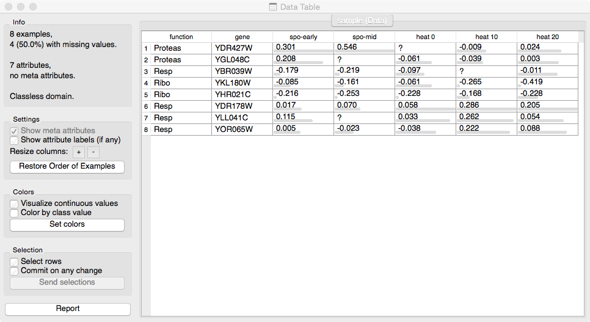

Loading your Data
=================

Orange comes with its own
:ref:`its own data format<tab-delimited>`, but can also handle standard
comma or tab delimited data files. The input data set would usually be a
table, with data instances (samples) in rows and data attributes in columns.
Data attributes can be of different types
(continuous, discrete, and strings) and kinds (input variables, meta
attributes, and a class). Data attribute type and kind can be provided in
the data table header and can be changed later, after reading the data,
with several specialized widgets, like :ref:`Select Attributes`.

In a Nutshell
-------------

- Orange can import any comma or tab-delimited data file. Use :ref:`File` widget
  and then, if needed, select class and meta attributes
  in :ref:`Select Attributes` widget.

- To specify the domain and the type of the attribute, attribute names can
  be preceded with a label followed by a hash. Use c for a class and m for
  meta attribute, i to ignore a column, and C, D, S to continuous, discrete
  and string attribute type. Examples: C#mpg, mS#name, i#dummy. Make sure
  to set **Import Options** in :ref:`File` widget and set the header to
  **Orange simplified header**.

- Orange's native format is a tab-delimited text file with three header rows.
  The first row contains attribute names, the second the domain
  (**continuous**,
  **discrete** or **string**), and the third optional type
  (**class**, **meta** or **string**).

Data from Excel
---------------

Say we have the data (:download:`sample.xlsx <sample.xlsx>`) in some popular
spreadsheet application, like Excel:

.. image:: spreadsheet.png
   :scale: 80%

To move this data to Orange, we need to save the file in a tab or comma
separated format. In Excel, we can use a **Save As ...**
command from the **File** menu:

.. image:: save-as.png
   :scale: 80%

and select **Comma Separated Values (.csv)** as an output format:

.. image:: save-as-csv.png
   :scale: 80%

We can now save the data in, say, a file named
:download:`sample.csv <sample.csv>`.

To load the data set in Orange,
we can design a simple workflow with File and Data Table widget,

.. image:: file-data-table-workflow.png
   :scale: 80%

open the :ref:`File` widget (double click on its icon) and click
on the file browser icon,

.. image:: file-browser-icon.png
   :scale: 80%

change the file type selector to csv,

.. image:: csv-selector.png
   :scale: 80%

locate the data file sample.csv which we have saved from Excel
and open it. The **File** widget should now look something like this:

Notice that our data contains 8 data instances (rows) and 7 data
attributes (columns). We can explore the contents of this data set
in the :ref:`Data Table` widget (double click its icon to open it):

.. image:: data-table-widget.png
   :scale: 80%

Question marks in the data table denote missing data entries. These
entries correspond to empty cells in the Excel table. Rows in our example
data set
represent genes, with the values in the first column denoting a gene class.
The second column stores gene names and the remaining columns record
measurements that characterize each gene. Gene class can be used
for classification. Gene name is a meta information, a label that is not
relevant to any data mining algorithm but can identify a data instance in, say,
visualizations like scatter plot. We need to tell Orange that these first two
columns are special. One way to do this within Orange is through
:ref:`Select Attributes` widget:

.. image:: select-attributes-schema.png
   :scale: 80%

Opening the :ref:`Select Attributes` widget reveals that in our input data file
all seven column are treated as ordinary attributes (input variables), with the
only distinction that the first two variables are categorical (discrete)
and the other two are real-valued (continuous):

.. image:: select-attributes-start.png
   :scale: 80%

To correctly reassign attribute types, drag attribute named ``function`` to
a **Class** box, and attribute named ``gene`` to a **Meta Attribute** box.
The :ref:`Select Attributes` widget should now look like this:

.. image:: select-attributes-reassigned.png
   :scale: 80%

Change of attribute types in :ref:`Select Attribute` widget should be confirmed by
clicking the **Apply** button. The data from this widget is fed into
:ref:`Data Table`
widget, that now renders the class and meta attribute in a color different
from those for input features:

.. image:: data-table-with-class.png
   :scale: 80%

We could also define the domain for this data set in some different way. Say,
we could make the data set ready for regression, and use ``heat 0`` as
a continuous class variable,
keep gene function and name as meta variables, and remove
``heat 10`` and ``heat 20`` from the data set (making these two attributes
available for type assignment, but not including them in the data on the output
of :ref:`Select Attributes` widget):

.. image:: select-attributes-regression.png
   :scale: 80%

Under the above setting of attributes the rending of the data in the Data Table
widget looks like the following:

.. image:: data-table-regression.png
   :scale: 80%

Header with Attribute Type Information
--------------------------------------

Information on attribute type may already be provided in the header of the
Comma Separated Values file. Let us open the
(:download:`sample.xlsx <sample.xlsx>`) data set in Excel again. This time,
however, we will augment the names of the attributes with prefix characters
expressing attribute type (class or meta attribute) and/or its domain
(continuous, discrete, string), and separate them from the attribute name
with a hash sign ("#"). For the type, the abbreviations are:

- c: class attribute
- m: meta attribute
- i: ignore the attribute

and abbreviations for the domain are:

- C: Continuous
- D: Discrete
- S: String

This is how the header with augmented attribute names looks like in Excel
(:download:`sample-head.xlsx <sample-head.xlsx>`):

.. image:: spreadsheet-simple-head.png
   :scale: 80%

We can again use a :ref:`File` widget to read the data from
the comma-separated file
exported from Excel. We have to instruct Orange to interpret annotations in
attribute names. We do so by choosing **Import Options ...** button in the File
widget, and set the **Header** to **Orange simplified header**:

.. image:: file-widget-simplified-header.png
   :scale: 80%

Notice that the attributes that we have ignored (label "i" in the attribute
name) are not present in the data set.

Native Data Format of Orange
----------------------------

Orange's native data format is a tab-delimited text file with three header
rows. The first row lists attribute names, the second row defines
their domain (continuous, discrete and string, or abbreviated c, d and s),
and the third row an optional type (class, meta, or ignore). Here is an
example:

.. image:: excel-with-tab.png
   :scale: 80%

The above screenshot is from Excel, but the file was actually saved
using "Tab Delimited Text (.txt)" format.
To open it in Orange, we have to rename
the file such that it ends with ".tab" extension (say from sample.txt to
:download:`sample.tab <sample.tab>`). In Windows, one can bypass this step
by placing the name of the file and the .tab extension in quotes when using
**Save As ...** command (e.g., "sample.tab").
