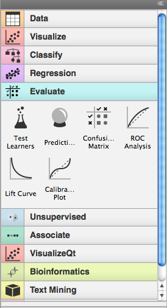
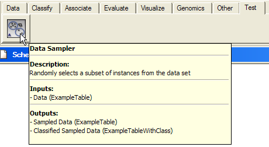
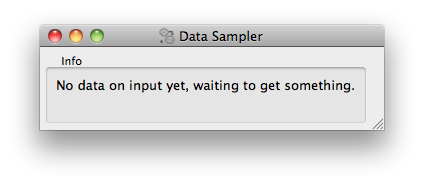
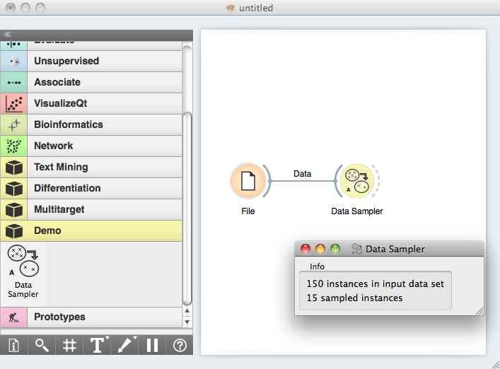

###############
Getting Started
###############

The tutorial on these pages is meant for those who are interested in
developing widgets in Orange. Orange Widgets are components in
Orange's visual programming environment. They are wrappers around some
data analysis code that provide graphical user interface
(GUI). Widgets communicate, and pass tokens through communication
channels to interact with other widgets. While simplest widgets
consist of even less than 100 lines of code, those more complex that
often implement some fancy graphical display of data and allow for
some really nice interaction may be over 1000 lines long.

On this page, we will start with some simple essentials, and then
show how to build a simple widget that will be ready to run within
Orange Canvas, our visual programming environment.

*************
Prerequisites
*************

Each Orange widget belongs to a category and within a
category has an associated priority. Opening Orange Canvas, a visual
programming environment that comes with Orange, widgets are listed in
a toolbox on the left:

The widgets and categories to which they belong are discovered at Orange
Canvas startup leveraging setuptools/distribute and it's `entry points
<http://pythonhosted.org/distribute/setuptools.html#dynamic-discovery-of-services-and-plugins>`_
protocol. In particular Orange Canvas looks for widgets using a
`orange.widgets` entry point.

First we will examine an existing widget in Orange. The Test Learners
widget which is implemented in `OWTestLearners.py
<http://orange.biolab.si/trac/browser/orange/Orange/OrangeWidgets/Evaluate/OWTestLearners.py>`_.

Here is its header::

    """
    <name>Test Learners</name>
    <description>Estimates the predictive performance of learners on a data set.</description>
    <icon>icons/TestLearners1.svg</icon>
    <priority>200</priority>
    """

OWTestLearners is a Python module, so the header information we
show about lies within the comment block, with triple quote opening
and closing the comment. Header defines the name of the widget, its
description, the name of the picture file the widget will use for an
icon, and a number expressing the priority of the widget. The name of
the widget as given in the header will be the one that will be used
throughout in Orange Canvas. The description of the widget is shown
once mouse rests on an toolbox icon representing the widget. And for
the priority: this determines the order in which widgets appear in the
toolbox within a category.

Widgets communicate. They use typed channels, and exchange
tokens. Each widget would define its input and output channels in
something like::

    self.inputs = [("Test Data Set", ExampleTable, self.cdata),
                   ("Learner", orange.Learner, self.learner, 0)]
    self.outputs = [("Evaluation Results", orngTest.ExperimentResults)]

We will go over the syntax of channel definitions later, but for
now the following is important:

   - Widgets are defined in a Python files.
   - Widgets are registered through entry points and are discovered at
     runtime.
   - A python module implementing a widget starts with a header. This, given
     in sort of XMLish style, tells about the name, short description,
     location of an icon and priority of the widget.
   - The sole role of priority is to specify the placement (order) of widgets
     in the Orange Canvas toolbox.
   - Somewhere in the code (where we will learn later) there are two lines
     which tell which channels the widgets uses for communication. These,
     together with the header information, completely specify the widget as it
     is seen from the outside.

.. note::
   Orange caches widget descriptions to achieve a faster startup,
   but this cache is automatically refreshed at startup if any change
   is detected in widgets' file.

***********
Let's Start
***********

Now that we went through some of the more boring stuff, let us now
have some fun and write a widget. We will start with a very simple
one, that will receive a data set on the input and will output a data
set with 10% of the data instances. We will call this widget
`OWDataSamplerA.py` (OW for Orange Widget, DataSampler since this is what
widget will be doing, and A since we prototype a number of this widgets
in our tutorial).

But first we must create a simple `python project`_ layout called *Demo*,
that we will use in the rest of this tutorial.

.. _`python project`: http://docs.python.org/2/distutils/examples.html#pure-python-distribution-by-package

The layout should be::

   Demo/
         setup.py
         orangedemo/
                     __init__.py
                     OWDataSamplerA.py

and the :download:`setup.py` should contain

.. literalinclude:: setup.py

Note that we declare our *orangedemo* package as containing widgets
from an ad hoc defined category *Demo*.

Following the previous example of OWTestLearners, our module defining
the OWDataSamplerA widget starts with a following header::

    <name>Data Sampler</name>
    <description>Randomly selects a subset of instances from the data set</description>
    <icon>icons/DataSamplerA.svg</icon>
    <priority>10</priority>

This should all be clear now, perhaps just a remark on an icon. We
can put any name here, and if Orange Canvas won't find the
corresponding file, it will use a file called Unknown.png (an icon
with a question mark).

Orange Widgets are all derived from the class OWWidget. The name of
the class should match the file name, so the lines following the
header in our Data Sampler widget should look something like::

    import Orange
    from OWWidget import *
    import OWGUI

    class OWDataSamplerA(OWWidget):

        def __init__(self, parent=None, signalManager=None):
            OWWidget.__init__(self, parent, signalManager)

            self.inputs = [("Data", Orange.data.Table, self.data)]
            self.outputs = [("Sampled Data", Orange.data.Table)]

            # GUI
            box = OWGUI.widgetBox(self.controlArea, "Info")
            self.infoa = OWGUI.widgetLabel(box, 'No data on input yet, waiting to get something.')
            self.infob = OWGUI.widgetLabel(box, '')
            self.resize(100,50)

In initialization, the widget calls the :func:`__init__` method
of a base class. Widget then defines inputs and outputs. For input,
this is a *Data* channel, accepting tokens of the type
:class:`Orange.data.Table` and specifying that :func:`data` method will
be used to handle them. For now, we will use a single output channel
called "Sampled Data", which will be of the same type
(Orange.data.Table).

Notice that the types of the channels are specified by a class;
you can use any class here, but if your widgets need to talk with
other widgets in Orange, you will need to check which classes are
used there. Luckily, and as one of the main design principles,
there are just a few channel types that current Orange widgets are
using.

The next four lines specify the GUI of our widget. This will be
simple, and will include only two lines of text of which, if nothing
will happen, the first line will report on "no data yet", and second
line will be empty. By (another) design principles, in an interface
Orange widgets are most often split to control and main area. Control
area appears on the left and should include any controls for settings
or options that your widget will use. Main area would most often
include a graph, table or some drawing that will be based on the
inputs to the widget and current options/setting in the control
area. OWWidget make these two areas available through its attributes
:obj:`self.controlArea` and :obj:`self.mainArea`. Notice
that while it would be nice for all widgets to have this common visual
look, you can use these areas in any way you want to, even disregarding one
and composing your widget completely unlike the others in Orange.

As our widget won't display anything apart from some info, we will
place the two labels in the control area and surround it with the box
"Info".

In order to complete our widget, we now need to define how will it
handle the input data. This is done in a method called :func:`data`
(remember, we did introduce this name in the specification of the
input channel)::

    def data(self, dataset):
        if dataset:
            self.infoa.setText('%d instances in input data set' % len(dataset))
            indices = orange.MakeRandomIndices2(p0=0.1)
            ind = indices(dataset)
            sample = dataset.select(ind, 0)
            self.infob.setText('%d sampled instances' % len(sample))
            self.send("Sampled Data", sample)
        else:
            self.infoa.setText('No data on input yet, waiting to get something.')
            self.infob.setText('')
            self.send("Sampled Data", None)

The :obj:`dataset` argument is the token sent through the input
channel which our method needs to handle.

To handle the non-empty token, the widget updates the interface
reporting on number of data items on the input, then does the data
sampling using Orange's routines for these, and updates the
interface reporting on the number of sampled instances. Finally, the
sampled data is sent as a token to the output channel with a name
"Sampled Data".

Notice that the token can be empty (``None``), resulting from either
the sending widget to which we have connected intentionally emptying
the channel, or when the link between the two widgets is removed.
In any case, it is important that we always write token handlers
that appropriately handle the empty tokens. In our implementation,
we took care of empty input data set by appropriately setting the
GUI of a widget and sending an empty token to the output channel.

Although our widget is now ready to test, for a final touch, let's
design an icon for our widget. As specified in the widget header, we
will call it :download:`DataSamplerA.svg <DataSamplerA.svg>` and will
put it in `icons` subdirectory of `orangedemo` directory.

With this we cen now go ahead and install the orangedemo package. We
will do this by running :code:`python setup.py develop` command from
the `Demo` directory.

.. note::
   Depending on your python installation you might need
   administrator/superuser privileges.

For a test, we now open Orange Canvas. There should be a new pane in a
widget toolbox called Demo. If we click on this pane, it displays an
icon of our widget. Try to hover on it to see if the header and channel
info was processed correctly:

Now for the real test. We put the File widget on the schema (from
Data pane) and load the iris.tab data set. We also put our Data
Sampler widget on the scheme and open it (double click on the icon,
or right-click and choose Open):

Now connect the File and Data Sampler widget (click on an output
connector of the File widget, and drag the line to the input connector
of the Data Sampler). If everything is ok, as soon as you release the
mouse, the connection is established and, the token that was waiting
on the output of the file widget was sent to the Data Sampler widget,
which in turn updated its window:

To see if the Data Sampler indeed sent some data to the output,
connect it to the Data Table widget:

.. image:: schemawithdatatable.png

Try opening different data files (the change should propagate
through your widgets and with Data Table window open, you should
immediately see the result of sampling). Try also removing the
connection between File and Data Sampler (right click on the
connection, choose Remove). What happens to the data displayed in the
Data Table?

*****************************************
Testing Your Widget Outside Orange Canvas
*****************************************

When prototyping a single widget, for a fast test I often get
bored of running Orange Canvas, setting the schema and clicking on
icons to get widget windows. There are two options to bypass this. The
first one is to add a testing script at the end of your widget. To do
this, we finished Data Sampler with::

    if __name__=="__main__":
        appl = QApplication(sys.argv)
        ow = OWDataSamplerA()
        ow.show()
        dataset = Orange.data.Table('iris.tab')
        ow.data(dataset)
        appl.exec_()

These are essentially some calls to Qt routines that run GUI for our
widgets. Notice that we call the :func:`data` method directly.
