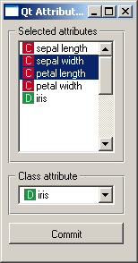

##########################
Context-Dependent Settings
##########################

You have already learned about :doc:`storing widget settings <settings>`.
But there's more: some settings are context
dependent. Open Orange Canvas and observe the scatter plot - feed it
some data, select two attributes for x- and y-axis, select some
examples... and then give it some other data. Your settings get
lost. Or do they? Well, change back to the original data and you will
see the same two attributes on the axes and even the same examples
selected.

What happens is that Orange remembers the settings (chosen
attributes etc.) and ties them with the data domain. The next time it
gets the data from the same (or similar enough) domain, the settings
will be reused. The history of an arbitrary number of domains can be
stored in this manner.

To learn how to do it yourself, consider the widget below used for
selecting a subset of attributes and the class attributes (note that a
better widget for this task is already included in your Orange
installation).

The widget gets examples on the input and outputs the same examples
with the attributes and the class chosen by the user. We'd like to
somehow store the user's selection.

Here's the widget's :func:`__init__` function.

Part of :download:`OWAttributeSampler.py <OWAttributeSampler.py>`

.. literalinclude:: OWAttributeSampler.py
   :pyobject: OWAttributeSampler.__init__

Note that we are strictly using controls from OWGUI. As for the
usual settings, if you use Qt controls directly, their state won't get
synchronized with the widget's internal variables and vice versa. The
list box is associated with two variables: :obj:`attributeList`
contains the attributes (as tuples with the name and the type), and
:obj:`selectedAttributes` is a list with indices of selected
attributes. Combo box will put the index of the chosen class attribute
into :obj:`classAttribute`.

When the widget gets the data, a function :obj:`dataset` is
called::

    def dataset(self, data):
        self.classAttrCombo.clear()
        if data:
            self.attributeList = [(attr.name, attr.varType) for attr in data.domain]
            self.selectedAttributes = []
            for attrName, attrType in self.attributeList:
                self.classAttrCombo.addItem(self.icons[attrType], attrName)
            self.classAttribute = 0
        else:
            self.attributeList = []
            self.selectedAttributes = []
            self.classAttrCombo.addItem("")

        self.data = data
        self.outputData()

.. literalinclude:: OWAttributeSampler.py
   :pyobject: OWAttributeSampler.outputData

Nothing special here (yet). We fill the list box, deselect all
attributes and set the last attribute to be the class
attribute. Output data is put into a separate function because it's
called by :obj:`dataset` and when the user presses the "Apply"
button.

The widgets is functionally complete, but it doesn't remember
anything. You can try to put the three variables
(:obj:`attributeList`, :obj:`selectedAttributes` and
:obj:`classAttribute`) in the :obj:`settingsList`, as
you've seen on the page about settings, but it won't work. It can't:
settings are saved and loaded only when the widget is created, not
every time it gets a new signal. Besides, the ordinary settings in the
:obj:`settingsList` are not context dependent, so the widget
would usually try to assign, say, the class attribute which doesn't
exist in the actual domain at all.

To make the setting dependent on the context, we put

.. literalinclude:: OWAttributeSampler.py
   :start-after: # ~start context handler~
   :end-before: # ~end context handler~

at the same place where we usually declare :obj:`settingsList`.

"Contexts" may be defined by different things, but settings most
commonly depend on the domain of the examples. Such settings are taken
by a context handler of type :obj:`DomainContextHandler`. We
tell it about the fields that it should control: the first is
:obj:`classAttribute`, and the other two form a pair,
:obj:`attributeList` contains the attributes and
:obj:`selectedAttributes` is the selection. The latter has the
flag :obj:`DomainContextHandler.List` which tells the context
handler that the property in question is a list, not an ordinary
field.

And what is ":obj:`Required`" and
":obj:`SelectedRequired`"? These are important in domain
matching. Say that you loaded the car data, selected attributes
:obj:`price`, :obj:`maint` and :obj:`lug_boot` and
set the class attribute to :obj:`acc`. Now you load a modified
car data in which the attribute :obj:`doors` is missing. Can the
settings be reused? Sure, :obj:`doors` was not selected, so this
attribute is not really needed. The new domain is thus not exactly the
same as the one with which the context was saved, but nothing
essential is missing so the context is loaded.

A different thing is if the new set misses attributes
:obj:`price` or :obj:`acc`; in this case, the old settings
cannot and should not be reused. So, this is the meaning of
:obj:`DomainContextHandler.Required` and
:obj:`DomainContextHandler.SelectedRequired`: a stored context
doesn't match the new data if the data lacks the attribute that the
context stores as ":obj:`classAttribute`". And, the new data
also has to have all the attributes that were selected in the stored
context. If any of the other attributes misses, it doesn't matter, the
context will still match and be used.

As you have guessed, we can also have optional attributes
(:obj:`DomainContextHandler.Optional`); sometimes certain
attribute doesn't really matter, so if it is present in the domain,
it's going to be used, otherwise not. And for the list, we could say
:obj:`DomainContextHandler.List + DomainContextHandler.Required`
in which case all the attributes on the list would be required for the
domain to match.

The default flag is :obj:`DomainContextHandler.Required`, and there
are other shortcuts for declaring the context, too. The above code could
be simplified as ::

    contextHandlers = {
        "": DomainContextHandler(
            "",
            ["classAttribute",
             ContextField("attributeList",
                          DomainContextHandler.SelectedRequiredList,
                          selected="selectedAttributes")])}

Why the dictionary and the empty string as the key? A widget can
have multiple contexts, depending, usually, on multiple input
signals. These contexts can be named, but the default name is empty
string. A case in which we would really need multiple contexts has yet
to appear, so you shall mostly declare the contexts as above. (Note
that we gave the name twice - the first empty string is for the key in
the dictionary and with the second we tell the context handler its own
name.)

So much for declaration of contexts. The ordinary, context
independent settings load and save automatically as the widget is
created and destroyed. Context dependent settings are stored and
restored when the context changes, usually due to receiving a signal
with a new data set. This unfortunately cannot be handled
automatically - you have to add the calls of the appropriate context
changing functions yourself. Here's what you have to do with the
function :obj:`dataset`

.. literalinclude:: OWAttributeSampler.py
   :pyobject: OWAttributeSampler.dataset

We added only two lines. First, before you change any controls in
the widget, you need to call :obj:`self.closeContext` (the function
has an optional argument, the context name, but since we use the
default name, an empty string, we can omit it). This reads the
data from the widget into the stored context. Then the function
proceeds as before: the controls (the list box and combo box)
are filled in as if there were no context handling (this is
important, so once again: widget should be set up as if there
were not context dependent settings). When the controls are put
in a consistent state, we call :obj:`self.openContext`. The first
argument is the context name and the second is the object from
which the handler reads the context. In case of
:obj:`DomainContextHandler` this can be either a domain or the
data. :obj:`openContext` will make the context handler search
through the stored context for the one that (best) matches the
data, and if one is find the widget's state is set accordingly
(that is, the list boxes are filled, attributes in it are selected
etc.). If no context is found, a new context is established and the
data from widget is copied to the context.

What can be stored as a context dependent setting? Anything, even
the state of check boxes if you want to. But don't do that. Make
some of your checkboxes context dependent (so that they will
change when the new data arrives) and the use of the widget will be
completely chaotic since nobody will know what changes and what stays
the same. Make all your controls context dependent and the
widget will become useless as it will reset to the defaults every time
some new data arrives. Bottom line, regarding to controls, make as
little context dependent settings as possible - the context dependent
controls will usually be limited to list boxes and combo boxes that
store attribute names.

But there are other things that you can put into the context. Just
remember the scatter plot's ability to remember the example selection
- which is surely not stored in a simple list box. How does it do it?
Here are two methods it defines::

    def settingsFromWidgetCallback(self, handler, context):
        context.selectionPolygons = []
        for key in self.graph.selectionCurveKeyList:
            curve = self.graph.curve(key)
            xs = [curve.x(i) for i in range(curve.dataSize())]
            ys = [curve.y(i) for i in range(curve.dataSize())]
            context.selectionPolygons.append((xs, ys))

    def settingsToWidgetCallback(self, handler, context):
        selections = context.selectionPolygons
        for (xs, ys) in selections:
            c = SelectionCurve(self.graph)
            c.setData(xs,ys)
            key = self.graph.insertCurve(c)
            self.graph.selectionCurveKeyList.append(key)

:obj:`settingsFromWidgetCallback` is called by the context
handler to copy the settings from the widget to the context, and
:obj:`settingsToWidgetCallback` writes the settings back to the
widget. Their arguments, besides :obj:`self`, are the context
handler and the context. Whatever
:obj:`settingsFromWidgetCallback` stores into the
:obj:`context`, stays there, gets saved when the canvas is
closed and loaded when it's opened
again. :obj:`setttingsToWidgetCallback` can read these fields
and restore the widget's state (the example selection, in this case)
accordingly.

:obj:`selectionPolygons` is not registered by the context
handler the way we registered :obj:`attributeList`,
:obj:`selectedAttributes` and :obj:`classAttribute` above,
since the context handler doesn't need to know and care about
:obj:`selectionPolygons`.

When writing such callback functions make sure that the data you
store is picklable and short enough, so you won't blow up the .ini
files that store these settings.
