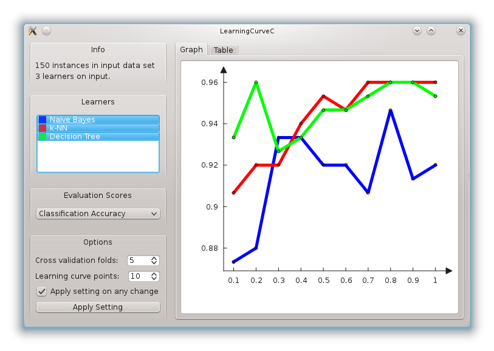

###########################
Graphing and Orange Widgets
###########################
 
The most fun widgets are of course those that include graphics. For
this we can use the classes for
drawing data plots as provided in Qwt library and PyQwt
interface. This method is described in :doc:`Graphing <graphing>`.

However, Orange provides a new plotting interface via the :obj:`OrangeWidgets.plot`
module. The OWPlot class use Qt's graphics framework and was written specifically for
Orange, so it contains methods more suitable to its data structures. It also provides
most methods also found in the Qwt-based OWGraph, so switching from one base
to another is quite easy. 

Creating a new plot using OWPlot is described in :doc:`Plots with OWPlot <plotsbasic>`.
This topic tries to show the similarities between the plot module and the old Qwt-based graph. 

*****
Plots
*****

Let us construct a widget with a following appearance:

There are two new elements from our previous incarnation of
a learning curve widget: a control with a list of classifiers, and a
graph with a plot of learning curves. From a list of classifiers we
can select those to be displayed in the plot.

The widget still provides learning curve table, but this is now
offered in a tabbed pane together with a graph. The code for
definition of the tabbed pane, and initialization of the graph is::

    # start of content (right) area
    tabs = OWGUI.tabWidget(self.mainArea)
    
    # graph widget
    tab = OWGUI.createTabPage(tabs, "Graph")
    self.graph = OWPlot(tab)
    self.graph.setAxisAutoScale(QwtPlot.xBottom)
    self.graph.setAxisAutoScale(QwtPlot.yLeft)
    tab.layout().addWidget(self.graph)
    self.setGraphGrid()

:obj:`OWPlot` is a convenience subclass of QGraphicsView and is imported from plot.owplot module. 
For the graph, we use :obj:`set_axis_autoscale` to
request that the axis are automatically set in regard to the data that
is plotted in the graph. We plot the graph in using the following
code::

    def drawLearningCurve(self, learner):
        if not self.data: return
        curve = self.graph.add_curve(learner.name, xData=self.curvePoints, yData=learner.score, autoScale=True)

        learner.curve = curve
        self.setGraphStyle(learner)
        self.graph.replot()

This is simple. We store the curve returned from :obj:`add_curve` with a
learner, and use a trick allowed in Orange that we can simply store
this as a new attribute to the learning object. In this way, each learner
also stores the current scores, which is a list of numbers to be
plotted in the graph. The details on how the plot is set are dealt
with in :obj:`setGraphStyle` function::

    def setGraphStyle(self, learner):
        curve = learner.curve
        if self.graphDrawLines:
            curve.set_style(OWCurve.LinesPoints)
        else:
            curve.set_style(OWCurve.Points)
        curve.set_symbol(OWPoint.Ellipse)
        curve.set_point_size(self.graphPointSize)
        curve.set_color(self.graph.color(OWPalette.Data))
        curve.set_pen(QPen(learner.color, 5))

Notice that the color of the plot line that is specific to the
learner is stored in its attribute :obj:`color`
(:obj:`learner.color`). Who sets it and how? This we discuss in
the following subsection.

<h2>Colors in Orange Widgets</h2>

Uniform assignment of colors across different widget is an
important issue. When we plot the same data in different widgets, we
expect that the color we used in a consistent way; for instance data
instances of one class should be plotted in scatter plot and parallel
axis plot using the same color. Developers are thus advised to use
:obj:`ColorPaletteHSV`, which is provided as a method within
:obj:`OWWidget` class. :obj:`ColorPaletteHSV` takes an
integer as an attribute, and returns a list of corresponding number of
colors. In our learning curve widget, we use it within a function that
sets the list box with learners::

    def updatellb(self):
        self.blockSelectionChanges = 1
        self.llb.clear()
        colors = ColorPaletteHSV(len(self.learners))
        for (i,lt) in enumerate(self.learners):
            l = lt[1]
            item = QListWidgetItem(ColorPixmap(colors[i]), l.name)
            self.llb.addItem(item)
            item.setSelected(l.isSelected)
            l.color = colors[i]
        self.blockSelectionChanges = 0

The code above sets the items of the list box, where each item
includes a learner and a small box in learner's color, which is in
this widget also used as a sort of a legend for the graph. This box is
returned by :obj:`ColorPixmap` function defined in
:obj:`OWColorPalette.py`. Else, the classifier's list box control is
defined in the initialization of the widget using::

    self.cbox = OWGUI.widgetBox(self.controlArea, "Learners")
    self.llb = OWGUI.listBox(self.cbox, self, "selectedLearners", selectionMode=QListWidget.MultiSelection, callback=self.learnerSelectionChanged)

    self.llb.setMinimumHeight(50)
    self.blockSelectionChanges = 0

Now, what is this :obj:`blockSelectionChanges`? Any time
user makes a selection change in list box of classifiers, we want to
invoke the procedure called
:obj:`learnerSelectionChanged`. But we want to perform
actions there when changes in the list box are invoked from clicking
by a user, and not by changing list box items from a program. This is
why, every time we want :obj:`learnerSelectionChanged` not to
perform its function, we set :obj:`self.blockSelectionChanges`
to 1.

In our widget, :obj:`learnerSelectionChanged` figures out
if any curve should be removed from the graph (the user has just
deselected the corresponding item in the list box) or added to the
graph (the user just selected a learner)::

    def learnerSelectionChanged(self):
        if self.blockSelectionChanges: return
        for (i,lt) in enumerate(self.learners):
            l = lt[1]
            if l.isSelected != (i in self.selectedLearners):
                if l.isSelected: # learner was deselected
                    l.curve.detach()
                else: # learner was selected
                    self.drawLearningCurve(l)
                self.graph.replot()
            l.isSelected = i in self.selectedLearners

The complete code of this widget is available `here <OWLearningCurve_plot.py>`_.
This is almost like a typical
widget that is include in a standard Orange distribution, with a
typical size just under 300 lines. Just some final cosmetics is needed
to make this widget a standard one, including setting some graph
properties (like line and point sizes, grid line control, etc.) and
saving the graph to an output file.

***************
Further reading
***************

This tutorial only shows one kind of a plot. 
If you wish to use different and more complicated plots, 
refer to the :doc:`Plot module documentation <OrangeWidgets.plot>`.
