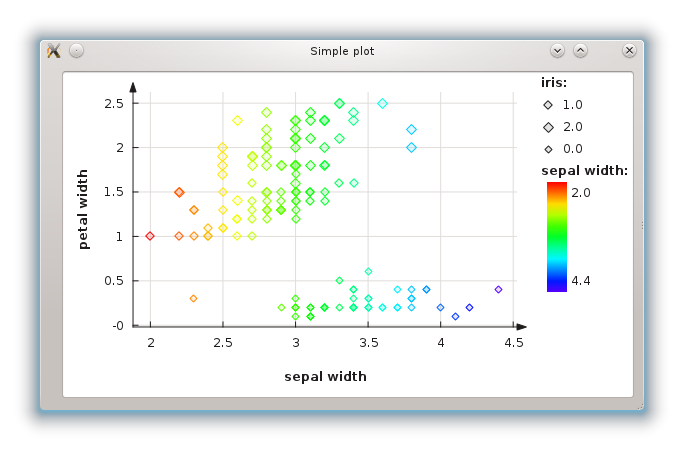

###########################
Using the new 'plot' module
###########################

Orange has a new plotting interface via the :obj:`OrangeWidgets.plot`
module. The OWPlot class use Qt's graphics framework and was written specifically for
Orange, so it contains methods more suitable to its data structures. It also provides
most methods also found in the Qwt-based OWGraph, so switching from one base
to another is quite easy. 

In the other example (:doc:`plots`) we showed how little modification
is used to replace OWGraph with OWPlot. 
On the other hand, this example shows that using OWPlot from the start can be much easier. 
We will implement the simplest graph: a series of points with x and y coordinates, 
and different colors, sizes and shapes. 

The central method for plotting a series of points is
:obj:`set_main_curve_data()`. It creates a curve and adds it to the plot, or
just updates it if one already exists. Because it doesn't recreate the curve every time
it's called, it can animate the transition from one data set to another. 

****************
Setting the data
****************

To use this method, we must first convert the data to lists, one list for every property: 
X coordinates, Y coordinates, point colors, sizes and shapes. 
Each list except the coordinates can be empty, in which case the default value is used for all points. 
You can convert the data directly from your inputs, or use the classes in the
:obj:`preprocess.scaling` module. ::

    color_cont = (domain[c_i].varType == orange.VarTypes.Continuous)

    for e in data:
        x_data.append(e[x_i])
        y_data.append(e[y_i])
        c_data.append(e[c_i])
        size = 5 + round(e[s_i])
        s_data.append(size)

    if color_cont:
        m = min(c_data)
        M = max(c_data)
        c_data = [self.plot.continuous_palette[(v-m)/(M-m)] for v in c_data]
    else:
        c_data = [QColor(*self.plot.discrete_palette.getRGB(i)) for i in c_data]

You can see that we have to adjust the color attribute in case that attribute is continuous. 
This is becouse OWPaletteGenerator only accepts values between 0 and 1 for such attributes. 
So we have to shrink the whole intervale to [0,1] before assigning any colors.

Once we have the data lists, it's time to plot them::

    self.plot.set_main_curve_data(x_data, y_data, color_data=c_data, size_data=s_data)
    self.plot.replot()

****************
Showing a legend
****************

The points sure look nice, but how do we know what color represents what value?
We show a legend. Unfortunately, using :obj:`set_main_curve_data()` can't
guess the names and values of all attributes, so we must do it ourselves. 
Still, it isn't much work.

First, we extend the loop for earlier to store colors and sizes in a set::

    color_cont = (domain[c_i].varType == orange.VarTypes.Continuous)

    legend_sizes = set()

    for e in data:
        x_data.append(e[x_i])
        y_data.append(e[y_i])
        c_data.append(e[c_i])
        size = 5 + round(e[s_i])
        s_data.append(size)

        legend_sizes.add( (size, float(e[s_i])) )

    if color_cont:
        m = min(c_data)
        M = max(c_data)
        legend_colors = set(float(c) for c in c_data)
        c_data = [self.plot.continuous_palette[(v-m)/(M-m)] for v in c_data]
    else:
        _colors = [self.plot.discrete_palette.getRGB(i) for i in c_data]
        _values = set([float(c) for c in c_data])
        legend_colors = zip([QColor(*c) for c in set(_colors)], _values)
        c_data = [QColor(*c) for c in _colors]

The logic for storing all possible sizes is quite simple: 
we create a set that holds them. Unfortunately, handling colors is bit more complex, 
because we first store (R,G,B) tuples in a set, and then convert them to QColor. 
Also, the approach differs for continuous or discrete color attributes.

Now we have a set all colors and sizes we need to display in the legend. 
:obj:`legend_colors` and :obj:`legend_sizes` are both sets because
we only want one legend item for each possible value, no matter how many
points share that value. Now all that's left is adding the legend items::

    self.plot.legend().clear()

    if domain[s_i].varType == orange.VarTypes.Discrete:
        for size, value in legend_sizes:
            self.plot.legend().add_item( domain[s_i].name, domain[s_i].values[int(value)], OWPoint(OWPoint.Diamond, self.plot.color(OWPalette.Data), size) )

    if color_cont:
        self.plot.legend().add_color_gradient(domain[c_i].name, ("%.1f" % min(legend_colors), "%.1f" % max(legend_colors)))
    else:
        for color, value in legend_colors:
            self.plot.legend().add_item( domain[c_i].name, domain[c_i].values[int(value)], OWPoint(OWPoint.Diamond, color, 5) )

We only show a legend for the size attribute if it's discrete. 
However, we show the color attribute in both cases. 
If it's continuous, only one item is created with a color gradient.

********************
Running this example
********************

You can find the full code for the example :download:`here <owplot_example.py>`.
This particular example has a timer, so that :obj:`set_data` is called every
five seconds, and attributes are chosen at random each time, athough always 
from the same data set. 
