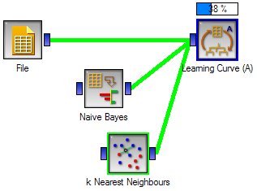

************
Progress Bar
************

Widgets, where there is any chance that their operation can be
slower than split second, should report on the progress of their
computation. For that purpose orange widgets use progress bar
functions, to which they report progress in terms of per-cent
completion of the task. The progress is then either reported above the
icon of the widget in Orange Canvas.

or in the title bar of the widget's window. There, Orange also
reports on the estimated time of completion of the task:

.. image:: progressbar-widget.png

Class :obj:`OWWidget`, the mother class of all
widgets, has for this purpose a set of functions, which include:

<xmp class="code">
progressBarInit()
progressBarSet(value)
progressBarFinished()
</xmp>

where value is any number between 0 and 100. Sometimes, like it is
the case for our widgets, we know about the number of iterations involved in
computation, and we would only like to advance the progress bar for
some constant at the end of the iteration. For this, we use
:obj:`ProgressBar` class in :obj:`OWGUI`, and the code in
the learning curve widget described in the previous lesson that does
it is as follows::

    def getLearningCurve(self, learners):
        pb = OWGUI.ProgressBar(self, iterations=self.steps*self.folds)
        curve = orngTest.learningCurveN(learners, self.data,
            folds=self.folds, proportions=self.curvePoints, callback=pb.advance)
        pb.finish()
        return curve

:obj:`ProgressBar` class removes the need to define any
special function to compute the percent of the task done and set the
progress bar, and instead uses :obj:`ProgressBar`'s method
:obj:`advance` for this purpose.
