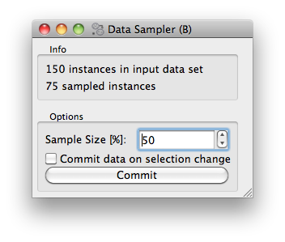

#####################
Settings and Controls
#####################

In the :doc:`previous section <basics>` of our tutorial we
have just built a simple sampling widget. Let us now make this widget
a bit more useful, by allowing a user to set the proportion of data
instances to be retained in the sample. Say we want to design a widget
that looks something like this:

What we added is an Options box, with a spin entry box to set the
sample size, and a check box and button to commit (send out) any
change we made in setting. If the check box with "Commit data on
selection change" is checked, than any change in the sample size will
make the widget send out the sampled data set. If data sets are large
(say of several thousands or more) instances, we may want to send out
the sample data only after we are done setting the sample size, hence
we left the commit check box unchecked and press "Commit" when we are
ready for it.

This is a very simple interface, but there is something more to
it. We want the settings (the sample size and the state of the commit
button) to be saved. That is, any setting we made, after closing our
widget (or after going out of Orange application that includes this
widget, or after closing Orange Canvas), we want to save so that the
next time we open the widget the settings is there as we have left
it. There is some complication to it, as widget can be part of an
application, or part of some schema in the Canvas, and we would like
to have the settings application- or schema-specific.

****************
Widgets Settings
****************

Luckily, since we use the base class :obj:`OWWidget`, the settings
will be handled just fine. We only need to tell which variables we
will use for the settings. For Python inspired readers: these
variables can store any complex object, as long as it is
picklable. In our widget, we will use two settings variables, and we
declare this just after the widget class definition.

::

    class OWDataSamplerB(OWWidget):
        settingsList = ['proportion', 'commitOnChange']
        def __init__(self, parent=None, signalManager=None):

Any setting has to be initialized, and then we need to call
:obj:`loadSettings()` to override defaults in case we have used
the widget before and the settings have been saved::

    self.proportion = 50
    self.commitOnChange = 0
    self.loadSettings()

Now anything we do with the two variables (:obj:`self.proportion` and
:obj:`self.commitOnChange`) will be saved upon exiting our
widget. In our widget, we won't be setting these variables directly,
but will instead use them in conjunction with GUI controls.

******************
Controls and OWGUI
******************

Now we could tell you how to put different Qt controls on the
widgets and write callback functions that set our settings
appropriately. This is what we have done before we got bored with it,
since the GUI part spanned over much of the widget's code. Instead, we
wrote a library called OWGUI (I never liked the name, but could never
come up with something better). With this library, the GUI definition
part of the options box is a bit dense but rather very short::

    box = OWGUI.widgetBox(self.controlArea, "Info")
    self.infoa = OWGUI.widgetLabel(box, 'No data on input yet, waiting to get something.')
    self.infob = OWGUI.widgetLabel(box, '')

    OWGUI.separator(self.controlArea)
    self.optionsBox = OWGUI.widgetBox(self.controlArea, "Options")
    OWGUI.spin(self.optionsBox, self, 'proportion', min=10, max=90, step=10,
               label='Sample Size [%]:', callback=[self.selection, self.checkCommit])
    OWGUI.checkBox(self.optionsBox, self, 'commitOnChange', 'Commit data on selection change')
    OWGUI.button(self.optionsBox, self, "Commit", callback=self.commit)
    self.optionsBox.setDisabled(1)

We are already familiar with the first part - the Info group
box. To make widget nicer, we put a separator between this and Options
box. After defining the option box, here is our first serious OWGUI
control. Called a :obj:`spin`, we give it place where it is
drawn (:obj:`self.optionsBox`), and we give it the widget object
(:obj:`self`) so that it knows where the settings and some other
variables of our widget are.

Next, we tell the spin box to be
associated with a variable called :obj:`proportion`. This simply
means that any change in the value the spin box holds will be directly
translated to a change of the variable
:obj:`self.proportion`. No need for a callback! But there's
more: any change in variable :obj:`self.proportion` will be
reflected in the look of this GUI control. Say if there would be a
line :obj:`self.proportion = 70` in your code, our spin box
control would get updated as well. (I must admit I do not know if you
appreciate this feature, but trust me, it may really help prototyping
widgets with some more complex GUI.

The rest of the OWGUI spin box call gives some parameters for the
control (minimum and maximum value and the step size), tells about the
label which will be placed on the top, and tells it which functions to
call when the value in the spin box is changed. We need the first
callback to make a data sample and report in the Info box what is the
size of the sample, and a second callback to check if we can send this
data out. In OWGUI, callbacks are either references to functions, or a
list with references, just like in our case.

With all of the above, the parameters for the call of
:obj:`OWGUI.checkBox` should be clear as well. Notice that this
and a call to :obj:`OWGUI.spin` do not need a parameter which
would tell the control the value for initialization: upon construction,
both controls will be set to the value that is pertained in the
associated setting variable.

That's it. Notice though that we have, as a default, disabled all
the controls in the Options box. This is because at the start of the
widget, there is no data to sample from. But this also means that when
process the input tokens, we should take care for enabling and
disabling. The data processing and token sending part of our widget
now is::

    def data(self, dataset):
        if dataset:
            self.dataset = dataset
            self.infoa.setText('%d instances in input data set' % len(dataset))
            self.optionsBox.setDisabled(0)
            self.selection()
            self.commit()
        else:
            self.send("Sampled Data", None)
            self.optionsBox.setDisabled(1)
            self.infoa.setText('No data on input yet, waiting to get something.')
            self.infob.setText('')

    def selection(self):
        indices = orange.MakeRandomIndices2(p0=self.proportion / 100.)
        ind = indices(self.dataset)
        self.sample = self.dataset.select(ind, 0)
        self.infob.setText('%d sampled instances' % len(self.sample))

    def commit(self):
        self.send("Sampled Data", self.sample)

    def checkCommit(self):
        if self.commitOnChange:
            self.commit()

You can now also inspect the `complete code <OWDataSamplerB.py>`_ of this
widget. To distinguish it with a widget we have developed in the
previous section, we have designed a special `icon <DataSamplerB.png>`_ for it. If you wish to test is
widget in the Orange Canvas, put its code in the Test directory we
have created for the previous widget, update the Canvas registry, and
try it out using a schema with a File and Data Table widget.

.. image:: schemawithdatasamplerB.png

Well-behaved widgets remember their settings - the state of their
checkboxes and radio-buttons, the text in their line edits, the
selections in their combo boxes and similar. These settings are even
maintained across sessions. This document describes the Orange's
methods that take care of that.

Orange doesn't really save the state of the controls but instead
saves the value of the corresponding attributes. For a check box there
should be a corresponding widget's attribute recording the check box's
state so that when the user changes a check box, the attribute changes
and vice-versa. Although you can create such a link manually, you
should always use the module <a href="owgui.htm">OWGUI</a> instead;
for instance, for a check box, use :obj:`OWGUI.checkBox` and not
simply the Qt's :obj:`QCheckBox`.

The settings fall into two groups. Some of them do not depend on
the data, while other are context-dependent. For the first to be saved
properly, you only need to list them in the :obj:`settingsList`
in the widget definition, as already described <a
href="settings.htm">elsewhere</a>.

**************************
Context dependent settings
**************************

Context dependent settings usually depend upon the attributes that
are present in the data set domain. For instance, the scatter plot
widget contains settings that specify the attributes for x and y axis,
and the settings that define the color, shape and size of the examples
in the graph. An even more complicated case is the widget for data
selection with which one can select the examples based on values of
certain attributes. Before applying the saved settings, these widgets
needs to check their compliance with the domain of the actual data
set. To be truly useful, context dependent settings needs to save a
setting configuration for each particular data set used. That is, when
given a particular data set, it has to select the saved settings that
is applicable and matches best currently used data set.

Saving, loading and matching contexts is taken care of by context
handlers. Currently, there are only two classes of context handlers
implemented. The first one is the abstract :obj:`ContextHandler`
and the second one is :obj:`DomainContextHandler` in which the
context is defined by the data set domain and where the settings
contain attribute names. The latter should cover most of your needs,
while for more complicated widgets you will need to derive a new
classes from it. There may even be some cases in which the context is
not defined by the domain, in which case the
:obj:`ContextHandler` will be used as a base for your new
handler.

Contexts need to be declared, opened and closed. Opening and
closing usually takes place (in the opposite order) in the function
that handles the data signal. This is how it looks in the scatter plot
(the code is somewhat simplified for clarity). ::

    def cdata(self, data, clearResults = 1):
        self.closeContext()

        exData = self.data
        self.data = data
        self.graph.setData(data)
        self.graph.insideColors = None
        self.graph.clusterClosure = None

        self.initAttrValues()

        self.openContext("", data)

        self.updateGraph()
        self.sendSelections()

In general, the function should go like this.

* Do any clean-up you need, but without clearing any of the settings that need to be saved. Scatter plot needs none.
* Call :obj:`self.closeContext`; this ensures that all the context dependent settings (e.g. attribute names from the list boxes) are remembered.
* Get the data (or whatever you do) and set the controls to some defaults as if there were no context retrieving mechanism. Scatter plot does it by calling :obj:`initAttrValues()` which assigns the first two attributes to the x and y axis and the class attribute to the color. At this phase, you shouldn't call any functions that depend on the settings, such as drawing the graph.
* Call :obj:`self.openContext` (more about the arguments later). This will search for a suitable context and assign the controls new values if one is found. If there is no saved context that can be used, a new context is created and filled with the default values that were assigned at the previous point.
* Finally, adjust the widget according to the retrieved controls. Scatter plot now plots the graph by calling :obj:`updateGraph`.

:obj:`closeContext` has an argument, the name of the context. If omitted (like above), the default name (:obj:`""`) is used. When opening the context, we give the name and some arguments on which the context depends. In case of :obj:`DomainContextHandler`, which scatter plot uses, we can give it a domain or any object that has a field :obj:`domain` containing a domain. Whether a saved context can be reused is judged upon the presence of attributes in the domain.

If the widget is constructed appropriately (that is, if it strictly uses OWGUI controls instead of the Qt's), no other administration is needed to switch the context.

Except for declaring the context settings, that is. Scatter plot has this just below the :obj:`settingsList`::

    contextHandlers = {"": DomainContextHandler("",
      [("attrX", DomainContextHandler.Required),
       ("attrY", DomainContextHandler.Required),
       ("attrLabel", DomainContextHandler.Optional),
       ("attrShape", DomainContextHandler.Optional),
       ("attrSize", DomainContextHandler.Optional)])}

:obj:`contextHandlers` is a dictionary whose keys are contexts' names. Each widget can have multiple contexts; for an unrealistic example, consider a scatter plot which gets two data sets and uses one attribute from the first for the x axis, and an attribute from the other for y. Since we won't see this often, the default name for a context is an empty string.

The values in the dictionary are context handlers. Scatter plot declares that it has a DomainContextHandler with name "" (sorry for the repetition) with attributes "attrX", "attrY", "attrLabel", "attrShape" and "attrSize". The first two are required, while the other three are optional.

*********************************
Using :obj:`DomainContextHandler`
*********************************

What we said above is not exactly
true. :obj:`DomainContextHandler.Required` is the default flag,
so :obj:`("attrX", DomainContextHandler.Required)` can be
replaced by simply :obj:`"attrX"`. And the latter three have the
same flags, so they can be grouped into :obj:`(["attrLabel",
"attrShape", "attrSize"], DomainContextHandler.Optional)`. So
what scatter plot really says is ::

    contextHandlers = {"": DomainContextHandler("", [
       "attrX", "attrY",
       (["attrLabel", "attrShape", "attrSize"], DomainContextHandler.Optional)])}

What do "optional" and "required" mean? Say that you used the
scatter plot on the data with attributes A, B, C and D; A and B are
used for the x and y axis and D defined the colors of examples. Now
you load a new data with attributes A, B, E, and F. The same context
can be used - A and B will again be shown on x and y axis and the
default (the one set by :obj:`self.initAttrValues`) will be used
for the color since the attribute D is missing in the new data. Now
comes the third data set, which only has attributes A, D and E. The
context now can't be reused since the attribute used for the
<em>required</em> :obj:`attrY` (the y axis) is missing.

OK, now it is time to be a bit formal. As said,
:obj:`contextHandlers` is a dictionary and the values in it need
to be context handlers derived from the abstract class
:obj:`ContextHandler`. The way it is declared of course depends
upon its constructor, so the above applies only to the usual
:obj:`DomainContextHandler`.

DomainContextHandler's constructor has the following arguments

contextName
The name of the context; it should consist of letters and digits (it is used as a prt of a variable name). In case the widget has multiple contexts, they should have unique names. In most cases there will be only one context, so you can leave it empty.

fields
The names of the attributes to be saved and the corresponding flags. They are described in more details below.

cloneIfImperfect
states that when the context doesn't match perfectly, that is, unless the domain is exactly the same as the domain from which the context was originally created, :obj:`openContext` shouldn't reuse a context but create a copy of the best matching context instead. Default is :obj:`True`.

loadImperfect
tells whether the contexts that do not match perfectly (see above) should be used or not. Default is :obj:`True`.

findImperfect
tells whether imperfect contexts match at all or not (this flag is somewhat confused with :obj:`loadImperfect`, but it may come useful some day. Default is :obj:`True` again.

syncWithGlobal
tells whether instances of this widget should have a shared list of contexts (default). The alternative is that each keeps its own list; each individual list is merged with the global when the widget is deleted from the canvas (or when the canvas is closed). This setting only applies to canvas, while in saved applications widgets always have separate settings lists.

maxAttributesToPickle
To keep the size of the context file small, settings for domains exceeding a certain number of attributes are not pickled. Default is 100, but you can increase (or decrease this) if you need to.

The truly interesting argument is :obj:`fields`. It roughly corresponds to the
:obj:`settingsList` in that each element specifies one widget attribute to be
saved. The elements of :obj:`fields` can be strings, tuples and/or instances of
:obj:`ContextField` (whatever you give, it gets automatically converted to the
latter). When given as tuples, they should consist of two elements, the field
name (just like in :obj:`settingsList`) and a flag. Here are the possible flags:

* :obj:`DomainContextHandler.Optional`, :obj:`DomainContextHandler.SelectedRequired` and :obj:`DomainContextHandler.Required` state whether the attribute is optional or required, as explained above. Default is :obj:`Required`. :obj:`DomainContextHandler.SelectedRequired` is applicable only if the control is a list box, where it means that the attributes that are selected are required while the other attributes from the list are not.
* :obj:`DomainContextHandler.NotAttribute` the setting is not an attribute name. You can essentially make a check box context dependent, but we very strongly dissuade from this since it can really confuse the user if some check boxes change with the data while most do not.
* :obj:`DomainContextHandler.List` tells that the attribute corresponds to a list box.

Flags can be combined, so to specify a list in which all attributes
are required, you would give :obj:`DomainContextHandler.List +
DomainContextHandler.Required`. Since this combination is
common, :obj:`DomainContextHandler.RequiredList` can be used
instead.

There are two shortcuts. The default flag is
:obj:`DomainContextHandler.Required`. If your attribute is like
this (as most are), you can give only its name instead of a
tuple. This is how :obj:`"attrX"` and :obj:`"attrY"` are
given in the scatter plot. If there are multiple attributes with the
same flags, you can specify them with a tuple in which the first
element is not a string but a list of strings. We have seen this trick
in the scatter plot, too.

But the tuples are actually a shortcut for instances of
:obj:`ContextField`. When you say :obj:`"attrX"` this is
actually :obj:`ContextField("attrX",
DomainContextHandler.Required)` (you should appreciate the
shortcurt, right?). But see this monster from widget "Select
Attributes" (file OWDataDomain.py)::

    contextHandlers = {"": DomainContextHandler("",
        [ContextField("chosenAttributes",
                       DomainContextHandler.RequiredList,
                       selected="selectedChosen", reservoir="inputAttributes"),
         ContextField("classAttribute",
                       DomainContextHandler.RequiredList,
                       selected="selectedClass", reservoir="inputAttributes"),
         ContextField("metaAttributes",
                       DomainContextHandler.RequiredList,
                       selected="selectedMeta", reservoir="inputAttributes")
    ])}

:obj:`ContextField`'s constructor gets the name and flags and a list of arguments that are written directly into the object instance. To follow the example, recall what Select Attributes looks like: it allows you to select a subset of attributes, the class attribute and the meta attributes that you want to use; the attributes in the corresponding three list boxes are stored in the widget's variables :obj:`chosenAttributes`, :obj:`classAttribute` and :obj:`metaAttributes` respectively. When the user selects some attributes in any of these boxes, the selection is stored in :obj:`selectedChosen`, :obj:`selectedClass` and <cose>selectedMeta</cose>. The remaining attributes - those that are not in any of these three list boxes - are in the leftover listbox on the left-hand side of the widget, and the content of the box is stored in the widget's variable :obj:`inputAttributes`.

The above definition tells that the context needs to store the contents of the three list boxes by specifying the corresponding variables; the list of attributes is given as the name of the field and the list of selected attributes is in the optional named attribute :obj:`selected`. By :obj:`reservoir` we told the context handler that the attributes are taken from :obj:`inputAttributes`. So, when a context is retrieved, all the attributes that are not in any of the three list boxes are put into :obj:`inputAttributes`.

Why the mess? Couldn't we just store :obj:`inputAttributes` as the fourth list box? Imagine that the user first loads the data with attributes A, B, C, D, E and F, puts A, B, C in chosen and D in class. E and F are left in :obj:`inputAttributes`. Now she loads another data which has attributes A, B, C, D, E, and G. The contexts should match (the new data has all the attributes we need), but :obj:`inputAttributes` should now contain E and G, not E and F, since F doesn't exist any more, while G needs to be made available.

You can use :obj:`ContextField` (instead of tuples and strings) for declaring any fields, but you will usually need them only for lists or, maybe, some complicated future controls.

*****************************
Defining New Context Handlers
*****************************

Avoid it if you can. If you can't, here's the list of the methods you may need to implement. You may want to copy as much from the :obj:`DomainContextHandler` as you can.

__init__
Has the same arguments as the :obj:`DomainContextHandler`'s, except for the :obj:`fields`.

newContext
Creates and returns a new context. In :obj:`ContextHandler` is returns an instance of :obj:`Context`; you probably won't need to change this.

openContext
The method is given a widget and some additional arguments based on which the contexts are compared. In case of :obj:`DomainContextHandler` this is a domain. There can be one or more such arguments. Note that the method :obj:`openContext` which we talked about above is a method of :obj:`OWBaseWidget`, while here we describe a method of context handlers. Actually, :obj:`OWBaseWidget(self, contextName, *args)` calls the context handler's, passing it's :obj:`self` and :obj:`*args`.

It needs to find a matching context and copy its settings to the widget or construct a new context and copy the settings from the widget. Also, when an old context is reused, it should be moved to the beginning of the list. :obj:`ContextHandler` already defines this method, which should usually suffice. :obj:`DomainContextHandler` adds very little to it.

closeContext
Copies the settings from the widget by calling :obj:`settingsFromWidget`. You probably won't need to overwrite it.

match
The method is called by :obj:`openContext` to find a matching context. Given an existing context and the arguments that were given to :obj:`openContext` (for instance, a domain), it should decide whether the context matches or not. If it returns 2, it is a perfect match (e.g. domains are the same). If it returns 0, the context is not applicable (e.g. some of the required attributes are missing). In case it returns a number between 0 and 1 (excluding 0), the higher the number the better the match. :obj:`openContext` will use the best matching context (or the perfect one, if found).

settingsToWidget/settingsFromWidget
Copy the settings to and from the widget.

fastSave
This function is called by the widget's :obj:`__setattr__` each time any widget's variable is changed to immediately synchronize the context with the state of the widget. The method is really needed only when :obj:`syncWithGlobal` is set. When the context is closed, :obj:`closeContext` will save the settings anyway.

cloneContext
Given an existing context, it prepares and returns a copy. The method is optional; :obj:`copy.deepcopy` can be used instead.

***************************
Saving and loading settings
***************************

Settings can be saved in two different places. Orange Canvas save
settings in .ini files in directory
Orange/OrangeWidgets/widgetSettings. Each widget type has its separate
file; for instance, the scatter plot's settings are saved in
:obj:`ScatterPlot.ini`. Saved schemas and applications save
settings in .sav files; the .sav file is placed in the same directory
as the schema or application, has the same name (except for the
extension) and contains the settings for all widgets in the
schema/application.

Saving and loading is done automatically by canvas or the
application. In a very rare case you need it to run these operations
manually, the functions involved are :obj:`loadSettings(self, file =
None)`, :obj:`saveSettings(self, file = None)`,
:obj:`loadSettingsStr(self, str)`,
:obj:`saveSettingsStr(self)`. The first two load and save from
the file; if not given, the default name (widget's name +
:obj:`.ini`) is used. They are called by the canvas, never by a
schema or an application. The last two load and save from a string and
are used by schemas and applications. All the functions are defined as
methods of :obj:`OWBaseWidget`, which all other widgets are
derived from.
