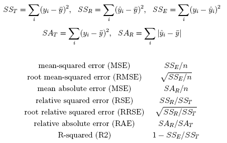

.. automodule:: Orange.evaluation.scoring

############################
Method scoring (``scoring``)
############################

.. index: scoring

This module contains various measures of quality for classification and
regression. Most functions require an argument named :obj:`res`, an instance of
:class:`Orange.evaluation.testing.ExperimentResults` as computed by
functions from :mod:`Orange.evaluation.testing` and which contains
predictions obtained through cross-validation,
leave one-out, testing on training data or test set instances.

==============
Classification
==============

To prepare some data for examples on this page, we shall load the voting data
set (problem of predicting the congressman's party (republican, democrat)
based on a selection of votes) and evaluate naive Bayesian learner,
classification trees and majority classifier using cross-validation.
For examples requiring a multivalued class problem, we shall do the same
with the vehicle data set (telling whether a vehicle described by the features
extracted from a picture is a van, bus, or Opel or Saab car).

Basic cross validation example is shown in the following part of
(:download:`statExamples.py <code/statExamples.py>`, uses :download:`voting.tab <code/voting.tab>` and :download:`vehicle.tab <code/vehicle.tab>`):

.. literalinclude:: code/statExample0.py

If instances are weighted, weights are taken into account. This can be
disabled by giving :obj:`unweighted=1` as a keyword argument. Another way of
disabling weights is to clear the
:class:`Orange.evaluation.testing.ExperimentResults`' flag weights.

General Measures of Quality
===========================

.. autofunction:: CA

.. autofunction:: AP

.. autofunction:: Brier_score

.. autofunction:: IS

So, let's compute all this in part of
(:download:`statExamples.py <code/statExamples.py>`, uses :download:`voting.tab <code/voting.tab>` and :download:`vehicle.tab <code/vehicle.tab>`) and print it out:

.. literalinclude:: code/statExample1.py
   :lines: 13-

The output should look like this::

    method  CA      AP      Brier    IS
    bayes   0.903   0.902   0.175    0.759
    tree    0.846   0.845   0.286    0.641
    majorty  0.614   0.526   0.474   -0.000

Script :download:`statExamples.py <code/statExamples.py>` contains another example that also prints out
the standard errors.

Confusion Matrix
================

.. autofunction:: confusion_matrices

   **A positive-negative confusion matrix** is computed (a) if the class is
   binary unless :obj:`classIndex` argument is -2, (b) if the class is
   multivalued and the :obj:`classIndex` is non-negative. Argument
   :obj:`classIndex` then tells which class is positive. In case (a),
   :obj:`classIndex` may be omitted; the first class
   is then negative and the second is positive, unless the :obj:`baseClass`
   attribute in the object with results has non-negative value. In that case,
   :obj:`baseClass` is an index of the target class. :obj:`baseClass`
   attribute of results object should be set manually. The result of a
   function is a list of instances of class :class:`ConfusionMatrix`,
   containing the (weighted) number of true positives (TP), false
   negatives (FN), false positives (FP) and true negatives (TN).

   We can also add the keyword argument :obj:`cutoff`
   (e.g. confusion_matrices(results, cutoff=0.3); if we do, :obj:`confusion_matrices`
   will disregard the classifiers' class predictions and observe the predicted
   probabilities, and consider the prediction "positive" if the predicted
   probability of the positive class is higher than the :obj:`cutoff`.

   The example (part of :download:`statExamples.py <code/statExamples.py>`) below shows how setting the
   cut off threshold from the default 0.5 to 0.2 affects the confusion matrics
   for naive Bayesian classifier::

       cm = Orange.evaluation.scoring.confusion_matrices(res)[0]
       print "Confusion matrix for naive Bayes:"
       print "TP: %i, FP: %i, FN: %s, TN: %i" % (cm.TP, cm.FP, cm.FN, cm.TN)

       cm = Orange.evaluation.scoring.confusion_matrices(res, cutoff=0.2)[0]
       print "Confusion matrix for naive Bayes:"
       print "TP: %i, FP: %i, FN: %s, TN: %i" % (cm.TP, cm.FP, cm.FN, cm.TN)

   The output::

       Confusion matrix for naive Bayes:
       TP: 238, FP: 13, FN: 29.0, TN: 155
       Confusion matrix for naive Bayes:
       TP: 239, FP: 18, FN: 28.0, TN: 150

   shows that the number of true positives increases (and hence the number of
   false negatives decreases) by only a single instance, while five instances
   that were originally true negatives become false positives due to the
   lower threshold.

   To observe how good are the classifiers in detecting vans in the vehicle
   data set, we would compute the matrix like this::

      cm = Orange.evaluation.scoring.confusion_matrices(resVeh, vehicle.domain.classVar.values.index("van"))

   and get the results like these::

       TP: 189, FP: 241, FN: 10.0, TN: 406

   while the same for class "opel" would give::

       TP: 86, FP: 112, FN: 126.0, TN: 522

   The main difference is that there are only a few false negatives for the
   van, meaning that the classifier seldom misses it (if it says it's not a
   van, it's almost certainly not a van). Not so for the Opel car, where the
   classifier missed 126 of them and correctly detected only 86.

   **General confusion matrix** is computed (a) in case of a binary class,
   when :obj:`classIndex` is set to -2, (b) when we have multivalued class and
   the caller doesn't specify the :obj:`classIndex` of the positive class.
   When called in this manner, the function cannot use the argument
   :obj:`cutoff`.

   The function then returns a three-dimensional matrix, where the element
   A[:obj:`learner`][:obj:`actual_class`][:obj:`predictedClass`]
   gives the number of instances belonging to 'actual_class' for which the
   'learner' predicted 'predictedClass'. We shall compute and print out
   the matrix for naive Bayesian classifier.

   Here we see another example from :download:`statExamples.py <code/statExamples.py>`::

       cm = Orange.evaluation.scoring.confusion_matrices(resVeh)[0]
       classes = vehicle.domain.classVar.values
       print "\t"+"\t".join(classes)
       for className, classConfusions in zip(classes, cm):
           print ("%s" + ("\t%i" * len(classes))) % ((className, ) + tuple(classConfusions))

   So, here's what this nice piece of code gives::

              bus   van  saab opel
       bus     56   95   21   46
       van     6    189  4    0
       saab    3    75   73   66
       opel    4    71   51   86

   Van's are clearly simple: 189 vans were classified as vans (we know this
   already, we've printed it out above), and the 10 misclassified pictures
   were classified as buses (6) and Saab cars (4). In all other classes,
   there were more instances misclassified as vans than correctly classified
   instances. The classifier is obviously quite biased to vans.

   .. method:: sens(confm)
   .. method:: spec(confm)
   .. method:: PPV(confm)
   .. method:: NPV(confm)
   .. method:: precision(confm)
   .. method:: recall(confm)
   .. method:: F2(confm)
   .. method:: Falpha(confm, alpha=2.0)
   .. method:: MCC(conf)

   With the confusion matrix defined in terms of positive and negative
   classes, you can also compute the
   `sensitivity <http://en.wikipedia.org/wiki/Sensitivity_(tests)>`_
   [TP/(TP+FN)], `specificity <http://en.wikipedia.org/wiki/Specificity_%28tests%29>`_
   [TN/(TN+FP)], `positive predictive value <http://en.wikipedia.org/wiki/Positive_predictive_value>`_
   [TP/(TP+FP)] and `negative predictive value <http://en.wikipedia.org/wiki/Negative_predictive_value>`_ [TN/(TN+FN)].
   In information retrieval, positive predictive value is called precision
   (the ratio of the number of relevant records retrieved to the total number
   of irrelevant and relevant records retrieved), and sensitivity is called
   `recall <http://en.wikipedia.org/wiki/Information_retrieval>`_
   (the ratio of the number of relevant records retrieved to the total number
   of relevant records in the database). The
   `harmonic mean <http://en.wikipedia.org/wiki/Harmonic_mean>`_ of precision
   and recall is called an
   `F-measure <http://en.wikipedia.org/wiki/F-measure>`_, where, depending
   on the ratio of the weight between precision and recall is implemented
   as F1 [2*precision*recall/(precision+recall)] or, for a general case,
   Falpha [(1+alpha)*precision*recall / (alpha*precision + recall)].
   The `Matthews correlation coefficient <http://en.wikipedia.org/wiki/Matthews_correlation_coefficient>`_
   in essence a correlation coefficient between
   the observed and predicted binary classifications; it returns a value
   between -1 and +1. A coefficient of +1 represents a perfect prediction,
   0 an average random prediction and -1 an inverse prediction.

   If the argument :obj:`confm` is a single confusion matrix, a single
   result (a number) is returned. If confm is a list of confusion matrices,
   a list of scores is returned, one for each confusion matrix.

   Note that weights are taken into account when computing the matrix, so
   these functions don't check the 'weighted' keyword argument.

   Let us print out sensitivities and specificities of our classifiers in
   part of :download:`statExamples.py <code/statExamples.py>`::

       cm = Orange.evaluation.scoring.confusion_matrices(res)
       print
       print "method\tsens\tspec"
       for l in range(len(learners)):
           print "%s\t%5.3f\t%5.3f" % (learners[l].name, Orange.evaluation.scoring.sens(cm[l]), Orange.evaluation.scoring.spec(cm[l]))

ROC Analysis
============

`Receiver Operating Characteristic \
<http://en.wikipedia.org/wiki/Receiver_operating_characteristic>`_
(ROC) analysis was initially developed for
a binary-like problems and there is no consensus on how to apply it in
multi-class problems, nor do we know for sure how to do ROC analysis after
cross validation and similar multiple sampling techniques. If you are
interested in the area under the curve, function AUC will deal with those
problems as specifically described below.

.. autofunction:: AUC

   .. attribute:: AUC.ByWeightedPairs (or 0)

      Computes AUC for each pair of classes (ignoring instances of all other
      classes) and averages the results, weighting them by the number of
      pairs of instances from these two classes (e.g. by the product of
      probabilities of the two classes). AUC computed in this way still
      behaves as concordance index, e.g., gives the probability that two
      randomly chosen instances from different classes will be correctly
      recognized (this is of course true only if the classifier knows
      from which two classes the instances came).

   .. attribute:: AUC.ByPairs (or 1)

      Similar as above, except that the average over class pairs is not
      weighted. This AUC is, like the binary, independent of class
      distributions, but it is not related to concordance index any more.

   .. attribute:: AUC.WeightedOneAgainstAll (or 2)

      For each class, it computes AUC for this class against all others (that
      is, treating other classes as one class). The AUCs are then averaged by
      the class probabilities. This is related to concordance index in which
      we test the classifier's (average) capability for distinguishing the
      instances from a specified class from those that come from other classes.
      Unlike the binary AUC, the measure is not independent of class
      distributions.

   .. attribute:: AUC.OneAgainstAll (or 3)

      As above, except that the average is not weighted.

   In case of multiple folds (for instance if the data comes from cross
   validation), the computation goes like this. When computing the partial
   AUCs for individual pairs of classes or singled-out classes, AUC is
   computed for each fold separately and then averaged (ignoring the number
   of instances in each fold, it's just a simple average). However, if a
   certain fold doesn't contain any instances of a certain class (from the
   pair), the partial AUC is computed treating the results as if they came
   from a single-fold. This is not really correct since the class
   probabilities from different folds are not necessarily comparable,
   yet this will most often occur in a leave-one-out experiments,
   comparability shouldn't be a problem.

   Computing and printing out the AUC's looks just like printing out
   classification accuracies (except that we call AUC instead of
   CA, of course)::

       AUCs = Orange.evaluation.scoring.AUC(res)
       for l in range(len(learners)):
           print "%10s: %5.3f" % (learners[l].name, AUCs[l])

   For vehicle, you can run exactly this same code; it will compute AUCs
   for all pairs of classes and return the average weighted by probabilities
   of pairs. Or, you can specify the averaging method yourself, like this::

       AUCs = Orange.evaluation.scoring.AUC(resVeh, Orange.evaluation.scoring.AUC.WeightedOneAgainstAll)

   The following snippet tries out all four. (We don't claim that this is
   how the function needs to be used; it's better to stay with the default.)::

       methods = ["by pairs, weighted", "by pairs", "one vs. all, weighted", "one vs. all"]
       print " " *25 + "  \tbayes\ttree\tmajority"
       for i in range(4):
           AUCs = Orange.evaluation.scoring.AUC(resVeh, i)
           print "%25s: \t%5.3f\t%5.3f\t%5.3f" % ((methods[i], ) + tuple(AUCs))

   As you can see from the output::

                                   bayes   tree    majority
              by pairs, weighted:  0.789   0.871   0.500
                        by pairs:  0.791   0.872   0.500
           one vs. all, weighted:  0.783   0.800   0.500
                     one vs. all:  0.783   0.800   0.500

.. autofunction:: AUC_single

.. autofunction:: AUC_pair

.. autofunction:: AUC_matrix

The remaining functions, which plot the curves and statistically compare
them, require that the results come from a test with a single iteration,
and they always compare one chosen class against all others. If you have
cross validation results, you can either use split_by_iterations to split the
results by folds, call the function for each fold separately and then sum
the results up however you see fit, or you can set the ExperimentResults'
attribute number_of_iterations to 1, to cheat the function - at your own
responsibility for the statistical correctness. Regarding the multi-class
problems, if you don't chose a specific class, Orange.evaluation.scoring will use the class
attribute's baseValue at the time when results were computed. If baseValue
was not given at that time, 1 (that is, the second class) is used as default.

We shall use the following code to prepare suitable experimental results::

    ri2 = Orange.data.sample.SubsetIndices2(voting, 0.6)
    train = voting.selectref(ri2, 0)
    test = voting.selectref(ri2, 1)
    res1 = Orange.evaluation.testing.learnAndTestOnTestData(learners, train, test)

.. autofunction:: AUCWilcoxon

.. autofunction:: compute_ROC

Comparison of Algorithms
------------------------

.. autofunction:: McNemar

.. autofunction:: McNemar_of_two

==========
Regression
==========

General Measure of Quality
==========================

Several alternative measures, as given below, can be used to evaluate
the sucess of numeric prediction:

.. autofunction:: MSE

.. autofunction:: RMSE

.. autofunction:: MAE

.. autofunction:: RSE

.. autofunction:: RRSE

.. autofunction:: RAE

.. autofunction:: R2

The following code (:download:`statExamples.py <code/statExamples.py>`) uses most of the above measures to
score several regression methods.

.. literalinclude:: code/statExamplesRegression.py

The code above produces the following output::

    Learner   MSE     RMSE    MAE     RSE     RRSE    RAE     R2
    maj       84.585  9.197   6.653   1.002   1.001   1.001  -0.002
    rt        40.015  6.326   4.592   0.474   0.688   0.691   0.526
    knn       21.248  4.610   2.870   0.252   0.502   0.432   0.748
    lr        24.092  4.908   3.425   0.285   0.534   0.515   0.715

=================
Ploting functions
=================

.. autofunction:: graph_ranks

The following script (:download:`statExamplesGraphRanks.py <code/statExamplesGraphRanks.py>`) shows hot to plot a graph:

.. literalinclude:: code/statExamplesGraphRanks.py

Code produces the following graph:

.. image:: files/statExamplesGraphRanks1.png

.. autofunction:: compute_CD

.. autofunction:: compute_friedman

=================
Utility Functions
=================

.. autofunction:: split_by_iterations

=====================================
Scoring for multilabel classification
=====================================

Multi-label classification requries different metrics than those used in traditional single-label
classification. This module presents the various methrics that have been proposed in the literature.
Let :math:`D` be a multi-label evaluation data set, conisting of :math:`|D|` multi-label examples
:math:`(x_i,Y_i)`, :math:`i=1..|D|`, :math:`Y_i \\subseteq L`. Let :math:`H` be a multi-label classifier
and :math:`Z_i=H(x_i)` be the set of labels predicted by :math:`H` for example :math:`x_i`.

.. autofunction:: mlc_hamming_loss
.. autofunction:: mlc_accuracy
.. autofunction:: mlc_precision
.. autofunction:: mlc_recall

So, let's compute all this and print it out (part of
:download:`mlc-evaluate.py <code/mlc-evaluate.py>`, uses
:download:`emotions.tab <code/emotions.tab>`):

.. literalinclude:: code/mlc-evaluate.py
   :lines: 1-15

The output should look like this::

    loss= [0.9375]
    accuracy= [0.875]
    precision= [1.0]
    recall= [0.875]

References
==========

Boutell, M.R., Luo, J., Shen, X. & Brown, C.M. (2004), 'Learning multi-label scene classification',
Pattern Recogintion, vol.37, no.9, pp:1757-71

Godbole, S. & Sarawagi, S. (2004), 'Discriminative Methods for Multi-labeled Classification', paper
presented to Proceedings of the 8th Pacific-Asia Conference on Knowledge Discovery and Data Mining
(PAKDD 2004)

Schapire, R.E. & Singer, Y. (2000), 'Boostexter: a bossting-based system for text categorization',
Machine Learning, vol.39, no.2/3, pp:135-68.
