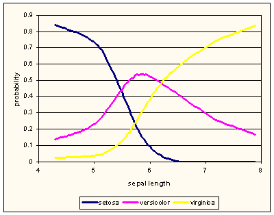

.. py:currentmodule:: Orange.feature.discretization

###################################
Discretization (``discretization``)
###################################

.. index:: discretization

.. index::
   single: feature; discretization

Continues features can be discretized either one feature at a time, or, as demonstrated in the following script,
using a single discretization method on entire set of data features:

.. literalinclude:: code/discretization-table.py

Discretization introduces new categorical features and computes their values in accordance to
selected (or default) discretization method::

    Original data set:
    [5.1, 3.5, 1.4, 0.2, 'Iris-setosa']
    [4.9, 3.0, 1.4, 0.2, 'Iris-setosa']
    [4.7, 3.2, 1.3, 0.2, 'Iris-setosa']

    Discretized data set:
    ['<=5.45', '>3.15', '<=2.45', '<=0.80', 'Iris-setosa']
    ['<=5.45', '(2.85, 3.15]', '<=2.45', '<=0.80', 'Iris-setosa']
    ['<=5.45', '>3.15', '<=2.45', '<=0.80', 'Iris-setosa']

The following discretization methods are supported:

* equal width discretization, where the domain of continuous feature is split to intervals of the same
  width equal-sized intervals (:class:`EqualWidth`),
* equal frequency discretization, where each intervals contains equal number of data instances (:class:`EqualFreq`),
* entropy-based, as originally proposed by [FayyadIrani1993]_ that infers the intervals to minimize
  within-interval entropy of class distributions (:class:`Entropy`),
* bi-modal, using three intervals to optimize the difference of the class distribution in
  the middle with the distribution outside it (:class:`BiModal`),
* fixed, with the user-defined cut-off points.

The above script used the default discretization method (equal frequency with three intervals). This can be changed
as demonstrated below:

.. literalinclude:: code/discretization-table-method.py
    :lines: 3-5

With exception to fixed discretization, discretization approaches infer the cut-off points from the
training data set and thus construct a discretizer to convert continuous values of this feature into categorical
value according to the rule found by discretization. In this respect, the discretization behaves similar to
:class:`Orange.classification.Learner`.

Utility functions
=================

Some functions and classes that can be used for
categorization of continuous features. Besides several general classes that
can help in this task, we also provide a function that may help in
entropy-based discretization (Fayyad & Irani), and a wrapper around classes for
categorization that can be used for learning.

.. autoclass:: Orange.feature.discretization.DiscretizedLearner_Class

.. autoclass:: DiscretizeTable

.. rubric:: Example

FIXME. A chapter on `feature subset selection <../ofb/o_fss.htm>`_ in Orange
for Beginners tutorial shows the use of DiscretizedLearner. Other
discretization classes from core Orange are listed in chapter on
`categorization <../ofb/o_categorization.htm>`_ of the same tutorial.

Discretization Algorithms
=========================

Instances of discretization classes are all derived from :class:`Discretization`.

.. class:: Discretization

    .. method:: __call__(feature, data[, weightID])

        Given a continuous ``feature``, ``data`` and, optionally id of
        attribute with example weight, this function returns a discretized
        feature. Argument ``feature`` can be a descriptor, index or
        name of the attribute.

.. class:: EqualWidth

    Discretizes the feature by spliting its domain to a fixed number
    of equal-width intervals. The span of original domain is computed
    from the training data and is defined by the smallest and the
    largest feature value.

    .. attribute:: n

        Number of discretization intervals (default: 4).

The following example discretizes Iris dataset features using six
intervals. The script constructs a :class:`Orange.data.Table` with discretized
features and outputs their description:

.. literalinclude:: code/discretization.py
    :lines: 38-43

The output of this script is::

    D_sepal length: <<4.90, [4.90, 5.50), [5.50, 6.10), [6.10, 6.70), [6.70, 7.30), >7.30>
    D_sepal width: <<2.40, [2.40, 2.80), [2.80, 3.20), [3.20, 3.60), [3.60, 4.00), >4.00>
    D_petal length: <<1.98, [1.98, 2.96), [2.96, 3.94), [3.94, 4.92), [4.92, 5.90), >5.90>
    D_petal width: <<0.50, [0.50, 0.90), [0.90, 1.30), [1.30, 1.70), [1.70, 2.10), >2.10>

The cut-off values are hidden in the discretizer and stored in ``attr.get_value_from.transformer``::

    >>> for attr in newattrs:
    ...    print "%s: first interval at %5.3f, step %5.3f" % \
    ...    (attr.name, attr.get_value_from.transformer.first_cut, \
    ...    attr.get_value_from.transformer.step)
    D_sepal length: first interval at 4.900, step 0.600
    D_sepal width: first interval at 2.400, step 0.400
    D_petal length: first interval at 1.980, step 0.980
    D_petal width: first interval at 0.500, step 0.400

All discretizers have the method
``construct_variable``:

.. literalinclude:: code/discretization.py
    :lines: 69-73

.. class:: EqualFreq

    Infers the cut-off points so that the discretization intervals contain
    approximately equal number of training data instances.

    .. attribute:: n

        Number of discretization intervals (default: 4).

The resulting discretizer is of class :class:`IntervalDiscretizer`. Its ``transformer`` includes ``points``
that store the inferred cut-offs.

.. class:: Entropy

    Entropy-based discretization as originally proposed by [FayyadIrani1993]_. The approach infers the most
    appropriate number of intervals by recursively splitting the domain of continuous feature to minimize the
    class-entropy of training examples. The splitting is repeated until the entropy decrease is smaller than the
    increase of minimal descripton length (MDL) induced by the new cut-off point.

    Entropy-based discretization can reduce a continuous feature into
    a single interval if no suitable cut-off points are found. In this case the new feature is constant and can be
    removed. This discretization can
    therefore also serve for identification of non-informative features and thus used for feature subset selection.

    .. attribute:: force_attribute

        Forces the algorithm to induce at least one cut-off point, even when
        its information gain is lower than MDL (default: ``False``).

Part of :download:`discretization.py <code/discretization.py>`:

.. literalinclude:: code/discretization.py
    :lines: 77-80

The output shows that all attributes are discretized onto three intervals::

    sepal length: <5.5, 6.09999990463>
    sepal width: <2.90000009537, 3.29999995232>
    petal length: <1.89999997616, 4.69999980927>
    petal width: <0.600000023842, 1.0000004768>

.. class:: BiModal

    Infers two cut-off points to optimize the difference of class distribution of data instances in the
    middle and in the other two intervals. The
    difference is scored by chi-square statistics. All possible cut-off
    points are examined, thus the discretization runs in O(n^2). This discretization method is especially suitable
    for the attributes in
    which the middle region corresponds to normal and the outer regions to
    abnormal values of the feature.

    .. attribute:: split_in_two

        Decides whether the resulting attribute should have three or two values.
        If ``True`` (default), the feature will be discretized to three intervals and the discretizer
         is of type :class:`BiModalDiscretizer`. If ``False`` the result is the
        ordinary :class:`IntervalDiscretizer`.

Iris dataset has three-valued class attribute. The figure below, drawn using LOESS probability estimation, shows that
sepal lenghts of versicolors are between lengths of setosas and virginicas.

If we merge classes setosa and virginica, we can observe if
the bi-modal discretization would correctly recognize the interval in
which versicolors dominate. The following scripts peforms the merging and construction of new data set with class
that reports if iris is versicolor or not.

.. literalinclude:: code/discretization.py
    :lines: 84-87

The following script implements the discretization:

.. literalinclude:: code/discretization.py
    :lines: 97-100

The middle intervals are printed::

    sepal length: (5.400, 6.200]
    sepal width: (2.000, 2.900]
    petal length: (1.900, 4.700]
    petal width: (0.600, 1.600]

Judging by the graph, the cut-off points inferred by discretization for "sepal length" make sense.

Discretizers
============

Discretizers construct a categorical feature from the continuous feature according to the method they implement and
its parameters. The most general is
:class:`IntervalDiscretizer` that is also used by most discretization
methods. Two other discretizers, :class:`EquiDistDiscretizer` and
:class:`ThresholdDiscretizer`> could easily be replaced by
:class:`IntervalDiscretizer` but are used for speed and simplicity.
The fourth discretizer, :class:`BiModalDiscretizer` is specialized
for discretizations induced by :class:`BiModalDiscretization`.

.. class:: Discretizer

    A superclass implementing the construction of a new
    attribute from an existing one.

    .. method:: construct_variable(feature)

        Constructs a descriptor for a new feature. The new feature's name is equal to ``feature.name``
        prefixed by "D\_". Its symbolic values are discretizer specific.

.. class:: IntervalDiscretizer

    Discretizer defined with a set of cut-off points.

    .. attribute:: points

        The cut-off points; feature values below or equal to the first point will be mapped to the first interval,
        those between the first and the second point
        (including those equal to the second) are mapped to the second interval and
        so forth to the last interval which covers all values greater than
        the last value in ``points``. The number of intervals is thus
        ``len(points)+1``.

The script that follows is an examples of a manual construction of a discretizer with cut-off points
at 3.0 and 5.0:

.. literalinclude:: code/discretization.py
    :lines: 22-26

First five data instances of ``data2`` are::

    [5.1, '>5.00', 'Iris-setosa']
    [4.9, '(3.00, 5.00]', 'Iris-setosa']
    [4.7, '(3.00, 5.00]', 'Iris-setosa']
    [4.6, '(3.00, 5.00]', 'Iris-setosa']
    [5.0, '(3.00, 5.00]', 'Iris-setosa']

The same discretizer can be used on several features by calling the function construct_var:

.. literalinclude:: code/discretization.py
    :lines: 30-34

Each feature has its own instance of :class:`ClassifierFromVar` stored in
``get_value_from``, but all use the same :class:`IntervalDiscretizer`,
``idisc``. Changing any element of its ``points`` affect all attributes.

.. note::

    The length of :obj:`~IntervalDiscretizer.points` should not be changed if the
    discretizer is used by any attribute. The length of
    :obj:`~IntervalDiscretizer.points` should always match the number of values
    of the feature, which is determined by the length of the attribute's field
    ``values``. If ``attr`` is a discretized attribute, than ``len(attr.values)`` must equal
    ``len(attr.get_value_from.transformer.points)+1``.

.. class:: EqualWidthDiscretizer

    Discretizes to intervals of the fixed width. All values lower than :obj:`~EquiDistDiscretizer.first_cut` are mapped to the first
    interval. Otherwise, value ``val``'s interval is ``floor((val-first_cut)/step)``. Possible overflows are mapped to the
    last intervals.

    .. attribute:: first_cut

        The first cut-off point.

    .. attribute:: step

        Width of the intervals.

    .. attribute:: n

        Number of the intervals.

    .. attribute:: points (read-only)

        The cut-off points; this is not a real attribute although it behaves
        as one. Reading it constructs a list of cut-off points and returns it,
        but changing the list doesn't affect the discretizer. Only present to provide
        the :obj:`EquiDistDiscretizer` the same interface as that of
        :obj:`IntervalDiscretizer`.

.. class:: ThresholdDiscretizer

    Threshold discretizer converts continuous values into binary by comparing
    them to a fixed threshold. Orange uses this discretizer for
    binarization of continuous attributes in decision trees.

    .. attribute:: threshold

        The value threshold; values below or equal to the threshold belong to the first
        interval and those that are greater go to the second.

.. class:: BiModalDiscretizer

    Bimodal discretizer has two cut off points and values are
    discretized according to whether or not they belong to the region between these points
    which includes the lower but not the upper boundary. The
    discretizer is returned by :class:`BiModalDiscretization` if its
    field :obj:`~BiModalDiscretization.split_in_two` is true (the default).

    .. attribute:: low

        Lower boundary of the interval (included in the interval).

    .. attribute:: high

        Upper boundary of the interval (not included in the interval).

Implementational details
========================

Consider a following example (part of :download:`discretization.py <code/discretization.py>`):

.. literalinclude:: code/discretization.py
    :lines: 7-15

The discretized attribute ``sep_w`` is constructed with a call to
:class:`Entropy`; instead of constructing it and calling
it afterwards, we passed the arguments for calling to the constructor. We then constructed a new
:class:`Orange.data.Table` with attributes "sepal width" (the original
continuous attribute), ``sep_w`` and the class attribute::

    Entropy discretization, first 5 data instances
    [3.5, '>3.30', 'Iris-setosa']
    [3.0, '(2.90, 3.30]', 'Iris-setosa']
    [3.2, '(2.90, 3.30]', 'Iris-setosa']
    [3.1, '(2.90, 3.30]', 'Iris-setosa']
    [3.6, '>3.30', 'Iris-setosa']

The name of the new categorical variable derives from the name of original continuous variable by adding a prefix
"D_". The values of the new attributes are computed automatically when they are needed using a transformation function
:obj:`~Orange.data.variable.Variable.get_value_from` (see :class:`Orange.data.variable.Variable`) which encodes the
discretization::

    >>> sep_w
    EnumVariable 'D_sepal width'
    >>> sep_w.get_value_from
    <ClassifierFromVar instance at 0x01BA7DC0>
    >>> sep_w.get_value_from.whichVar
    FloatVariable 'sepal width'
    >>> sep_w.get_value_from.transformer
    <IntervalDiscretizer instance at 0x01BA2100>
    >>> sep_w.get_value_from.transformer.points
    <2.90000009537, 3.29999995232>

The ``select`` statement in the discretization script converted all data instances
from ``data`` to the new domain. This includes a new feature
``sep_w`` whose values are computed on the fly by calling ``sep_w.get_value_from`` for each data instance.
The original, continuous sepal width
is passed to the ``transformer`` that determines the interval by its field
``points``. Transformer returns the discrete value which is in turn returned
by ``get_value_from`` and stored in the new example.

References
==========

.. [FayyadIrani1993] UM Fayyad and KB Irani. Multi-interval discretization of continuous valued
  attributes for classification learning. In Proc. 13th International Joint Conference on Artificial Intelligence, pages
  1022--1029, Chambery, France, 1993.
