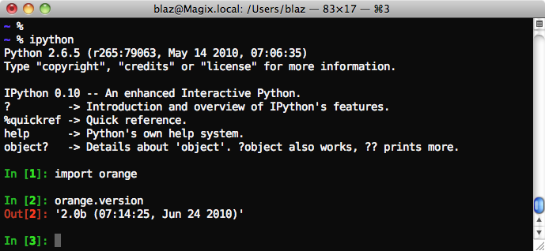

Start with Python and Orange
============================

To start with Python and Orange scripting, you will first need to `download
<http://orange.biolab.si/download/>`_ and install Orange. Python scripts can
be run in a terminal window, integrated environments
like `PyCharm<http://www.jetbrains.com/pycharm/>`_ and `PythonWin<http://wiki.python.org/moin/PythonWin>`_,
or shells like `iPython<http://ipython.scipy.org/moin/>`_. This tutorial will run the
Python code in the
terminal
window:

.. image:: files/python_win.png
   :alt: Orange in PythonWin

and a similar screenshot for iPython (use <TAB> key for code
completion):

Whichever environment you are using, try now to import Orange (just
type import Orange, brackets are in the following to denote shell's
prompt):

>>> import orange
>>> 

If this leaves no error and warning, Orange and python are properly
installed and you are ready to continue with this Tutorial.
