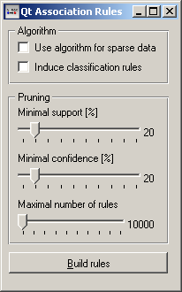

.. _Association Rules:

Association Rules
=================

.. image:: ../icons/AssociationRules.png

Construction of Association Rules

Signals
-------

Inputs:
   - Examples (ExampleTable)
      A table with training examples

Outputs:
   - Association Rules
      Induced rules.

Description
-----------

This widget runs several algorithms for induction of association rules: the original Agrawal's algorithm for sparse data sets, a modified version by Zupan and Demsar which is more suitable for the usual machine learning data, and, finally, an algorithm which induces classification rules where the right-hand side of the rule is always the class attribute. Don't confuse the latter algorithm with rule induction like `Association Rules Tree Viewer <AssociationRulesTreeViewer.htm>`_.

The first check box, :obj:`Induce classification rules` allows you to specify the algorithm to use. If checked, the original Agrawal's algorithm is used, which is designed for (very) sparse data sets. If clear, it will use an algorithm which works better on the usual machine learning data where each example is described by a (smaller) list of attributes and there are not many missing values.

Next, you can decide whether to :obj:`Induce classification rules` or ordinary association rules. The former always have the class attribute (and nothing else) on the right-hand side. You can combine this with any of the above two algorithms.

As for pruning, you can specify the :obj:`Minimal support` and :obj:`Minimal confidence`, where support is percentage of the entire data set covered by the (entire) rule and the confidence is the proportion of the number of examples which fit the right side among those that fit the left side. The running time depends primarily on the support.

If support is set too low, the algorithm may find too many rules and eventually run out of memory. For this reason the number of rules is by default limited to 10000. You can increase the limit at a risk of running out of memory.

:obj:`Build rules` runs the algorithm and outputs the induced rules. You need to push this button after changing any settings.

Examples
--------

This widget is typically used with the `Association Rules Tree Viewer <AssociationRulesTreeViewer.htm>`_ and/or `Association Rules Tree Viewer <AssociationRulesTreeViewer.htm>`_. One possible schema is shown below.

.. image:: images/AssociationRules-Schema.png
   :alt: Association Rules
