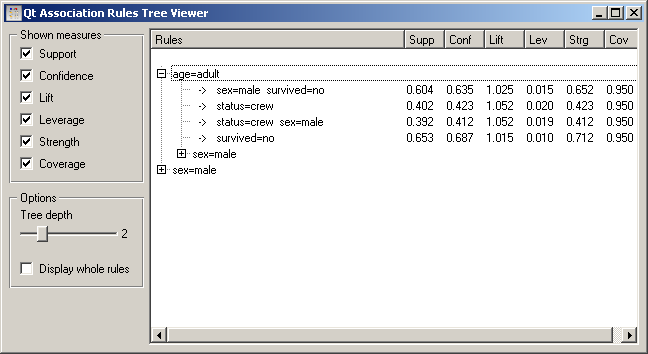

.. _Association Rules Explorer:

Association Rules Tree Viewer
=============================

.. image:: ../icons/AssociationRulesExplorer.png

A tree-like association rules viewer

Signals
-------

Inputs:
   - Association Rules
      A list of rules

Outputs:
   - None

Description
-----------

This widget is a tree-like association rules viewer.

The widget can be used to find all the rules that include a particular
condition on the left-hand side. The below snapshot is made on the Titanic
data set, using the filter as shown on the page on the
:ref:`Association Rules Filter`.

.. image:: images/AssociationRulesTreeViewer-closed.png
   :alt: Association Rules Tree Viewer Widget

Say that we are interested in rules regarding the survival of adults. By
opening the branch "age=adult", we discover four rules that contain this
condition as the sole condition on the left-hand side, while the right-hand
sides contain different combinations of sex, status and survival.

Besides that, there are rules with (at least) two conditions on the
left-hand side, "age=adult" and "sex=male"; to explore these rules,
we would need to open the corresponding branch.

Each leaf of the tree corresponds to one particular ordering of the
left-hand side conditions in a particular rule. Turned around, this
means that each rule appears in many places in the tree. As the completely
open tree below shows, the rule "age=adult & sex=male -> status=crew"
appears in two places (the seventh and the eleventh row).

On the left-hand side of the widget, we can choose the measures we want
to observe. Let L, R and B be the number of examples that fit the left,
the right and both sides of the rule, respectively, and N the total number
of examples in the data set. The measures are then defined as follows

   - confidence = B / L
   - confidence = B / L
   - coverage = L / N
   - strength = R / L
   - lift = N * B / (L * R)
   - leverage = N * B - L * R

:obj:`Tree depth` sets the depth to which the tree is expanded. If, it is set
to, for instance, three, then the leaves corresponding to rules with five
conditions will, besides the right-hand side, also contain the two conditions
which are not shown in the branches.

With :obj:`Display whole rules` we can decide whether we want the entire rule
(including the information that is already contained in the branches, that
is, in the path from the root to the rule) reprinted again in the leaf.

Examples
--------

This widget is typically used with the :ref:`Association Rules` and possibly
:ref:`Association Rules Filter`. A typical schema is shown below.

.. image:: images/AssociationRules-Schema.png
   :alt: Association Rules
