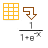
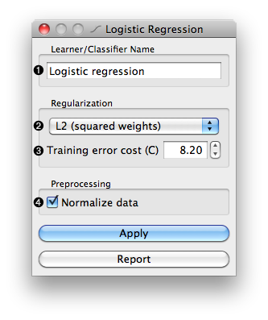

.. _Logistic Regression:

Logistic Regression Learner
===========================

Logistic Regression Learner

Signals
-------

Inputs:

   - Examples (ExampleTable)
      A table with training examples

Outputs:

   - Learner
      The logistic regression learning algorithm with settings as specified
      in the dialog.

   - Logistic Regression Classifier
      Trained classifier (a subtype of Classifier)

Signal :obj:`Logistic Regression Classifier` sends data only if the learning
data (signal :obj:`Examples` is present.

Description
-----------

This widget provides a graphical interface to the logistic regression
classifier.

As all widgets for classification, this widget provides a learner and
classifier on the output. Learner is a learning algorithm with settings
as specified by the user. It can be fed into widgets for testing learners,
for instance :ref:`Test Learners`. Classifier is a logistic regression
classifier (a subtype of a general classifier), built from the training
examples on the input. If examples are not given, there is no classifier
on the output.

The widget requires - due to limitations of the learning algorithm - data with
binary class.

Learner can be given a name under which it will appear in, say,
:ref:`Test Learners`. The default name is "Logistic Regression".

If :obj:`Stepwise attribute selection` is checked, the learner will
iteratively add and remove the attributes, one at a time, based on their
significance. The thresholds for addition and removal of the attribute are
set in :obj:`Add threshold` and :obj:`Remove threshold`. It is also possible
to limit the total number of attributes in the model.

Independent of these settings, the learner will always remove singular
attributes, for instance the constant attributes or those which can be
expressed as a linear combination of other attributes.

Logistic regression has no internal mechanism for dealing with missing
values. These thus need to be imputed. The widget offers a number of options:
it can impute the average value of the attribute, its minimum and maximum or
train a model to predict the attribute's values based on values of other
attributes. It can also remove the examples with missing values.

Note that there also exist a separate widget for missing data imputation,
:ref:`Impute`.

Examples
--------

The widget is used just as any other widget for inducing classifier. See,
for instance, the example for the :ref:`Naive Bayes`.
