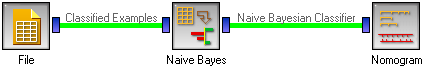

.. _Nomogram:

Nomogram
========

.. image:: ../icons/Nomogram.png

Nomogram

Signals
-------

Inputs:
   - Classifier (orange.Classifier)
      A classifier (either naive Bayesian classifier or logistic regression)

Outputs:
   - None

Description
-----------

Nomogram is a simple and intuitive, yet useful and powerful representation of
linear models, such as logistic regression and naive Bayesian classifier. In
statistical terms, the nomogram plots log odds ratios for each value of each
attribute. We shall describe its basic properties here, though we recommend
reading the paper in which we introduced the nomograms for naive Bayesian
classifier, `Nomograms for Visualization of Naive Bayesian Classifier`_. This
description will show the nomogram for a naive Bayesian classifier; nomograms
for other types of classifiers are similar, though they lack some functionality
due to inherent limitations of these models.

.. _Nomograms for Visualization of Naive Bayesian Classifier: http://www.ailab.si/blaz/papers/2004-PKDD.pdf

The snapshot below shows a naive Bayesian nomogram for the heart disease data.
The first attribute, gender, has two values, where log odds ratio for
females is -1 (as read from the axis on the top) and for males it is around
0.4. For the next attribute, the type of chest pain, the asymptotic pain
votes for the target class (having narrowed vessels), and the other three
have negative odds of different magnitudes. Note that these are odds for
naive Bayesian classifier, where, unlike in logistic regression, there is
no "base value" which would have a odds ratio of zero.

.. image:: images/Nomogram.png

The third attribute, SBP at rest, is continuous. To get log odds ratios
for a particular value of the attribute, find the value (say 175) of the
vertical axis to the left of the curve corresponding to the attribute. Then
imagine a line to the left, at the point where it hits the curve, turn
upwards and read the number on the top scale. The SBP of 175 has log odds
ration of approximately 1 (0.93, to be precise). The curve thus shows a
mapping from attribute values on the left to log odds at the top.

Nomogram is a great data exploration tool. Lengths of the lines correspond
to spans of odds ratios, suggesting importance of attributes. It also shows
impacts of individual values; being female is good and being male is bad
(w.r.t. this disease, at least); besides, being female is much more
beneficial than being male is harmful. Gender is, however, a much less
important attribute than the maximal heart rate (HR) with log odds from
-3.5 to +2.2. SBP's from 125 to 140 are equivalent, that is, have the
same odds ratios...

.. image:: images/Nomogram-predictions.png

Nomograms can also be used for making probabilistic prediction. A sum
of log odds ratios for a male with asymptomatic chest pain, a rest
SBP of 100, cholesterol 200 and maximal heart rate 175 is
`0.38 + 1.16 + -0.51 + -0.4 = -0.58`, which corresponds to a probability
32 % for having the disease. To use the widget for classification,
check :obj:`Show predictions`. The widget then shows a blue dots on
attribute axes, which can be dragged around - or left at the zero-line
if the corresponding value is unknown. The axes at the bottom then show
a mapping from the sum of log odds to probabilities.

Now for the settings. Option :obj:`Target Class` defines the target class,
Attribute values to the right of the zero line represent arguments for
that class and values to the left are arguments against it.

Log odds for naive Bayesian classifier are computed so that all values
can have non-zero log odds. The nomogram is drawn as shown above, if
alignment is set to :obj:`Align by zero influence`. If set to
:obj:`Align left`, all attribute axes are left-aligned. Logistic regression
compares the base value with other attribute values, so the base value
always has log odds ratio of 0, and the attribute axes are always aligned
to the left.

The influence of continuous attribute can be shown as two dimensional
curves (:obj:`2D curve`) or with the values projected onto a single line
(:obj:`1D projection`). The latter make the nomogram smaller, but can be
unreadable if the log odds are not monotonous. In our sample, the
nomogram would look OK for the heart rate and SBP, but not for cholesterol.

The widget can show either log odds ratios (:obj:`Log odds ratios`),
as above, or "points" (:obj:`Point scale`). In the latter case, log OR
are simply scaled to the interval -100 to 100 for easier (manual)
calculation, for instance, if one wishes to print out the nomogram
and use it on the paper.

:obj:`Show prediction` puts a blue dot at each attribute which we
can drag to the corresponding value. The widget sums the log odds
ratios and shows the probability of the target class on the bottom
axes. :obj:`Confidence intervals` adds confidence intervals for the
individual log ratios and for probability prediction. :obj:`Show histogram`
adds a bar whose height represents the relative number of examples for
each value of discrete attribute, while for continuous attributes the
curve is thickened where the number of examples is higher.

.. image:: images/Nomogram-histograms.png

For instance, for gender the number of males is about twice as big than
the number of females, and the confidence interval for the log OR is
correspondingly smaller. The histograms and confidence intervals also
explain the strange finding that extreme cholesterol level (600) is healthy,
healthier than 200, while really low cholesterol (50) is almost as bad as
levels around 300. The big majority of patients have cholesterol between
200 and 300; what happens outside this interval may be a random effect,
which is also suggested by the very wide confidence intervals.

Examples
--------

To draw a nomogram, we need to get some data (e.g. from the
:ref:`File` widget, induce a classifier and give it to the nomogram.

