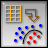

.. _SVM:

SVM Learner
===========

Support vector machine learner (classification)

Signals
-------

Inputs:

   - Examples
      A table with training examples

Outputs:

   - Learner
      The support vector machine learning algorithm with settings as specified in the dialog.

   - Classifier
      Trained SVM classifier

   - Support Vectors
      A subset of data instances from the training set that were used as support vectors in the trained classifier

Description
-----------

Support vector machines (SVM) is a popular classification technique that will construct a separating hyperplane in the attribute space which maximizes the margin between the instances of different classes. The technique often yields supreme predictive performance results. Orange embeds a popular implementation of SVM in `LIBSVM <http://www.csie.ntu.edu.tw/~cjlin/libsvm/>`_ package, and this widget provides for a graphical user interface to its functionality. It also behaves like a typical Orange learner widget: on its output, it presents an object that can learn and is initialized with the setting specified in the widget, or, given the input data set, also a classifier that can be used to predict classes and class probabilities given a set of new examples.

.. image:: images/SVM.png
   :alt: Support vector machines widget

Learner can be given a name under which it will appear in other widgets that use its output, say, in `Test Learners <../Evaluate/TestLearners.htm>`_. The default name is simply "SVM".

The next block of options deals with kernel, that is, a function that transforms attribute space to a new feature space to fit the maximum-margin hyperplane, thus allowing the algorithm to create non-linear classifiers. The first kernel in the list, however, is a :obj:`Linear` kernel that does not require this trick, but all the others (:obj:`Polynomial`, :obj:`RBF` and :obj:`Sigmoid`) do. Specific functions that specify the kernel are presented besides their names, and the constants involved:

:obj:`g` for the gamma constant in kernel function (the recommended value is 1/k, where k is the number of the attributes, but since there may be no training set given to the widget the default is 0 and the user has to set this option manually), :obj:`d`) for the degree of the kernel (default 3), and :obj:`c` for the constant c0 in the kernel function (default 0).

:obj:`Options` control other aspects of the SVM learner. :obj:`Model complexity (C)` (penalty parameter), :obj:`Tolerance (p)` and :obj:`Numeric precision (eps)` are options that define the optimization function; see `LIBSVM <http://www.csie.ntu.edu.tw/~cjlin/libsvm/>`_ for further details. The other three options are used to instruct the learner to prepare the classifier such that it would estimate the class probability values (:obj:`Estimate class probabilities`), constrain the number of the support vectors which define the maximum-margin hyperplane (:obj:`Limit the number of support vectors`) and normalize the training and later the test data (:obj:`Normalize data`). The later somehow slows down the learner, but may be essential in achieving better classification performance.

The last button in the SVM dialog is :obj:`Automatic parameter search`. This is enabled when the widget is given a data set, and uses `LIBSVM <http://www.csie.ntu.edu.tw/~cjlin/libsvm/>`_'s procedures to search for the optimal value of learning parameters. Upon completion, the values of the parameters in the SVM dialog box are set to the parameters found by the procedure.

Examples
--------

There are two typical uses of this widget, one that uses it as a classifier and the other one that uses it to construct an object for learning. For the first one, we have split the data set to two data sets (:obj:`Sample` and :obj:`Remaining Examples`). The sample was sent to :obj:`SVM` which produced a :obj:`Classifier`, that was then used in :obj:`Predictions` widget to classify the data in :obj:`Remaning Examples`. A similar schema can be used if the data would be already separated in two different files; in this case, two :obj:`File` widgets would be used instead of the :obj:`File`-:obj:`Data Sampler` combination.

.. image:: images/SVM-Predictions.png
   :alt: SVM - a schema with a classifier

The second schema shows how to use the :obj:`SVM` widget to construct the learner and compare it in cross-validation with :obj:`Majority` and :obj:`k Nearest Neighbors` learners.

.. image:: images/SVM-Evaluation.png
   :alt: SVM and other learners compared by cross-validation

The following schema observes a set of support vectors in a :obj:`Scatterplot` visualization.

.. image:: images/SVM-SupportVectors.png
   :alt: Visualization of support vectors

For the above schema to work correctly, the channel between :obj:`SVM` and :obj:`Scatterplot` widget has to be set appropriately. Set the channel between these two widgets by double-clinking on the green edge between the widgets, and use the settings as displayed in the dialog below.

.. image:: images/SVM-SupportVectorsOutput.png
   :alt: Channel setting for communication of support vectors
