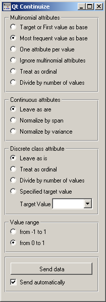

.. _Continuize:

Continuize
==========

.. image:: ../icons/Continuize.png

Turns discrete attributes into continuous dummy variables.

Signals
-------

Inputs:
   - Examples (ExampleTable)
      Input data set.

Outputs:
   - Examples (ExampleTable)
      Output data set.

Description
-----------

Continuize widget receives a data set on the input and outputs the same data in which the discrete attributes (including binary attributes) are replaced with continuous using the methods specified by the user.

The first box, :obj:`Multinominal attributes`, defines the treatment of multivalued discrete attributes. Say that we have a discrete attribute status with values low, middle and high, listed in that order. Options for its transformation are

   - :obj:`Target or First value as base`: the attribute will be transformed into two continuous attributes, status=middle with values 0 or 1 signifying whether the original attribute had value middle on a particular example, and similarly, status=high. Hence, a three-valued attribute is transformed into two continuous attributes, corresponding to all except the first value of the attribute.

   - :obj:`Most frequent value as base`: similar to the above, except that the data is analyzed and the most frequent value is used as a base. So, if most examples have the value middle, the two newly constructed continuous attributes will be status=low and status=high.

   - :obj:`One attribute per value`: this would construct three continuous attributes out of a three-valued discrete one.

   - :obj:`Ignore multinominal attributes`: removes the multinominal attributes from the data.

   - :obj:`Treat as ordinal:` converts the attribute into a continuous attribute with values 0, 1, and 2.

   - :obj:`Divide by number of values:` same as above, except that the values are normalized into range 0-1. So, our case would give values 0, 0.5 and 1.

Next box defines the treatment of continuous attributes. You will usually prefer :obj:`Leave as is` option. The alternative is :obj:`Normalize by span` which will subtract the lowest value found in the data and divide by the span, so all values will fit into [0, 1]. Finally, :obj:`Normalize by variance` subtracts the average and divides by the variance.

Finally, you can decide what happens with the class if it is discrete. Besides leaving it as it is, there are also the options which are available for multinominal attributes, except for those options which split the attribute into more than one attribute - this obviously cannot be supported since you cannot have more than one class attribute. Additionally, you can :obj:`specify a target value`; this will transform the class into a continuous attribute with value 1 if the value of the original attribute equals the target and 0 otherwise.

With :obj:`value range`, you can define the values of the new attributes. In the above text we supposed the range :obj:`from 0 to 1`. You can change it to :obj:`from -1 to 1`.

If :obj:`Send automatically` is set, the data set is committed on any change. Otherwise, you have to press :obj:`Send data` after each change.

Examples
--------

The schema below shows a typical use of this widget: in order to properly plot linear projection of the data, discrete attributes need to be converted to continuous, therefore we put the data through Continuize widget before drawing it. Attribute "chest pain" originally had four values and was transformed into three continuous attributes; similar happened to gender, which was transformed into a single attribute gender=female.

.. image:: images/Continuize-Schema.png
