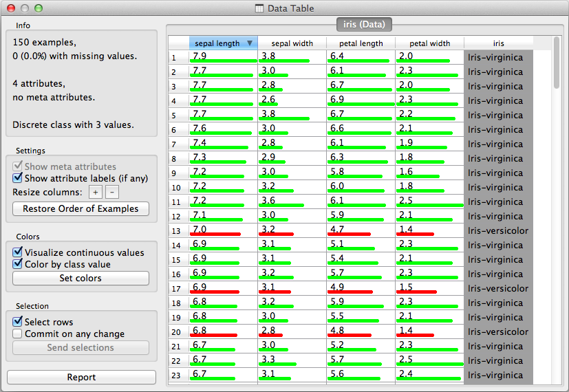

.. _Data Table:

Data Table
==========

.. image:: images/DataTable_icon.png
   :alt: Data Table icon
  
Signals
-------

Inputs:
    - Examples (ExampleTable)
        Attribute-valued data set.
      
Outputs:
    - Selected Examples (Example Table)
        Selected data instalces
        
Description
-----------
    
Data Table widget takes one or more data sets on its input, and presents
them in a spreadsheet format. Widget supports sorting by attribute 
values (click on the attribute name in the header row). 

Examples
--------

We used two :ref:`File` widgets, read the iris and glass data set (provided in Orange distribution), and send them to the Data Table widget.

.. image:: images/DataTable_schema.png
   :alt: Example data table schema
   
A snapshot of the widget under these settings is shown below.

