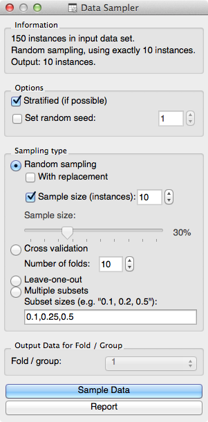

.. _Data Sampler:

Data Sampler
============

.. image:: ../icons/DataSampler.png

Selects a subset of data instances from the input data set.

Signals
-------

Inputs:

   - Examples (ExampleTable)
      Attribute-valued data set.

Outputs:

   - Sample (ExampleTable)
      Attribute-valued data set as sampled from the input data.
   - Remaining Examples (ExampleTable)
      Data instances from input data set that are not included in the sampled data.

Description
-----------

Data Sampler supports provides support for several means of
sampling of the data from the input channel and outputs the sampled
data set and complementary data set (with instances from the input set
that are not included in the sampled data set). Output is set when the
input data set is set to the widget or after :obj:`Sample Data` is
pressed.

Sampling may be stratified: if input data contains a class,
sampling will try to match its class distribution in the output data
sets.

Several types of sampling are supported. :obj:`Random
sampling` can draw a
fixed number of instances or create a data set with a size set as
a proportion of instances from the input data set. In repeated
sampling, an data instance may be included in a sampled data several
times (like in bootstrap).

:obj:`Cross validation`,
:obj:`Leave-one-out` or sampling that creates
:obj:`Multiple subsets` of preset sample sizes relative to the input data set
(like random sampling) all create several data samples. Which one is
send to the output is determined by the data set index in :obj:`Fold/Group`
(indices start with 1).

Examples
--------

Schema where we have sampled 10 data instances from Iris data set
and presented this selection in Scatterplot widget is shown
below.

.. image:: images/DataSampler-Example-S.gif
   :alt: Schema with Data Sampler
