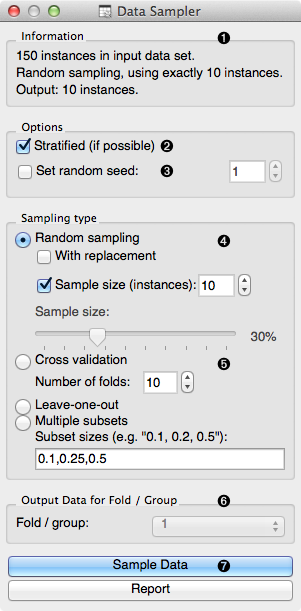
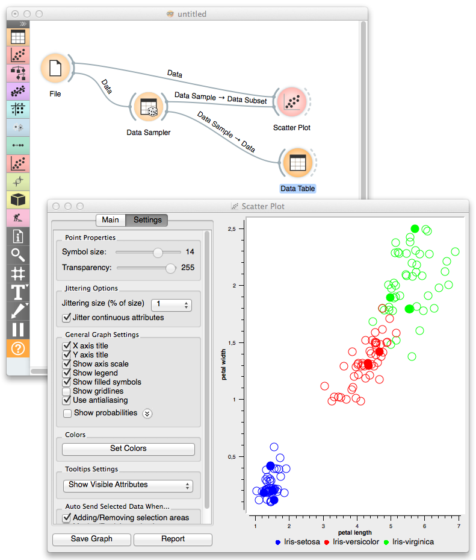

.. _Data Sampler:

Data Sampler
============

.. image:: ../../../../Orange/OrangeWidgets/Data/icons/DataSampler.svg
   :alt: Data Sampler icon
   :class: widget-category-data widget-icon

Selects a subset of data instances from the input data set.

Signals
-------

Inputs:
    - :obj:`Data`
        Input data set to be sampled.

Outputs:
    - :obj:`Data Sample`
        A set of sampled data instances.
    - :obj:`Remaining Data`
        All other data instances from input data set that are not included
        in the sample.

Description
-----------

Data Sampler implements several means of
sampling of the data from the input channel. It outputs the sampled
data set and complementary data set (with instances from the input set
that are not included in the sampled data set). Output is set when the
input data set is provided and after :obj:`Sample Data` is
pressed.

.. rst-class:: stamp-list

   1. Info on input and output data set.
   #. If input data contains a class, sampling will try to match
      its class distribution in the output data sets.
   #. Set random seed to always obtain the same sample given a choice of
      data set and sampling parameters.
   #. :obj:`Random sampling` can draw a
      fixed number of instances or create a data set with a size set as
      a proportion of instances from the input data set. In repeated
      sampling, an data instance may be included in a sampled data several
      times (like in bootstrap).
   #. :obj:`Cross validation`, :obj:`Leave-one-out` or sampling that creates
      :obj:`Multiple subsets` of preset sample sizes relative to the input
      data set (like random sampling) all create several data samples.
      Cross validation would split the data to equally-sized subsets
      (:obj:`Number of folds`), and consider one of these as a sample.
      Leave-one-out randomly chooses one data instance; all other instances
      go to :obj:`Remaining Data` channel. Multiple subsets can create subset
      of different sizes.
   #. For sampling methods that create different data subsets, this
      determines which subset is pushed to the :obj:`Data Sample` channel.
   #. Press :obj:`Sample Data` to push the sample to the output
      channel of the widget.

.. container:: clearer

   .. image :: images/spacer.png

Example
-------

In the following workflow Schema where we have sampled 10 data instances
from Iris data set and send original data and the sample
to Scatterplot widget. Sampled data instances are plotted with filled circles.

