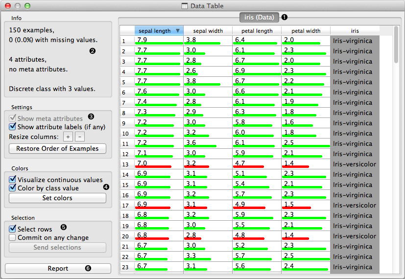
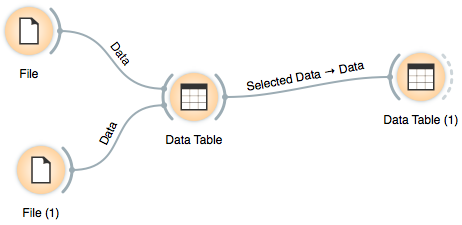
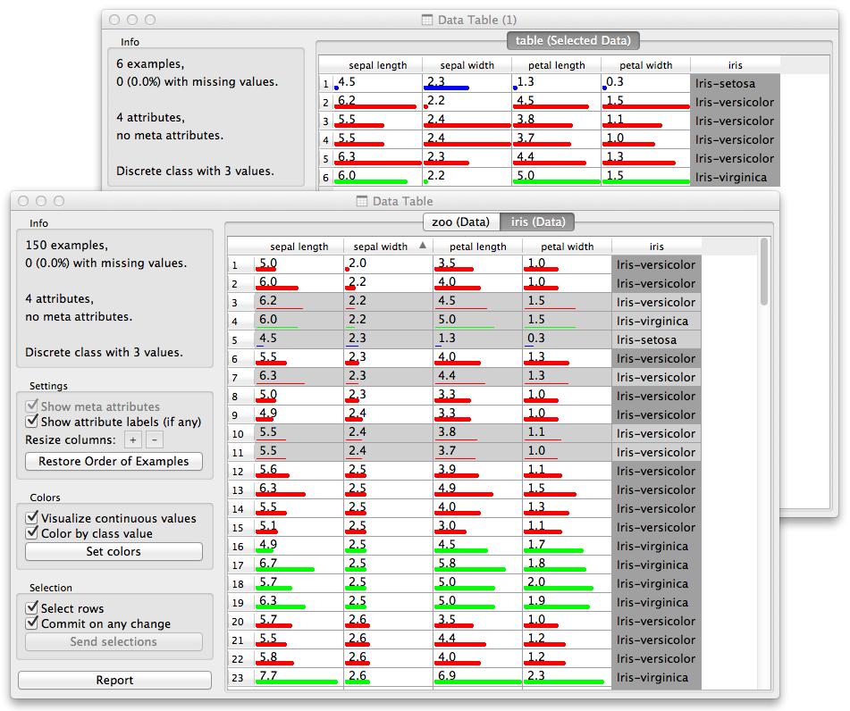

.. _Data Table:

Data Table
==========

Displays attribute-value data in a spreadsheet.

Signals
-------

Inputs:
    - :obj:`Data`
        Attribute-valued data set.

Outputs:
    - :obj:`Selected Data`
        Selected data instances.

Description
-----------

Data Table widget receives one or more data sets on its input and presents
them in a spreadsheet format. Data instances may be sorted by attribute
values. Widget also supports manual selection of data instances.

.. rst-class:: stamp-list

1. The name of the data set (e.g., inherited from the name of the
   input data file) with a table of data instances (in rows)
   and their attribute values (columns). In the example shown the data set
   is sorted by the attribute "sepal length".
#. Info on current data set size and the number and types of attributes.
#. Meta attributes are not included in this example data set,
   the corresponding option is dimmed.
   Use "Restore Order" button to reorder data instance after attribute-based
   sorting.
#. Values of continuous attributes can be visualized with bars.
#. Data instances (rows) can be selected and sent to the widget's output
   channel.
#. Adds an entry with the entire data table to the current report.

Example
-------

We used two :ref:`File` widgets, read the iris and glass data set (provided in
Orange distribution), and send them to the Data Table widget.

Selected data instances in the first Data Table are passed to the second
Data Table. Notice that we can select which data set to view (iris or zoo);
change from one data set to another alters the communicated
selection of the data instances if "Commit on any change is selected".

