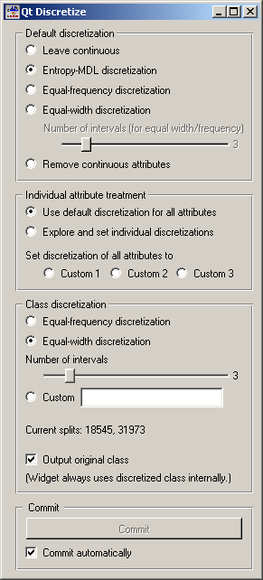
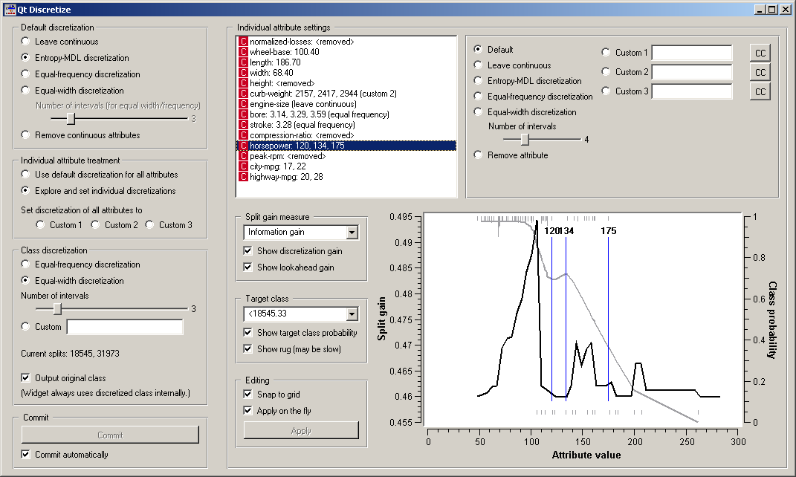

.. _Discretize:

Discretize
==========

.. image:: ../icons/Discretize.png

Discretizes continuous attrbutes from input data set.

Signals
-------

Inputs:

   - Examples (ExampleTable)
      Attribute-valued data set.

Outputs:

   - Examples (ExampleTable)
      Attribute-valued data set composed from instances from input data set that match user-defined condition.

Description
-----------

Discretize widget receives data set on the input, finds
attributes that are continuous and discretizes them using selected
method. It then outputs the same data set with continuous attributes
replaced by their discretized version.

The basic version of the widget is rather simple. It allows choosing between three
different discretizations. :obj:`Entropy-MDL`, invented by
Fayyad and Irani is a top-down discretization which recursively splits the attribute
at a cut giving the maximal information gain, until the gain is below the minimal
description length of the cut. This discretization can result in an arbitrary number of
intervals, including a single interval in which case the attribute is discarded as useless.
:obj:`Equal-frequency` splits the attribute into the given
:obj:`Number of intervals`, so that each contains approximately the same
number of examples. :obj:`Equal-width` evenly splits the range between
the smallest and the largest observed value.

The widget can also be set to leave the attributes continuous or to remove them.

:obj:`Class discretization` box defines what happens with the class
value if it is continuous. We can use either equal frequency or equal width or set custom
thresholds. The box also shows the current thresholds. In the case on the snapshot, we have a
continuous class which is split into three intervals of equal widths; their boundaries are
at 18545 and 31973.

Since some discretization and other methods supported by the widget need discrete class
values, the class is always discretized. :obj:`Output original class`
decides whether the data produced by the widget will contain the original, continuous dependent
variable or the discretized one.

As usual, the widget can be set to immediately apply any changes or to commit them when
the user presses :obj:`Commit`.

Three discretization methods are supported. Continuous attributes
are either discretized using a set of intervals of the same size
(:obj:`Equal-Width Intervals`), using a set of intervals where interval
borders are defined so that each interval covers approximately equal
number of data instances (:obj:`Equal-Frequency Intervals`). Number of
intervals is user-defined.

A different technique is :obj:`Entropy-based
discretization`, which works only if an input data set includes a
discrete class and finds intervals so that these minimize the entropy
of the class variable (e.g., intervals tend to include instances of
some prevailing class). The algorithm used is that of Fayyad and Irani
(1992). One possible outcome of the algorithm is that no appropriate
cut-off points are found, hence an attribute is reduced to a constant
and can be removed from the data set. Attributes of this kind are
listed under :obj:`Removed Attributes`.

Depending on the user's settings, the widget can display either the
discretization intervals or the cut-off points, that is, interval borders.

Up until now, the same settings were used for all attributes. To treat
each attribute differently, click :obj:`Expxlore and set individual
discretizations`. This opens another part of the widget.

:obj:`Individual attribute settings` shows the specific
discretization of each attribute and allows for changing it. First, the top left
list shows the cut-off points for each attribute. In the snapshot we used the
entropy-MDL discretization which determines the optimal number of intervals
automatically: we see it discretized the length and width into two intervals
with cut-offs at 186.70 and 68.40, respectively, while the horsepower got split
into four intervals with cut-offs at 120, 134 and 175. The height, for instance,
was left with a single interval and thus removed.

Left of the list, we can select a specific discretization method for each attribute.
Attribute "Stroke" would be removed by the MDL-based discretization, so to save him,
we select the attribute and click, for instance, :obj:`Equal-frequency
discretization`. We did the same for "bore", while we decided to keep the "engine-size"
continuous.

Besides using the automatic discretization methods, it is possible to manually enter
a set of cut-off points. One can specify up to three different manual discretizations
for each attribute (:obj:`Custom 1`, :obj:`Custom 2`
:obj:`Custom 3`), for instance to play with different settings
and see their consequences further on in the schema.

A likely scenario would be that an automatic discrezation would find boundaries which
are (unnecessarily) not round numbers, like 97 instead of 100, or they would be close to
some established standard thresholds, like 37.3 C instead of 37 C for body temperature.
Clicking the pastes the current boundaries into the line, where one can edit
them manually.

The bottom part helps to manually determine a set of suitable cut-off points. The graph
can show two curves, discretization gain and the target class probability. Both can be switched
of, by (un)checking :obj:`Show discretization gain` and
:obj:`Show target class probability`, respectively.

Discretization gain is the quality estimate of the attribute if a new cut-off point is added at a specific
attribute value. On the snapshot, if we split the lowest interval at just above 100, the
new, five-interval attribute's information gain would be 0.495 higher than that of the current
four-interval attribute. The widget supports different functions for the
:obj:`Split gain measure`, that is, :obj:`Information
gain`, :obj:`Gini index`, :obj:`chi-square`
(the statistics) and :obj:`chi-square prob.` (the associated probability),
:obj:`ReliefF` and :obj:`Relevance`.

Checking :obj:`Show lookahead gain` adds another curve which shows
what the gain curve would look like after a cut-off at a certain point is added. (To see
what this means, try dragging an existing cut-off. You will see the gain, as it is, and another,
thinner gain line. After releasing the threshold, the thin line becomes the gain line,
except for the scaling.)

The class probability is shown with the grey curve and corresponds to the scale on the
right-hand side of the graph. In case of discrete classes, the target class can be any
of the original classes, while for discretized attributes, it is one of the intervals
(*< 18545.33* in our case). :obj:`Show rug` adds small lines at the bottom
and the top of the graph, which represents histograms showing the number of examples in the
target class (top) and the other classes (bottom). On the snapshot, the examples of the
target class (*< 18545.33*) are concentrated at between 50 and 120, while the rarer examples
of other classes are spread between 100 and 200, with an outlier at 250. Plotting the rug
can be slow if the number of examples is huge.

It is possible to add new cut-offs by clicking on the graph, remove them by right-clicking,
and drag them around. The discretization defined in this way is stored as a custom discretization.
Changes of the thresholds in the graph can be instantaneously copied to the custom line if
:obj:`Apply on the fly` is checked. Otherwise, they are copied only when
the user clicks :obj:`Apply`.

Similar also happens in the other direction: when an attribute is selected in the list,
the corresponding graph, including the thresholds, are shown in the graph, and any changes
of cut-off points are reflected in the graph as well.

Examples
--------

In the schema below we show Iris data set with continuous
attributes (as in original data file) and with discretized attributes.

.. image:: images/Discretize-Example-S.gif
   :alt: Schema with Discretize widget
