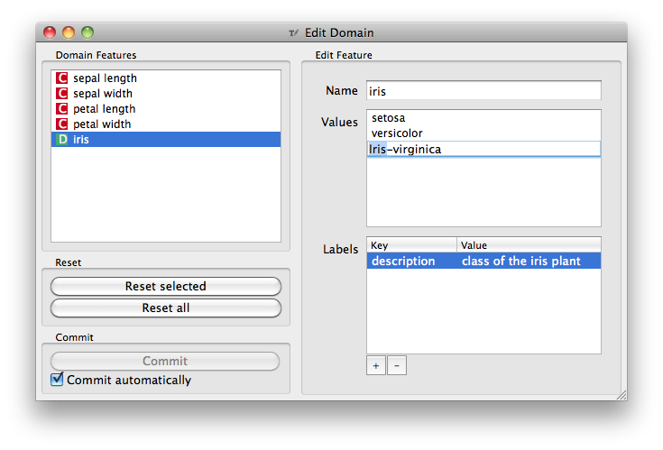

.. _Edit Domain:

Edit Domain
===========

Signals
-------

Inputs:
   - Data (Orange.data.Table)
      Input data set

Outputs
   - Data (Orange.data.Table)
      Edited output data set

Description
-----------

This widget can be used to edit/change the domain of the data set.

All features (including meta attributes) from the :obj:`Data` input data set
are listed in the :guilabel:`Domain Features` list box on the left. Selecting
one feature displays an editor in the right part.

The name of the feature can be changed in the :guilabel:`Name` line edit.

For *Discrete* features the value names can also be changed in the
:guilabel:`Values` list box.

Additonal feature annotations can be added/removed/edited in the
:guilabel:`Labels` box. To add a new label click the :guilabel:`+` button
and add the :guilabel:`Key` and :guilabel:`Value` columns of the new entry.
Selecting an existing label and pressing :guilabel:`-` will remove
the annotation.

To revert the changes made to a feature press :guilabel:`Reset Selected`
button in the :guilabel:`Reset` box while the feature is selected in the
:guilabel:`Domain Features` list. Pressing :guilabel:`Reset All` will reset
all features in the domain at the same time.

Pressing :guilabel:`Commit` button will send the changed domain data set on
the :obj:`Data` output channel.