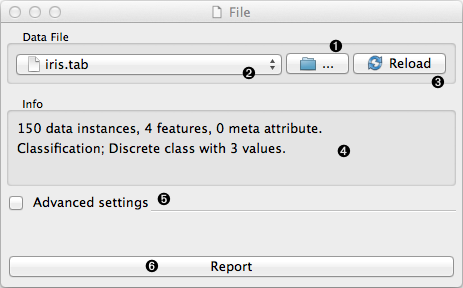
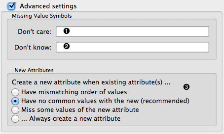

.. _File:

File
====

Reads attribute-value data from an input file.
   
Signals
-------

Inputs:
   - (None)

Outputs:
   - :obj:`Data`
         Attribute-valued data set read from the input file.

.. _my-reference-label:

Description
-----------

File widget reads the input data file (data table with data instances)
and sends the data set to its output channel. It maintains
a history of most recently opened files. For convenience, the history also
includes a directory with the sample data sets that come
pre-installed with Orange.

The widget reads data from simple tab-delimited or comma-separated files,
as well as files in
`Weka's arrf format <http://www.cs.waikato.ac.nz/~ml/weka/arff.html>`_.

.. rst-class:: stamp-list

   1. Browse for a data file.
   #. Browse through previously opened data files, or load any of the sample data
      files.
   #. Reloads currently selected data file.
   #. Information on loaded data set (data set size, number and types of
      data features).
   #. Opens a sub-window with advanced settings.
   #. Adds a report on data set info (size, features).

.. container:: clearer

    .. image :: images/spacer.png

Advanced Options
----------------

.. rst-class:: stamp-list

   1. Symbol for don't care data entry.
   #. Symbol for don't know data entry.
   #. Settings for treatment of feature names in the feature space of Orange.

.. container:: clearer

    .. image :: images/spacer.png

Tab-delimited data file can include user defined symbols for undefined
values. The symbols for "don't care" and "don't know" values can be
specified in the corresponding edit lines.  The default values for
"don't know" and "don't care" depend upon format. Most users will use
tab-delimited files: keep the field empty or put a question mark in
there and that's it. Most algorithms do not differ between don't know
and don't care values, so consider them both to mean undefined.

Orange will usually treat the attributes with the same name but
appearing in different files as the same attribute, so a classifier
which uses the attribute "petal length" from the first will use the
attribute of the same name from the second. In cases when attributes
from different files just accidentally bear different names, one can
instruct Orange to either always construct new attribute or construct
them when they differ in their domains. Use the options on dealing
with new attributes with great care (if at all).

Example
-------

Most Orange workflows would probably start with the File widget. In
the schema below, the widget is used to read the data that is sent to
both :ref:`Data Table` widget and to widget that displays
:ref:`Attribute Statistics`.

.. image:: images/File-Workflow.png
   :alt: Example schema with File widget
