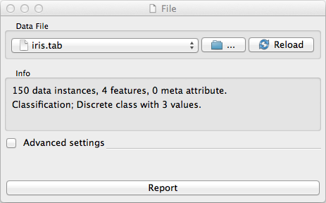
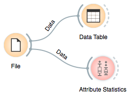

.. _File:

File
====

.. image:: images/File_icon.png
   :alt: File widget icon
   
Signals
-------

Inputs:
   - None

Outputs:
   - Examples (ExampleTable)
       	Attribute-valued data set read from the input file.

Description
-----------

   
This is the widget you will probably use in every schema. It reads the input data file 
(data table with examples) and sends the data set to the output channel. It maintains
a history of most recently used data files. For convenience, the history also includes 
a directory with the sample data sets that come with Orange.

To browse for a data file press .... Reload button reloads the file.

The widget can read data from simple tab-delimited or comma-separated files, as well as
files in C4.5 format and Weka's .arrf files.

The info box at the bottom of the widget displays information on the number of examples, 
attributes and meta attributes, and information on class variable (if defined in a file).

The controls in between are for more advanced users.

Tab-delimited file can have user defined symbols for undefined values. The symbols for 
"don't care" and "don't know" values can be specified in the corresponding edit lines. 
The default values for "don't know" and "don't care" depend upon format. Most users will 
use tab-delimited files: keep the field empty or put a question mark in there and that's 
it. Most algorithms do not differ between don't know and don't care values, so consider 
them both to mean undefined.

The part which most will probably neither understand nor need is related to construction 
of new attributes. It becomes important when multiple data sets are loaded, usually with 
multiple File widgets. A typical example is loading separate training and testing data 
from two files. In this case Orange will usually treat the attributes with the same name 
but appearing in different files as the same attribute, so a classifier which uses the 
attribute "petal length" from the first will use the attribute of the same name from 
the second. In cases when attributes from different files just accidentally bear different 
names, one can instruct Orange to either always construct new attribute or construct them when 
they differ in their domains. Use this option with great care (if at all).

Examples
--------

Any of your schemas should probably start with the File_ widget. In the schema below, 
the widget is used to read the data that is then sent to both :ref:`Data Table` widget and 
to widget that displays :ref:`Attribute Statistics`.

