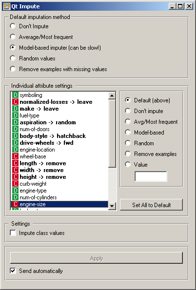

.. _Impute:

Impute
======

.. image:: ../icons/Impute.png

Replaces unknown values in the data.

Signals
-------

Inputs:

   - Examples (ExampleTable)
      Data set.

   - Learner for Imputation
      A learning algorithm to be used when values are imputed using a predictive model. This algorithm, if given, substitutes the default (1-NNLearner).

Outputs:

   - Examples (ExampleTable)
      The same data set as on the input, but with the missing values imputed.

Description
-----------

Some Orange's algorithms and visualization cannot handle unknown values in the data. This widget does what statistician call imputation: it substitutes them by values computed from the data or set by the user.

In the top-most box, :obj:`Default imputation method`, the user can specify a general imputation technique for all attributes.

   - :obj:`Don't Impute` does nothing with the missing values.

   - :obj:`Average/Most-frequent` uses the average value (for continuous attributes) or the most common value (for discrete attributes).

   - :obj:`Model-based imputer` constructs a model for predicting the missing value based on values of other attributes; a separate model is constructed for each attribute. The default model is 1-NN learner, which takes the value from the most similar example (this is sometimes referred to as hot deck imputation). This algorithm can be substituted by one that the user connects to the input signal :obj:`Learner for Imputation`. Note, however, that if there are discrete and continuous attributes in the data, the algorithm needs to be capable of handling them both; at the moment only kNN learner can do that. (In the future, when Orange has more regressors, Impute widget may have separate input signals for discrete and continuous models.)

   - :obj:`Random values` computes the distributions of values for each attribute and then imputes by picking random values from them.

   - :obj:`Remove examples with missing values` removes the example containing missing values, except for the attributes for which specific actions are defined as described below. This check also applies to the class attribute if :obj:`Impute class values` is checked.

It is also possible to specify individual treatment for each attribute which override the default treatment set above. One can also specify a manually defined value used for imputation. In the snapshot on the left, we decided not to impute the values of "normalized-losses" and "make", the missing values of "aspiration" will be replaced by random values, while the missing values of "body-style" and "drive-wheels" are replaced by "hatchback" and "fwd", respectively. If the values of "length", "width" or "height" is missing, the example is discarded. Values of all other attributes use the default method set above (model-based imputer, in our case).

Button :obj:`Set All to Default` resets the individual attribute treatments to the default.

Imputing class values is typically not a good practice, so it is off by default. It can be enabled by checking :obj:`Impute class values`. If checked and the default method is to remove the examples with missing values, then also examples with unknown classes are removed; otherwise they are not.

All changes are committed immediately is :obj:`Send automatically` is checked. Otherwise, :obj:`Apply` needs to be pushed to apply any new settings.
