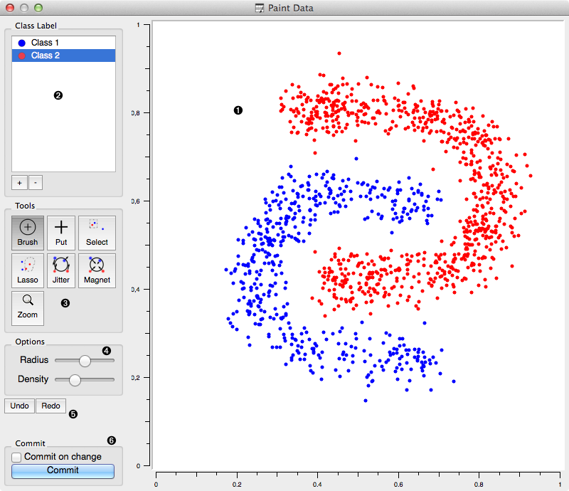
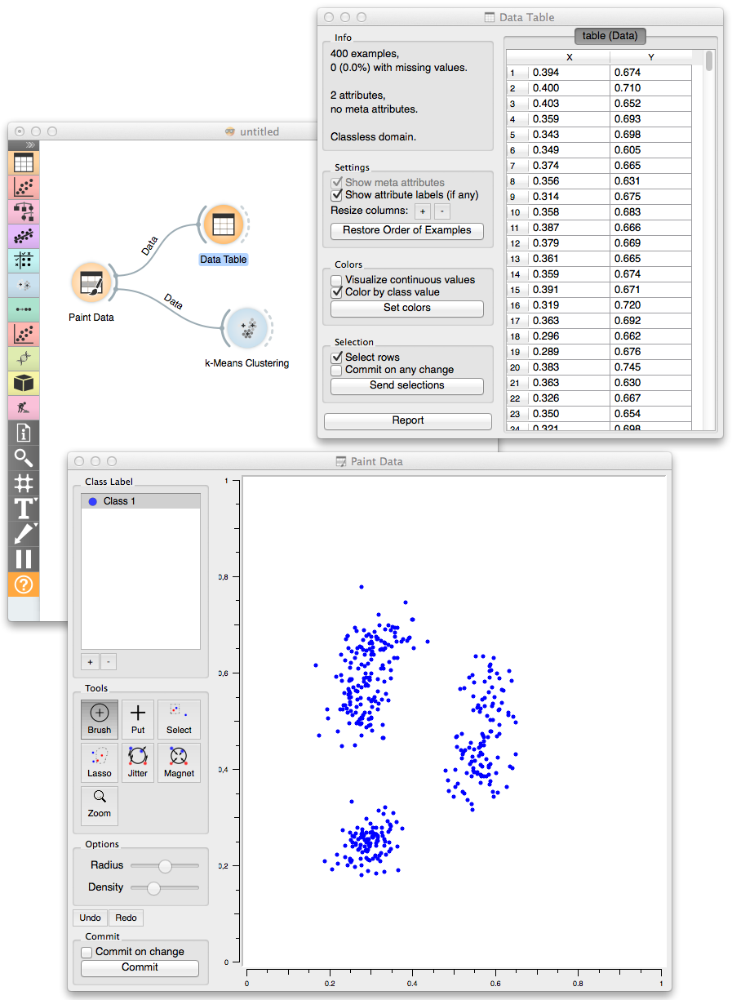

.. _Paint Data:

Paint Data
==========

Paints the data on a 2D plane. Place individual data
points or use brush to paint a larger data sets.
   
Signals
-------

Inputs:
   - (None)

Outputs:
   - :obj:`Data`
         Attribute-valued data set created in the widget.

.. _my-reference-label:

Description
-----------

The widget support the creation of the new data set by visually placing the
data points on the two-dimension plane. Data points can be placed on the
plane individually (:obj:`Put`) or in a larger number by brushing
(:obj:`Brush`). Data points can belong to classes if the data
is intended to be used in supervised learning.

.. rst-class:: stamp-list

   1. A 2D drawing canvas with fixed coordinate system.
   #. Select the class to paint its data instances. Add or remove classes.
      Use one class only to create classless, unsupervised data sets.
   #. Drawing tools. Paint data points with :obj:`Brush` and :obj:`Paint`.
      Select (and then remove or relocate) them with :obj:`Select` or
      :obj:`Lasso`. Reposition data points with :obj:`Jitter` or :obj:`Magnet`.
   #. Each of the tools may have its own options shown in this box.
   #. Undo or redo the editing actions.
   #. If :obj:`Commit on change` is checked, the data would be sent to the
      output channel of the widget upon any change. This operation could be
      slow when data sets become large.

Example
-------

In the workflow below we have painted an unsupervised (class-less) data
set and sent it to :ref:`Data Table` and :ref:`K-Means Clustering` clustering
widget. We have painted three clusters, which were, at least in a number
of clusters correctly identified by the k-means clustering.

