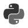
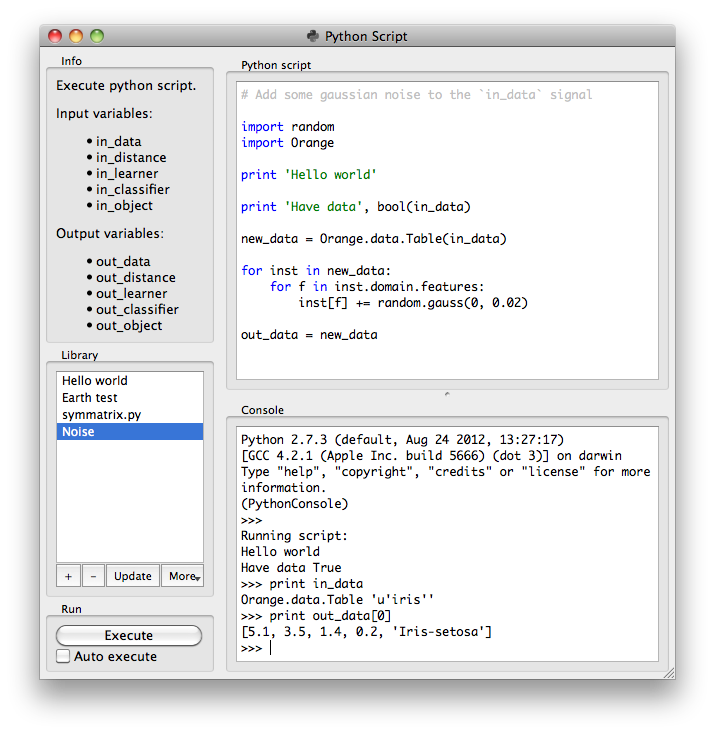

.. _Python Script:

Python Script
=============

Signals
-------

Inputs:

   - in_data (Orange.data.Table)
      Input data set bound to ``in_data`` variable in the script's local
      namespace.

   - in_distance (Orange.core.SymMatrix)
      Input symmetric matrix bound to ``in_distance`` variable in the script's
      local namespace.

   - in_learner (Orange.classification.Learner)
      Input learner bound to ``in_learner`` variable in the script's
      local namespace.

   - in_classifier (Orange.classification.Learner)
      Input classifier bound to ``in_classifier`` variable in the script's
      local namespace.

   - in_object (object)
      Input python object bound to ``in_object`` variable in the script's
      local namespace.

Outputs:

   - out_data (Orange.data.Table)
      Data set retrieved from ``out_data`` variable in the script's local
      namespace after execution.

   - out_distance (Orange.core.SymMatrix)
      Symmetric matrix retrieved from ``out_distance`` variable in the
      script's local namespace after execution.

   - out_learner (Orange.classification.Learner)
      Learner retrieved from ``out_learner`` variable in the script's local
      namespace.

   - out_classifier (Orange.classification.Learner), *Dynamic*
      Classifier retrieved from ``out_classifier`` variable in the script's
      local namespace after execution.

   - out_object (object), *Dynamic*
      Python object retrieved from ``out_object`` variable in the script's
      local namespace after execution.

Description
-----------

`Python Script` widget can be used to run a python script on the inputs,
when a suitable functionality is not implemented in an existing widgets.
The scripts have ``in_data``, ``in_distance``, ``in_learner``,
``in_classifier`` and ``in_object`` varaibles (from input signals) in their
local namespace. If a signal is not connected or it did not yet receive any
data, those variables contain ``None``.

After the script is executed ``out_data``, ``out_distance``, ... variables
from the script's local namespace are extracted and used as outputs of the
widget.

For instance the following script would simply pass on all signals it
receives::

   out_data = in_data
   out_distance = in_distance
   out_learner = in_learner
   out_classifier = in_classifier
   out_object = in_object

.. note:: You should not modify the input objects inplace.

The :guilabel:`Python script` editor on the left can be used to edit
a script (it supports some rudimentary syntax highlighting).

Pressing the :guilabel:`Execute` in the :guilabel:`Run` box executes the
script (using ``exec``). Any script output (from ``print``) is captured
and displayed in the :guilabel:`Console` below the script.

If the :guilabel:`Auto execute` is checked the script is run any time the
inputs to the widget change.

Library
+++++++

The :guilabel:`Library` control can be used to manage multiple scripts.

Pressing :guilabel:`+` will add a new entry and open it in the
:guilabel:`Python script` editor`. When the script is modified its entry in the
:guilabel:`Library` will change to indicate it has unsaved changes. Pressing
:guilabel:`Update` will save the script (keyboard shortcut `ctrl + s`). A
script can be removed by selecting it and pressing the :guilabel:`-` button.
