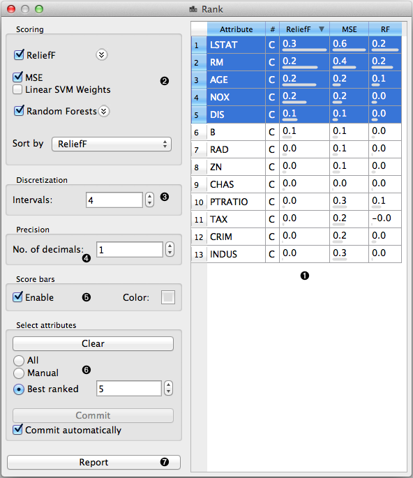
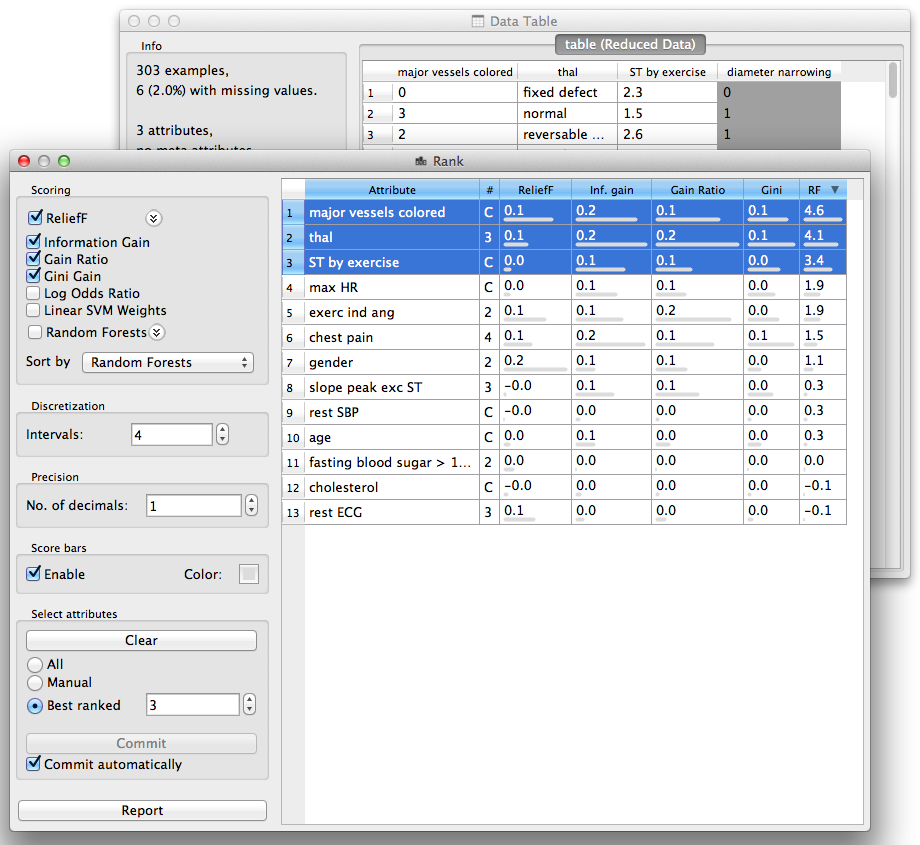
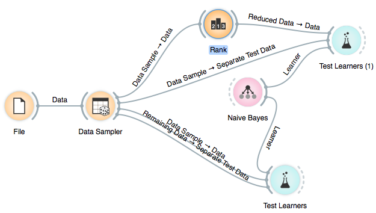

.. _Rank:

Rank
====

.. image:: ../../../../Orange/OrangeWidgets/Data/icons/Rank.svg
   :class: widget-category-data widget-icon

Ranking of attributes in classification or regression data sets.

Signals
-------

Inputs:
   - :obj:`Data`
        Input data set.

Outputs:
   - :obj:`Reduced Data`
        Data set which selected attributes.

Description
-----------

Rank widget considers class-labeled data sets (classification or regression)
and scores the attributes according to their correlation with the
class.

.. rst-class:: stamp-list

   1. Attributes (rows) and their scores by different scoring methods
      (columns).
   #. Scoring techniques and their (optional) parameters.
   #. For scoring techniques that require discrete attributes this is the number
      of intervals to which continues attributes will be discretized to.
   #. Number of decimals used in reporting the score.
   #. Toggles the bar-based visualisation of the feature scores.
   #. Adds a score table to the current report.

Example: Attribute Ranking and Selection
----------------------------------------

Below we have used immediately after the :ref:`File`
widget to reduce the set of data attribute and include only the most
informative one:

.. image:: images/Rank-Select-Schema.png

Notice how the widget outputs a data set that includes only the best-scored
attributes:

Example: Feature Subset Selection for Machine Learning
------------------------------------------------------

Following is a bit more complicated example. In the workflow below we
first split the data into training and test set. In the upper branch
the training data passes through the Rank widget to select the most
informative attributes, while in the lower branch there is no feature
selection. Both feature selected and original data sets are passed to
its own :ref:`Test Learners` widget, which develops a
:ref:`Naive Bayes <Naive Bayes>` classifier and scores it on a test set.

For data sets with many features and naive Bayesian classifier feature
selection, as shown above, would often yield a better predictive accuracy.