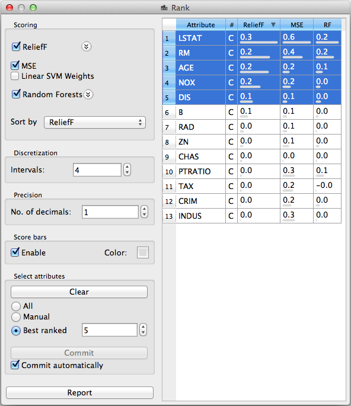

.. _Rank:

Rank
====

.. image:: ../icons/Rank.png

A widget for ranking the attributes and selecting attribute subsets.

Signals
-------

Inputs:

   - Examples (ExampleTable)
      Input data set.

Outputs:

   - Reduced Example Table (ExampleTable)
      Data set which include described by selected attributes.

   - ExampleTable Attributes (ExampleTable)
      Data set in where each example corresponds to an attribute from the original set, and the attributes correspond one of the selected attribute evaluation measures.

Description
-----------

This widget computes a set of measures for evaluating the quality/usefulness of attributes: ReliefF, information gain, gain ratio and gini index. Besides providing this information, it also allows user to select a subset of attributes or it can automatically select the specified number of best-ranked attributes.

The right-hand side of the widget presents the computed quality of the attributes. The first line shows the attribute name and the second the number of its values (or a "C", if the attribute is continuous. Remaining columns show different measures of quality.

The user is able to select the measures (s)he wants computed and presented. :obj:`ReliefF` requires setting two arguments: the number of :obj:`Neighbours` taken into account and the number of randomly chosen reference :obj:`Examples`. The former should be higher if there is a lot of noise; the latter generally makes the computation less reliable if set too low, while higher values make it slow.

The order in which the attributes are presented can be set either in the list below the measures or by clicking the table's column headers. Attributes can also be sorted by a measure not printed in the table.

Measures that cannot handle continuous attributes (impurity measures - information gain, gain ratio and gini index) are run on discretized attributes. For sake of simplicity we always split the continuous attributes in intervals with (approximately) equal number of examples, but the user can set the number of :obj:`Intervals`.

It is also possible to set the number of decimals (:obj:`No. of decimals`) in the print out. Using a number to high may exaggerate the accuracy of the computation; many decimals may only be useful when the computed numbers are really small.

The widget outputs two example tables. The one, whose corresponding signal is named :code:`ExampleTable Attributes` looks pretty much like the one shown in the Rank widget, except that the second column is split into two columns, one giving the attribute type (D for discrete and C for continuous), and the other giving the number of distinct values if the attribute is discrete and undefined if it's continuous.

The second, more interesting table has the same examples as the original, but with a subset of the attributes. To select/unselect attributes, click the corresponding rows in the table. This way, the widget can be used for manual selection of attributes. Something similar can also be done with a `Select Attributes <SelectAttributes.htm>`_ widget, except that the Rank widget can be used for selecting the attributes according to their quality, while Select Attributes offers more in terms of changing the order of attributes, picking another class attribute and similar.

The widget can also be used to automatically select a feature subset. If :obj:`Best ranked` is selected in box :obj:`Select attributes`, the widget will output a data set where examples are described by the specified number of best ranked attributes. The data set is changed whenever the order of attributes is changed for any reason (different measure is selected for sorting, ReliefF or discretization settings are changed...)

The first two options in :obj:`Select Attributes` box can be used to clear the selection (:obj:`None`) or to select all attributes (:obj:`All`).

Button :obj:`Commit` sends the data set with the selected attributes. If :obj:`Send automatically` is set, the data set is committed on any change.

Examples
--------

On typical use of the widget is to put it immediately after the `File widget <File.htm>`_ to reduce the attribute set. The snapshot below shows this as a part of a bit more complicated schema.

.. image:: images/Rank-after-file-Schema.png

The examples in the file are put through `Data Sampler <DataSampler.htm>`_ which split the data set into two subsets: one, containing 70% of examples (signal :code:`Classified Examples`) will be used for training a `naive Bayesian classifier <../Classify/NaiveBayes.htm>`_, and the other 30% (signal :code:`Remaining Classified Examples`) for testing. Attribute subset selection based on information gain was performed on the training set only, and five most informative attributes were selected for learning. A data set with all other attributes removed (signal :code:`Reduced Example Table`) is fed into :code:`Test Learners`. Test Learners widgets also gets the :code:`Remaining Classified Examples` to use them as test examples (don't forget to set :code:`Test on Test Data` in that widget!).

To verify how the subset selection affects the classifier's performance, we added another :code:`Test Learners`, but connected it to the :code:`Data Sampler` so that the two subsets emitted by the latter are used for training and testing without any feature subset selection.

Running this schema on the heart disease data set shows quite a considerable improvements in all respects on the reduced attribute subset.

In another, way simpler example, we connected a `Tree Viewer <../Classify/ClassificationTreeGraph.htm>`_ to the Rank widget to observe different attribute quality measures at different nodes. This can give us some picture about how important is the selection of measure in tree construction: the more the measures agree about attribute ranking, the less crucial is the measure selection.

.. image:: images/Rank-Tree.png

A variation of the above is using the Rank widget after the `Interactive tree builder <../Classify/InteractiveTreeBuilder.htm>`_: the sorted attributes may help us in deciding the attribute to use at a certain node.

.. image:: images/Rank-ITree.png
