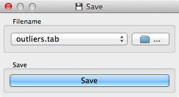

.. _Save:

Save
====

.. image:: ../icons/Save.png

Saves data to a file.

Signals
-------

Inputs:
   - Examples (ExampleTable)
      Attribute-valued data set.

Outputs:
   - (None)

Description
-----------

Takes a data set provided at the input channel and saves it to a
data file with the specified name. The widget remembers a history of the most recent file names.
It can save into tab-delimited and comma-separated files, as well as the
C4.5's format and Weka's .arrf files.

The widget does not save the data every time it receives a new signal on
the input as this would constantly (and, mostly, inadvertently) overwrite
the file. Instead the data is saved after a new file name is set or the
user pushes :obj:`Save current data`.

Example
-------

The schema below can be used to train the naive Bayesian classifier on the data loaded
from a file, use the classifier on data from another file and save the misclassified examples
(or the correctly classified, depending on what we select in the Confusion Matrix) into a file.

.. image:: images/Save-Example.png
   :alt: Schema with Save widget
