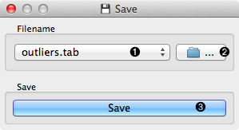
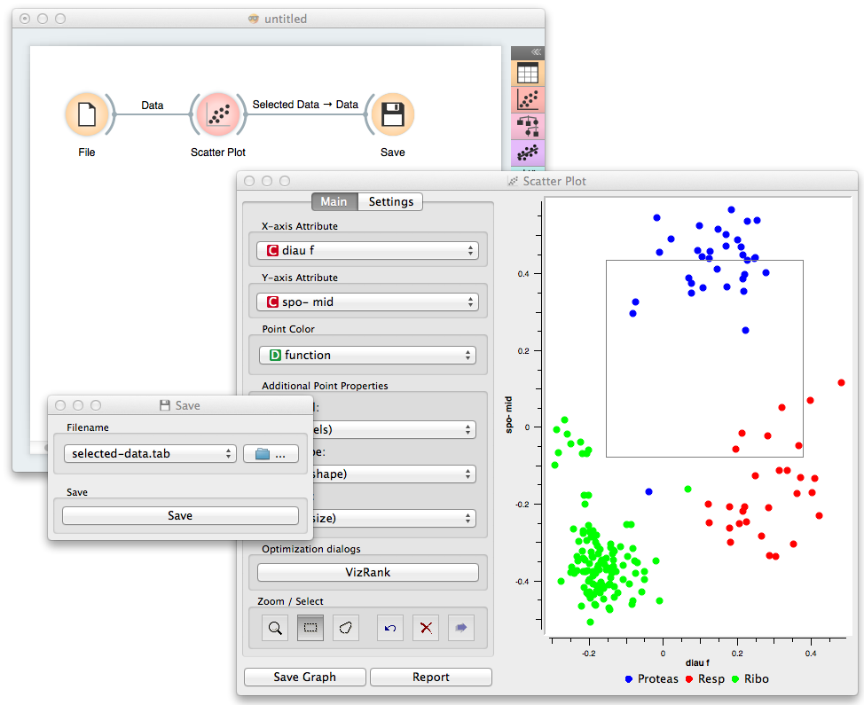

.. _Save:

Save
====

Saves data to a file.

Signals
-------

Inputs:
   - :obj:`Data`
        Attribute-valued data set.

Outputs:
   - (None)

Description
-----------

Save widget considers a data set provided on the input channel and
saves it to a data file with the specified name. The widget remembers
a history of the most recent file names. It can save into
tab-delimited and comma-separated files, as well as the C4.5's format
and Weka's .arrf files.

By design, the widget does not save the data every time it receives a
new signal on the input as this would constantly (and, mostly,
inadvertently) overwrite the file. Instead, the data is saved only
after a new file name is set or the user pushes :obj:`Save` button.

.. rst-class:: stamp-list

    1. Selected from the file names and locations from the past
       saves.
    #. Specify a new data file to save to.
    #. Save the data to a chosen data file.

.. container:: clearer

    .. image :: images/spacer.png

Example
-------

In the workflow below we load the data into a :ref:`Scatter Plot`
widget, where we select a subset of the data instances and push them
to Save widget to store them in a data file.

