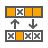
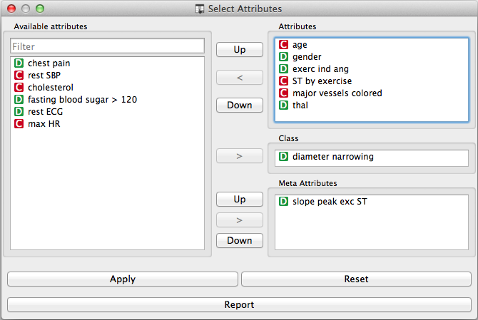

.. _Select Attributes:

Select Attributes
=================

   
Signals
-------

Input:
  - Examples (ExampleTable)
      Attribute-valued data set.

Outputs:
  - Examples (ExampleTable)
      Attribute-valued data set composed using the domain 
      specification constructed using the widget.
      
Description
-----------

Select Attributes widget is used to manually compose your data 
domain, that is, to decide which attributes will be used and how. 
Orange distinguishes between ordinary attributes, an (optional) class attributes 
and meta attributes. For instance, for building a classification model, the 
domain would be composed of a set of attributes and a discrete class attribute. 
Meta attributes are not used in modelling, but several widgets can use them 
for providing optional labels to instances.

Orange attributes are typed and are either discrete, continuous or 
a character string. The attribute type is marked with a symbol appearing 
before the name of the attribute (D, C, S, respectively).

Changes made to the domain are propagated to the output by pressing an 
Apply button. Reset will present the attributes as defined in original 
domain in the data set from the input signal

   
Examples
--------
Below is a simple example how to use this widget. The input is fed directly from 
the :ref:`File` widget, and the output to the :ref:`Data Table` widget. We have also linked 
the former to the File widget so that one can inspect the difference in the 
domain composition.

.. image:: images/SelectAttributes_schema.*
   :alt: Select Attributes schema
