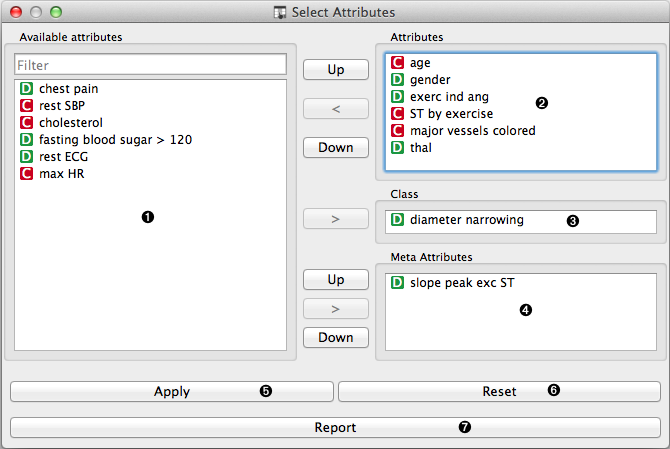
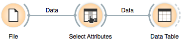
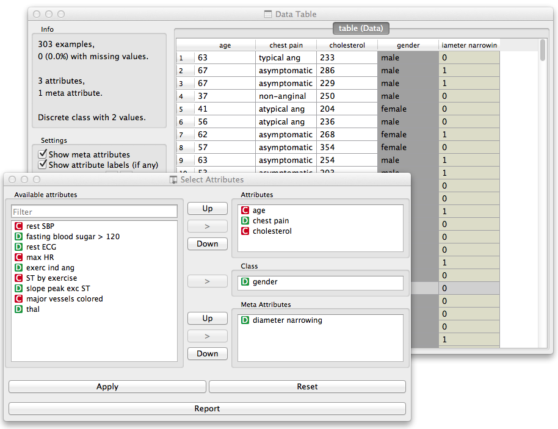

.. _Select Attributes:

Select Attributes
=================

.. image:: ../../../../Orange/OrangeWidgets/Data/icons/SelectAttributes.svg
   :alt: Select Attributes icon
   :class: widget-category-data widget-icon

Manual selection of data attributes and composition of data domain.

Signals
-------

Input:
    - :obj:`Data`
        Attribute-valued data set.

Outputs:
    - :obj:`Data`
        Attribute-valued data set composed using the domain
        specification from the widget.

Description
-----------

Select Attributes widget is used to manually compose your data
domain. User can decide which attributes will be used and how.
Orange distinguishes between ordinary attributes, an (optional) class
attributes and meta attributes. For instance, for building a classification
model, the domain would be composed of a set of attributes and a discrete class
attribute. Meta attributes are not used in modelling, but several widgets can
use them  for providing optional labels to instances.

Orange attributes are typed and are either discrete, continuous or
a character string. The attribute type is marked with a symbol appearing
before the name of the attribute (D, C, S, respectively).

.. rst-class:: stamp-list

    1. Left-out data attributes from the input data file that will not be in the
       data domain of the output data file.
    #. Data attributes in the new data file.
    #. A class attribute. If none, the new data set will be classless.
    #. Meta attributes of the new data file. The attributes are included in the
       data set but are, for most of the methods, not considered in data analysis.
    #. Apply change of the data domain and send the new data file to the output
       channel of the widget.
    #. Reset the domain composition to that of the input data file.
    #. Add an entry on domain data composition to the current report.

Example
-------

In a workflow below an input data from the :ref:`File` widget
is fed to the Select Attributes widget, which outputs the data to
the :ref:`Data Table`.

We used the schema to redefine the classification problem in
heart disease data set. Originally, the task was to predict if the patient
has a coronary artery diameter narrowing. We change the problem to that
of gender classification based on age, chest pain and cholesterol level,
and informatively kept the diameter narrowing attribute as a meta attribute.

