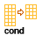
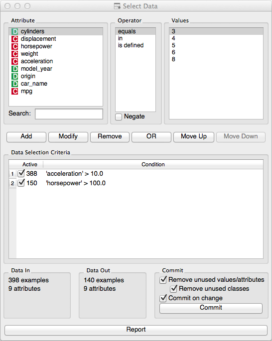

.. _Select Data:

Select Data
===========

Selects instances from input data sets based on conditions on attributes.

Signals
-------

Inputs:
   - Examples (ExampleTable)
      Attribute-valued data set.

Outputs:
   - Matching Examples (ExampleTable)
      Attribute-valued data set composed from instances from input data set
      that match user-defined condition.
   - Non-Matching Examples (ExampleTable)
      Data instances from input data set that do not match the user-defined
      condition.

Description
-----------

This widget allows the user to select a subset of the data from the
input data set based on the condition defined over a set of data's
attributes. Data instances that match the selection rule are placed on
the output channel.

Condition is presented in disjunctive normal form, that is, as
collection of conjuncted terms (AND operator) with optional disjunction
(OR operator). In other words, if condition does not include a
disjunction (OR line in the condition) than selected items are those
matching all terms in the condition.

Condition terms are defined through selecting of an attribute,
selecting an operator from the list of operators that apply to
attribute's type, and, if needed, defining the value to be used in
condition term. Operators are different for discrete, continuous and
string attributes.

After the terms is defined, it is included in the condition by
pressing :obj:`Add button`.

To update or change the condition term, select the corresponding
line in the :obj:`Data Selection Criteria`, change the term's definition
(:obj:`Attribute`/:obj:`Operator`/:obj:`Values`) and press :obj:`Update`.

Notice that any change in composition of the condition will trigger
updates in information pane that displays the number of data instances
being selected (:obj:`Data Out`). Number of instances that match specific
condition terms are also displayed at the start of the condition term
line.

Data set composed of instances that match the defined condition is
placed on the output channel. If :obj:`Update on any change` is selected,
than the output is updated on any change in the composition of the
condition or any of its terms.

Examples
--------

Below is a simple example that loads the imports-85 data set and
compares the lengths of the car in a complete data set and data set
where some more expensive brands are selected.

.. image:: images/SelectData-Example-S.gif
   :alt: Schema with Data Sampler
