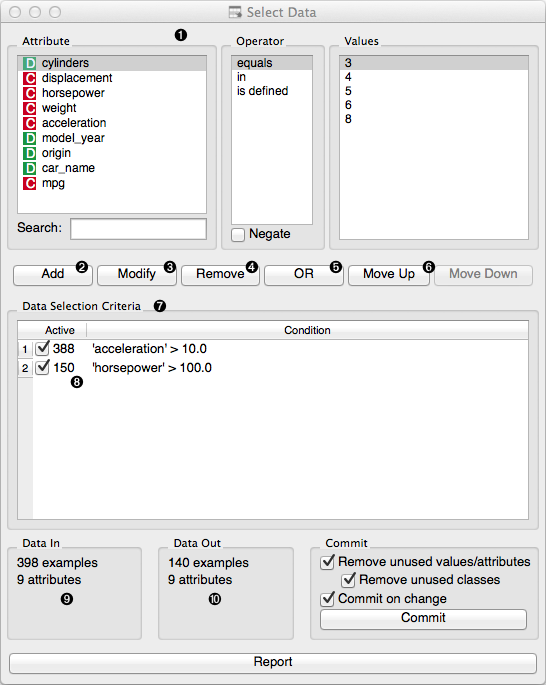
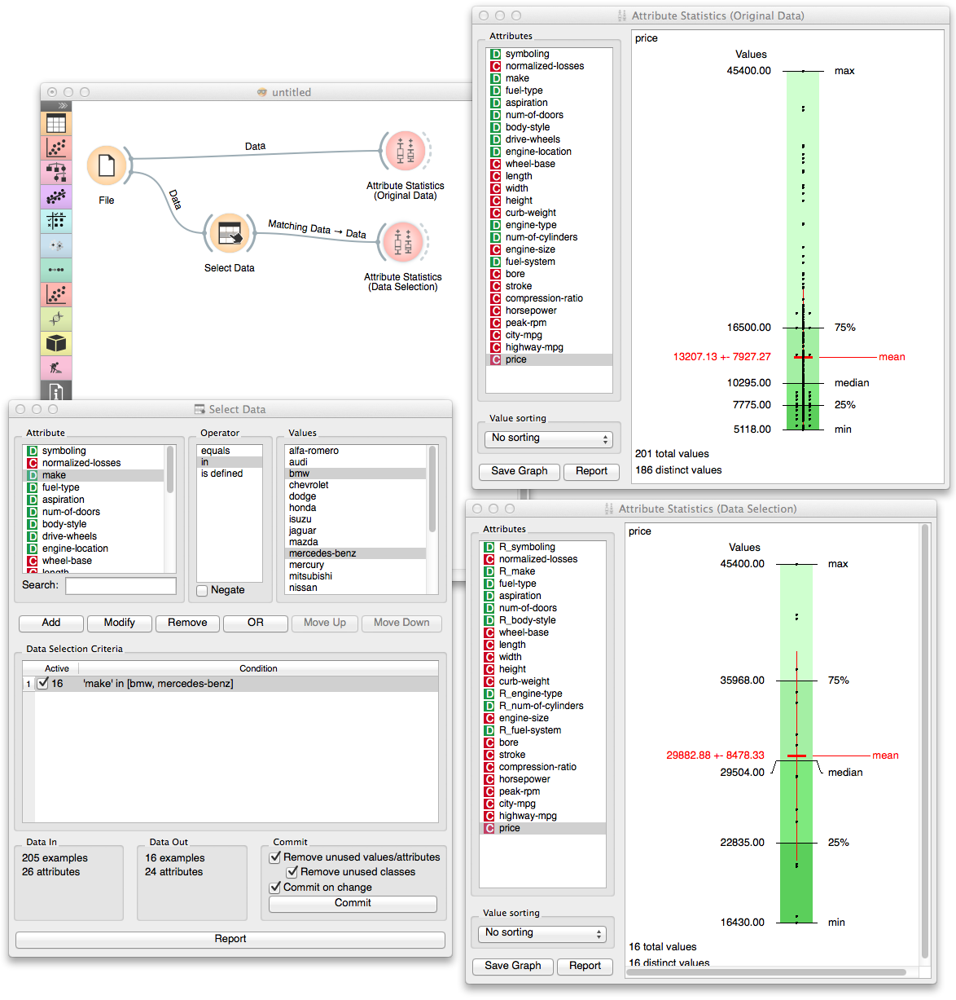

.. _Select Data:

Select Data
===========

Selects data instances based on conditions over data features.

Signals
-------

Inputs:
   - Data
      Attribute-valued data set.

Outputs:
   - Matching Data
      Data instances that match the conditions.
   - Non-Matching Data
      Data instances that do not match the conditions.

Description
-----------

This widget allows the user to select a subset of the data from the
input data set based on the condition defined over a set of data's
attributes. Data instances that match the selection rule are placed on
the output Matching Data channel.

Criteria for data selection are presented in disjunctive normal form, as
collection of conjuncted terms (AND operator) with optional disjunction
(OR operator). In other words, if condition does not include a
disjunction (OR line in the condition) than selected items are those
matching all terms in the condition.

Condition terms are defined through selecting of an attribute,
selecting an operator from the list of operators that apply to
attribute's type, and, if needed, defining the value to be used in
condition term. Operators are different for discrete, continuous and
string attributes.

.. rst-class:: stamp-list

   1. Choose an attribute, operator and related value to construct the
      condition.
   #. Add a new condition to the list of conditions. The new condition will
      appear in the Data Selection Criteria box.
   #. Modify a selected condition from the list.
   #. Remove the selected condition from the list.
   #. Insert an OR operator to the list of conditions.
   #. Rearrange the order of conditions in the list. If there is not OR
      operator, the order would not have any effect on data selection.
   #. List with conditions that are currently applied to the data.
   #. Number of data items matching the condition.
   #. Information on the input data set.
   #. Information on the data set of instances that match the condition.

Notice that any change in composition of the condition will trigger
updates in information pane that displays the number of data instances
being selected (:obj:`Data Out`). Number of instances that match specific
condition terms are also displayed at the start of the condition term
line.

Data set composed of instances that match the defined condition is
placed on the output channel. If :obj:`Commit on change` is selected,
than the output is updated on any change in the composition of the
condition or any of its terms.

Example
-------

In a toy example below we used the car data from imports-85 data set and
compared the prices of all the cars in the data set to those of BMW and
Marcedes-Benz.

