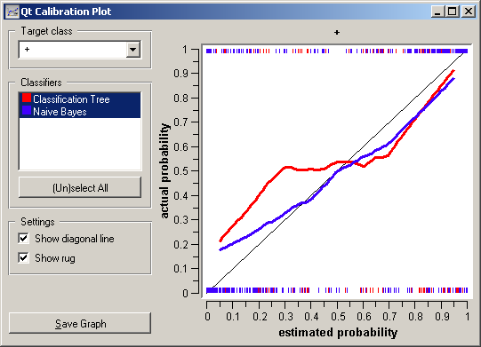

.. _Calibration Plot:

Calibration Plot
================

.. image:: ../icons/CalibrationPlot.png

Shows the match between the classifiers' probability predictions and actual class probabilities.

Signals
-------

Inputs:
   - Evaluation Results (orngTest.ExperimentResults)
      Results of classifiers' tests on data

Outputs:
   - None

Description
-----------

Calibration plot plots the class probabilities against those predicted by the classifier(s).

Option :obj:`Target class` chooses the positive class. In case there are more than two classes, the widget considers all other classes as a single, negative class. If the test results contain more than one classifier, the user can choose which curves she or he wants to see plotted.

The diagonal represents the optimal behaviour; the close the classifier gets, the more accurate its predictions.

If :obj:`Show rug` is enable, ticks at the bottom and the top of the graph represents negative and positive examples (respectively). Their position corresponds to classifier's probability prediction and the color shows the classifier. On the bottom of the graph, the points to the left are those which are (correctly) assigned a low probability of the target class, and those to the right are incorrectly assigned high probabilities. On the top of the graph, the instances to the right are correctly assigned hight probabilities and vice versa.

Example
-------

At the moment, the only widget which give the right type of the signal needed by the Calibration Plot is `Test Learners <TestLearners.htm>`_. The Lift Curve will hence always follow Test Learners and, since it has no outputs, no other widgets follow it. Here is a typical example.

.. image:: images/ROCLiftCalibration-Schema.png
