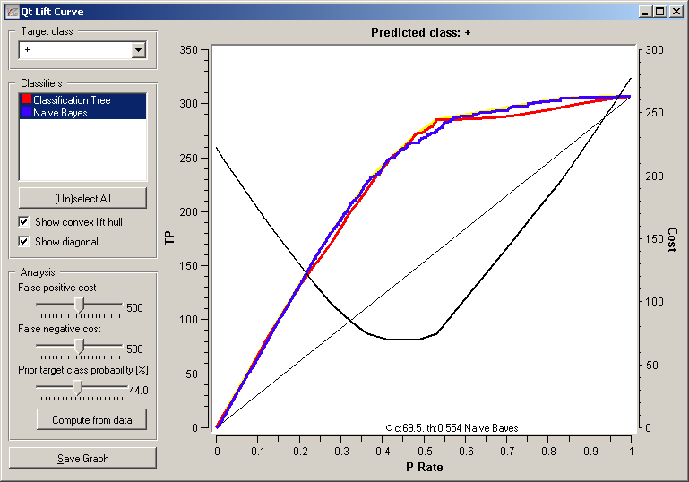

.. _Lift Curve:

Lift Curve
==========

.. image:: ../icons/LiftCurve.png

Shows the lift curves and analyzes them.

Signals
-------

Inputs:
   - Evaluation Results (orngTest.ExperimentResults)
      Results of classifiers' tests on data

Outputs:
   - None

Description
-----------

Lift curves show the relation between the number of instances which were predicted positive and those of them that are indeed positive. This type of curve is often used in segmenting the population, e.g., plotting the number of responding customers against the number of all customers contacted. Given the costs of false positives and false negatives, it can also determine the optimal classifier and threshold.

Option :obj:`Target class` chooses the positive class. In case there are more than two classes, the widget considers all other classes as a single, negative class.

If the test results contain more than one classifier, the user can choose which curves she or he wants to see plotted. :obj:`Show convex lift hull` plots a convex hull over lift curves for all classifiers. The curve thus shows the optimal classifier (or combination thereof) for each desired TP/P rate. The diagonal line represents the behaviour of a random classifier.

The user can specify the cost of false positives and false negatives, and the prior target class probability. :obj:`Compute from Data` sets it to the proportion of examples of this class in the data. The black line in the graph, which corresponds to the right-hand axis, gives the total cost for each P ration for the optimal classifier among those selected in the list box on the left. The minimum is labelled by the optimal classifier at that point and the related cost.

The widget allows setting costs from 1 to 1000. The units are not important, as are not the magnitudes. What matters is the relation between the two costs, so setting them to 100 and 200 will give the same result as 400 and 800.

Example
-------

At the moment, the only widget which give the right type of the signal needed by the Lift Curve is `Test Learners <TestLearners.htm>`_. The Lift Curve will hence always follow Test Learners and, since it has no outputs, no other widgets follow it. Here is a typical example.

.. image:: images/ROCLiftCalibration-Schema.png
