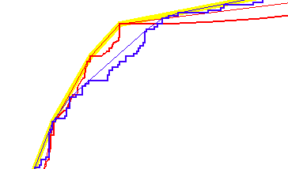
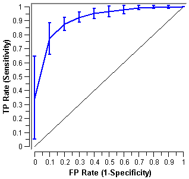
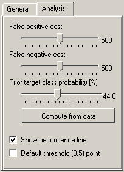

.. _ROC Analysis:

ROC Analysis
============

.. image:: ../icons/ROCAnalysis.png

Shows the ROC curves and analyzes them.

Signals
-------

Inputs:

   - Evaluation Results (orngTest.ExperimentResults)
      Results of classifiers' tests on data

Outputs:

None

Description
-----------

The widget show ROC curves for the tested models and the corresponding convex
hull. Given the costs of false positives and false negatives, it can also
determine the optimal classifier and threshold.

.. image:: images/ROCAnalysis.png

Option :obj:`Target class` chooses the positive class. In case there are
more than two classes, the widget considers all other classes as a single,
negative class.

If the test results contain more than one classifier, the user can choose
which curves she or he wants to see plotted.

Option :obj:`Show convex curves` refers to convex curves over each individual
classifier (the thin lines on the cutout on the left). :obj:`Show convex hull`
plots a convex hull over ROC curves for all classifiers (the thick yellow
line). Plotting both types of convex curves them makes sense since selecting a
threshold in a concave part of the curve cannot yield optimal results,
disregarding the cost matrix. Besides, it is possible to reach any point
on the convex curve by combining the classifiers represented by the points
at the border of the concave region.

The diagonal line represents the behaviour of a random classifier.

When the data comes from multiple iterations of training and testing, such
as k-fold cross validation, the results can be (and usually are) averaged.
The averaging options are:

   - :obj:`Merge (expected ROC perf.)` treats all the test data as if it
     came from a single iteration
   - :obj:`Vertical` averages the curves vertically, showing the corresponding
     confidence intervals
   - :obj:`Threshold` traverses over threshold, averages the curves positions
     at them and shows horizontal and vertical confidence intervals
   - :obj:`None` does not average but prints all the curves instead

.. image:: images/ROCAnalysis-Threshold.png

.. image:: images/ROCAnalysis-None.png

The second sheet of settings is dedicated to analysis of the curve. The user
can specify the cost of false positives and false negatives, and the prior
target class probability. :obj:`Compute from Data` sets it to the proportion
of examples of this class in the data.

Iso-performance line is a line in the ROC space such that all points on the
line give the same profit/loss. The line to the upper left are better those
down and right. The direction of the line depends upon the above costs and
probabilities. Put together, this gives a recipe for depicting the optimal
threshold for the given costs: it is the point where the tangent with the
given inclination touches the curve. If we go higher or more to the left,
the points on the isoperformance line cannot be reached by the learner.
Going down or to the right, decreases the performance.

The widget can show the performance line, which changes as the user
changes the parameters. The points where the line touches any of the
curves - that is, the optimal point for any of the given classifiers -
is also marked and the corresponding threshold (the needed probability
of the target class for the example to be classified into that class) is
shown besides.

The widget allows setting costs from 1 to 1000. The units are not important,
as are not the magnitudes. What matters is the relation between the two costs,
so setting them to 100 and 200 will give the same result as 400 and 800.

.. image:: images/ROCAnalysis-Performance2.png

Defaults: both costs equal (500), Prior target class probability 44%
(from the data)

.. image:: images/ROCAnalysis-Performance1.png

False positive cost: 838, False negative cost 650, Prior target class
probability 73%

:obj:`Default threshold (0.5) point` shows the point on the ROC curve
achieved by the classifier if it predicts the target class if its probability
equals or exceeds 0.5.

Example
-------

At the moment, the only widget which give the right type of the signal
needed by ROC Analysis is :ref:`Test Learners`. The ROC Analysis will hence
always follow Test Learners and, since it has no outputs, no other widgets
follow it. Here is a typical example.

.. image:: images/ROCLiftCalibration-Schema.png
