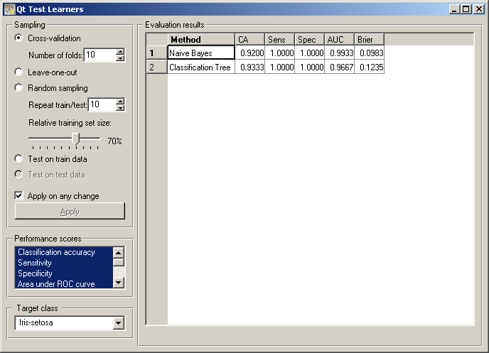

.. _Test Learners:

Test Learners
=============

.. image:: ../icons/TestLearners.png

Tests learning algorithms on data.

Signals
-------

Inputs:
   - Data (ExampleTable)
      Data for training and, unless separate test data set is used, testing
   - Separate Test Data (ExampleTable)
      Separa data for testing
   - Learner (orange.Learner)
      One or more learning algorithms

Outputs:
   - Evaluation results (orngTest.ExperimentResults)
      Results of testing the algorithms

Description
-----------

The widget tests learning algorithms on data. Different sampling schemes are
available, including using a separate test data. The widget does two things.
First, it shows a table with different performance measures of the classifiers,
such as classification accuracy and area under ROC. Second, it outputs a signal
with data which can be used by other widgets for analyzing the performance of
classifiers, such as :ref:`ROC Analysis` or :ref:`Confusion Matrix`.

The signal Learner has a not very common property that it can be connected to
more than one widget, which provide multiple learners to be tested with the
same procedures. If the results of evaluation or fed into further widgets,
such as the one for ROC analysis, the learning algorithms are analyzed together.

The widget supports various sampling methods. :obj:`Cross-validation` splits
the data into the given number of folds (usually 5 or 10). The algorithm is
tested by holding out the examples from one fold at a time; the model is
induced from the other folds and the examples from the held out fold are
classified. :obj:`Leave-one-out` is similar, but it holds out one example
at a time, inducing the model from all others and then classifying the held
out. This method is obviously very stable and reliable ... and very slow.
:obj:`Random sampling` randomly splits the data onto the training and
testing set in the given proportion (e.g. 70:30); the whole procedure is t
repeated for the specified number of times. :obj:`Test on train data` uses the
whole data set for training and then for testing. This method practically
always gives overly optimistic results.

The above methods use the data from signal Data only. To give another data
set with testing examples (for instance from another file or some data selected
in another widget), we put it on the input signal Separate Test Data and select
:obj:`Test on test data`.

Any changes in the above settings are applied immediately if
:obj:`Applied on any change` is checked. If not, the user will have to press
:obj:`Apply` to apply any changes.

The widget can compute a number of performance statistics.

   - :obj:`Classification accuracy` is the proportion of correctly classified
     examples
   - :obj:`Sensitivity` (also called true positive rate (TPR), hit rate and
     recall) is the number of detected positive examples among all positive
     examples, e.g. the proportion of sick people correctly diagnosed as sick
   - :obj:`Specificity` is the proportion of detected negative examples among
     all negative examples, e.g. the proportion of healthy correctly recognized
     as healthy
   - :obj:`Area under ROC` is the area under receiver-operating curve
   - :obj:`Information score` is the average amount of information per
     classified instance, as defined by Kononenko and Bratko
   - :obj:`F-measure` is a weighted harmonic mean of precision and recall
     (see below), 2*precision*recall/(precision+recall)
   - :obj:`Precision` is the number of positive examples among all examples
     classified as positive, e.g. the number of sick among all diagnosed as
     sick, or a number of relevant documents among all retrieved documents
   - :obj:`Recall` is the same measure as sensitivity, except that the latter
     term is more common in medicine and recall comes from text mining, where
     it means the proportion of relevant documents which are retrieved
   - :obj:`Brier score` measure the accuracy of probability assessments, which
     measures the average deviation between the predicted probabilities of
     events and the actual events.

More comprehensive descriptions of measures can be found at
`http://en.wikipedia.org/wiki/Receiver_operating_characteristic
<http://en.wikipedia.org/wiki/Receiver_operating_characteristic>`_
(from classification accuracy to area under ROC),
`http://www.springerlink.com/content/j21p620rw33xw773/
<http://www.springerlink.com/content/j21p620rw33xw773/>`_ (information score),
`http://en.wikipedia.org/wiki/F-measure#Performance_measures
<http://en.wikipedia.org/wiki/F-measure#Performance_measures>`_
(from F-measure to recall) and
`http://en.wikipedia.org/wiki/Brier_score
<http://en.wikipedia.org/wiki/Brier_score>`_ (Brier score).

Most measure require a target class, e.g. having the disease or being relevant.
The target class can be selected at the bottom of the widget.

Example
-------

In a typical use of the widget, we give it a data set and a few learning
algorithms, and we observe their performance in the table inside the Test
Learners widgets and in the ROC and Lift Curve widgets attached to the Test
Learners. The data is often preprocessed before testing; in this case we
discretized it and did some manual feature selection; not that this is done
outside the cross-validation loop, so the testing results may be overly
optimistic.

.. image:: images/TestLearners-Schema.png

Another example of using this widget is given in the documentation for
widget :ref:`Confusion Matrix`.
