##############
Orange Widgets
##############

Orange widgets are building blocks of data analysis workflows that are
assembled in Orange's visual programming environment.

.. image:: images/simple-workflow.png
	:alt: Orange Workflow

Widgets are grouped into classes according to their function. A typical
workflow may mix widgets for data input and filtering, visualization,
and predictive data mining.

Data
----

.. list-table::
    :class: widget-catalog-table widget-category-data
    :widths: 1 1 1
    
    * - |File_icon| :ref:`File`
      - |PaintData_icon| :ref:`Paint Data`
      - |DataTable_icon| :ref:`Data Table`
    * - |SelectAttributes_icon| :ref:`Select Attributes`
      - |Rank_icon| :ref:`Rank`
      - |PurgeDomain_icon| :ref:`Purge Domain`
    * - |MergeData_icon| :ref:`Merge Data`
      - |Concat_icon| :ref:`Concatenate`
      - |DataSampler_icon| :ref:`Data Sampler`
    * - |SelectData_icon| :ref:`Select Data`
      - |Save_icon| :ref:`Save`
      - |Discretize_icon| :ref:`Discretize`
    * - |Cont_icon| :ref:`Continuize`
      - |Impute_icon| :ref:`Impute`
      - |Outliers_icon| :ref:`Outliers`
    * - |EditDomain_icon| :ref:`Edit Domain`
      - |PythonScript_icon| :ref:`Python Script`
      -

.. |File_icon| image:: ../../../Orange/OrangeWidgets/Data/icons/File.svg
    :alt: File
    :width: 36
    :height: 36

.. |PaintData_icon| image:: ../../../Orange/OrangeWidgets/Data/icons/PaintData.svg
    :alt: File
    :width: 36
    :height: 36

.. |DataTable_icon| image:: ../../../Orange/OrangeWidgets/Data/icons/DataTable.svg
	:alt: Data Table
	:width: 36
	:height: 36
	

	
.. |Rank_icon| image:: ../../../Orange/OrangeWidgets/Data/icons/Rank.svg
	:alt: Rank
	:width: 36
	:height: 36
	
.. |PurgeDomain_icon| image:: ../../../Orange/OrangeWidgets/Data/icons/PurgeDomain.svg
	:alt: Purge Domain
	:width: 36
	:height: 36
	

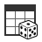

.. |SelectData_icon| image:: ../../../Orange/OrangeWidgets/Data/icons/SelectData.svg
	:alt: Merge Data
	:width: 36
	:height: 36

.. |Save_icon| image:: ../../../Orange/OrangeWidgets/Data/icons/Save.svg
	:alt: Merge Data
	:width: 36
	:height: 36

	
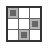
	

.. |EditDomain_icon| image:: ../../../Orange/OrangeWidgets/Data/icons/EditDomain.svg
   :alt: Edit Domain
   :width: 36
   :height: 36

.. |PythonScript_icon| image:: ../../../Orange/OrangeWidgets/Data/icons/PythonScript.svg
   :alt: Edit Domain
   :width: 36
   :height: 36

Visualize
---------

.. list-table::
    :class: widget-catalog-table widget-category-visualize
    :widths: 1 1 1
    
    * - |Distributions_icon| :ref:`Distributions`
      - |ScatterPlot_icon| :ref:`Scatter Plot`
      - |AttributeStatistics_icon| :ref:`Attribute Statistics`
    * - |LinearProjection_icon| :ref:`Linear Projection`
      - |Radviz_icon| :ref:`Radviz`
      - |Polyviz_icon| :ref:`Polyviz`
    * - |ParallelCoords_icon| :ref:`Parallel Coordinates`
      - |SurveyPlot_icon| :ref:`Survey Plot`
      - |MosaicDisplay_icon| :ref:`Mosaic Display`
    * - |SieveDiagram_icon| :ref:`Sieve Diagram`
      - |SieveMultigram_icon| `Sieve Multigram`
      -

	
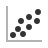
	
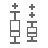
	
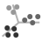
	
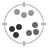
	
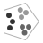
	

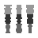
	

	
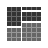
	

Classify
--------
    
.. list-table::
    :class: widget-catalog-table widget-category-classify
    :widths: 1 1 1
    
    * - |NaiveBayes_icon| :ref:`Naive Bayes`
      - |SVM_icon| :ref:`SVM`
      - |LogReg_icon| :ref:`Logistic Regression`
    * - |Majority_icon| :ref:`Majority`
      - |ClassificationTree_icon| :ref:`Classification Tree`
      - |ClassificationTreeGraph_icon| :ref:`Classification Tree Graph`
    * - |ClsTreeViewer_icon| :ref:`Classification Tree Viewer`
      - |CN2Rules_icon| :ref:`CN2 Rules`
      - |CN2RulesViewer_icon| :ref:`CN2 Rules Viewer`
    * - |kNN_icon| :ref:`k-Nearest Neighbours`
      - |Nomogram_icon| :ref:`Nomogram`
      - |RandomForest_icon| :ref:`Random Forest`
    * - |C4.5_icon| :ref:`C4.5`
      - |ITreeBuilder_icon| :ref:`Interactive Tree Builder`
      -

.. |NaiveBayes_icon| image:: ../../../Orange/OrangeWidgets/Classify/icons/NaiveBayes.svg
    :alt: Naive Bayes
    :width: 36
    :height: 36

.. |SVM_icon| image:: ../../../Orange/OrangeWidgets/Classify/icons/SVM.svg
    :alt: Support Vector Machines
    :width: 36
    :height: 36

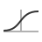

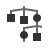

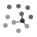

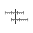

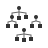

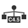

Regression
----------

.. list-table::
    :widths: 1 1 1
    :class: widget-catalog-table widget-category-regression
    
    * - |Mean_icon| :ref:`Mean`
      - |LinearRegression_icon| :ref:`Linear Regression`
      - |RegressionTree_icon| :ref:`Regression Tree`
    * - |RegressionTreeGraph_icon| :ref:`Regression Tree Graph`
      - |Pade_icon| :ref:`Pade`
      -

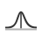

.. |RegressionTree_icon| image:: ../../../Orange/OrangeWidgets/Regression/icons/RegressionTree.svg
    :alt: Regression Tree
    :width: 36
    :height: 36

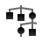

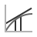

Evaluate
--------

.. list-table::
    :widths: 1 1 1
    :class: widget-catalog-table widget-category-evaluate
    
    * - |ConfusionMatrix_icon| :ref:`Confusion Matrix`
      - |ROCAnalysis_icon| :ref:`ROC Analysis`
      - |LiftCurve_icon| :ref:`Lift Curve`
    * - |CalibrationPlot_icon| :ref:`Calibration Plot`
      - |TestLearners_icon| :ref:`Test Learners`
      - |Predictions_icon| :ref:`Predictions`

.. |LiftCurve_icon| image:: ../../../Orange/OrangeWidgets/Evaluate/icons/LiftCurve.svg
    :alt: Lift Curve
    :width: 36
    :height: 36

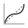

.. |TestLearners_icon| image:: ../../../Orange/OrangeWidgets/Evaluate/icons/TestLearners1.svg
    :alt: Test Learners
    :width: 36
    :height: 36

.. |Predictions_icon| image:: ../../../Orange/OrangeWidgets/Evaluate/icons/Predictions.svg
    :alt: Predictions
    :width: 36
    :height: 36

Associate
---------

.. list-table::
    :widths: 1 1 1
    :class: widget-catalog-table widget-category-associate
    
    * - |AssociationRules_icon| :ref:`Association Rules`
      - |AssociationRulesFilter_icon| :ref:`Association Rules Filter`
      - |AssociationRulesExplorer_icon| :ref:`Association Rules Explorer`
    * - |ItemSets_icon| `Item Sets`
      - |ItemSetsExplorer_icon| `Item Sets Explorer`
      -

.. |ItemSets_icon| image:: ../../../Orange/OrangeWidgets/Associate/icons/Itemsets.svg
    :alt: Item Sets
    :width: 36
    :height: 36

Unsupervised
------------

.. list-table::
    :widths: 1 1 1
    :class: widget-catalog-table widget-category-unsupervised
    
    * - |DistanceFile_icon| :ref:`Distance File`
      - |SaveDistanceFile_icon| `Save Distance File`
      - |MatrixTransformation_icon| `Matrix Transformation`
    * - |DistanceMatrixFilter_icon| `Distance Matrix Filter`
      - |DistanceMap_icon| :ref:`Distance Map`
      - |ExampleDistance_icon| :ref:`Example Distance`
    * - |AttributeDistance_icon| :ref:`Attribute Distance`
      - |HierarchicalClustering_icon| :ref:`Hierarchical Clustering`
      - |InteractionGraph_icon| :ref:`Interaction Graph`
    * - |kMeansClustering_icon| :ref:`k-Means Clustering`
      - |MDS_icon| :ref:`MDS`
      - |PCA_icon| :ref:`PCA`
    * - |SOM_icon| `SOM`
      - |SOMVisualizer_icon| `SOM Visualizer`
      -

.. |MatrixTransformation_icon| image:: ../../../Orange/OrangeWidgets/Unsupervised/icons/MatrixTransformation.svg
    :alt: Matrix Transformation
    :width: 36
    :height: 36

.. |DistanceMatrixFilter_icon| image:: ../../../Orange/OrangeWidgets/icons/DistanceFilter.png
    :alt: Distance Matrix Filter
    :width: 36
    :height: 36

.. |DistanceMap_icon| image:: ../../../Orange/OrangeWidgets/Unsupervised/icons/DistanceMatrix.svg
    :alt: Distance Map
    :width: 36
    :height: 36

.. |ExampleDistance_icon| image:: ../../../Orange/OrangeWidgets/Unsupervised/icons/Distance.svg
    :alt: Example Distance
    :width: 36
    :height: 36

.. |AttributeDistance_icon| image:: ../../../Orange/OrangeWidgets/Unsupervised/icons/Distance.svg
    :alt: Attribute Distance
    :width: 36
    :height: 36

.. |HierarchicalClustering_icon| image:: ../../../Orange/OrangeWidgets/Unsupervised/icons/HierarchicalClustering.svg
    :alt: Hierarchical Clustering
    :width: 36
    :height: 36

.. |InteractionGraph_icon| image:: ../../../Orange/OrangeWidgets/Unsupervised/icons/InteractionGraph_40.png
    :alt: Interaction Graph
    :width: 36
    :height: 36

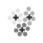

.. |MDS_icon| image:: ../../../Orange/OrangeWidgets/Unsupervised/icons/MDS.svg
    :alt: MDS
    :width: 36
    :height: 36

.. |PCA_icon| image:: ../../../Orange/OrangeWidgets/Unsupervised/icons/PCA.svg
    :alt: PCA
    :width: 36
    :height: 36

Index:

.. toctree::
   :maxdepth: 1
   
   data/file.rst
   data/paintdata.rst
   data/datatable.rst
   data/selectattributes.rst
   data/rank.rst
   data/purgedomain.rst
   data/mergedata.rst
   data/concatenate.rst
   data/datasampler.rst
   data/selectdata.rst
   data/save.rst
   data/discretize.rst
   data/continuize.rst
   data/impute.rst
   data/outliers.rst
   data/editdomain.rst
   data/pythonscript.rst

   visualize/distributions.rst
   visualize/scatterplot.rst
   visualize/attributestatistics.rst
   visualize/linearprojection.rst
   visualize/radviz.rst
   visualize/polyviz.rst
   visualize/parallelcoordinates.rst
   visualize/surveyplot.rst
   visualize/mosaicdisplay.rst
   visualize/sievediagram.rst

   classify/naivebayes.rst
   classify/svm.rst
   classify/logisticregression.rst
   classify/majority.rst
   classify/classificationtree.rst
   classify/classificationtreegraph.rst
   classify/classificationtreeviewer.rst
   classify/cn2.rst
   classify/cn2rulesviewer.rst
   classify/knearestneighbours.rst
   classify/nomogram.rst
   classify/randomforest.rst
   classify/c45.rst
   classify/interactivetreebuilder.rst

   regression/mean.rst
   regression/linear.rst
   regression/regressiontree.rst
   regression/regressiontreegraph.rst
   regression/pade.rst

   evaluate/confusionmatrix.rst
   evaluate/rocanalysis.rst
   evaluate/liftcurve.rst
   evaluate/calibrationplot.rst
   evaluate/testlearners.rst
   evaluate/predictions.rst

   associate/associationrules.rst
   associate/associationrulesfilter.rst
   associate/associationrulesexplorer.rst

   unsupervized/distancefile.rst
   unsupervized/distancemap.rst
   unsupervized/exampledistance.rst
   unsupervized/attributedistance.rst
   unsupervized/hierarchicalclustering.rst
   unsupervized/interactiongraph.rst
   unsupervized/kmeansclustering.rst
   unsupervized/mds.rst
   unsupervized/PCA.rst

****************
Index and search
****************

* :ref:`genindex`
* :ref:`search`
