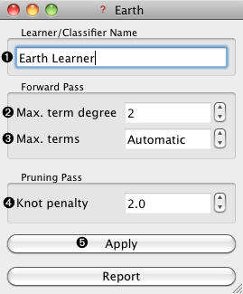

.. _Earth:

Earth Learner
=============

.. image:: ../../../../Orange/OrangeWidgets/icons/Unknown.png
   :alt: Earth Learner 
   
Channels
--------

Inputs:
   - Data (Table)

Outputs:
   - Learner
       	The Earth learning algorithm with parameters as specified in the
         dialog.

   - Predictor
        Trained regressor

Signal ``Predictor`` sends the regressor only if signal ``Data`` is present.

Description
-----------

This widget constructs a Earth learning algorithm (an implementation of
the `MARS - Multivariate Adaptive Regression Splines`_). As all widgets
for classification and regression, this widget provides a learner and
classifier/regressor on the output. Learner is a learning algorithm with
settings as specified by the user. It can be fed into widgets for testing
learners, for instance Test Learners.

.. _`MARS - Multivariate Adaptive Regression Splines`: http://en.wikipedia.org/wiki/Multivariate_adaptive_regression_splines

.. rst-class:: stamp-list

	1. Learner/Predictor can be given a name under which it will appear
	   in other widgets (say ``Test Learners`` or ``Predictions``).

	2. The ``Max. term degree`` parameter specifies the degree of the
	   terms induced in the forward pass. For instance, if set to ``1``
	   the resulting model will contain only linear terms.

	3. The ``Max. terms`` specifies how many terms can be induces in the
	   forward pass. A special value ``Automatic`` instructs the learner
	   to set the limit automatically based on the dimensionality of the
	   data (``min(200, max(20, 2 * NumberOfAttributes)) + 1``)

	4. The ``Knot penalty`` is used in the pruning pass (hinge function
	   penalty for the GCV calculation)

After changing one or more settings, you need to push 5 ``Apply``,
which will put the new learner on the output and, if the training
examples are given, construct a new predictor and output it as well.

Examples
--------

Lets use the learner to train a model on a data subset and test it on
unseen instances.

.. image:: images/Earth-Schema.png
