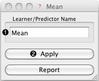

.. _Mean:

Mean Learner
============

.. image:: ../../../../Orange/OrangeWidgets/icons/Unknown.png
   :alt: Mean Learner
   
Channels
--------

Inputs:
   - Data (Table)

Outputs:
   - Learner
       	The Mean learning algorithm.
       	
   - Predictor 
        Trained regressor
        
Signal ``Predictor`` sends the regressor only if signal ``Data`` is present.

Description
-----------

This is the simplest learner widget for regression problems. It *learns*
the mean of the class variable and produces a predictor that always predicts
this value.

 

.. rst-class:: stamp-list

	1. Learner/predictor name.
	
	2. ``Apply`` button sends the learner (and predictor if input 
	   signal ``Data`` is present).
	      