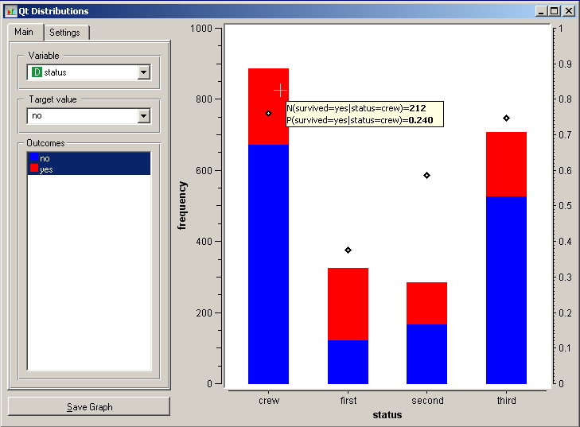

.. _Distributions:

Distributions
=============

.. image:: ../icons/Distributions.png

Displays value distributions for a single attribute.

Signals
-------

Inputs:
   - Examples (ExampleTable)
      Input data set.

Outputs:
   - (None)

Description
-----------

Distributions displays the value distribution of either discrete or continuous attributes. If the data contains class, the distributions are conditioned on the class.

For discrete attributes, the graph displayed by the widget shows how many times (e.g., in how many data instances) each of the attribute values appear in the data. If the data contains a class variable, class distributions for each of the attribute values will be displayed as well (like in the snapshot above). The widget may be requested to display only value distributions for instances of certain class (:obj:`Outcomes`). For class-valued data sets, the class probability conditioned on a specific value of the attribute (:obj:`Target value`) may be displayed as well.

.. image:: images/Distributions-Cont.png

For continuous attributes, the attribute values are discretized and value distribution is displayed as a histogram. Notice that the :obj:`Number of bars` can be used to alter the discretization used. Class probabilities for the continuous attributes are obtained through loess smoothing, the appearance of the curve and inclusion of the confidence intervals are set in :obj:`Probability plot` settings.

Notice that in class-less domains, the bars are displayed in gray and no additional information (e.g. conditional probabilities) are available.

.. image:: images/Distributions-NoClass.png
