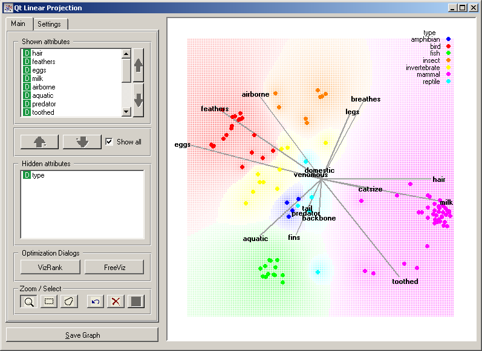

.. _Linear Projection:

Linear Projection
=================

.. image:: ../icons/LinearProjection.png

Various linear projection methods with explorative data analysis and intelligent data visualization enhancements.

Signals
-------

Inputs:
   - Examples (ExampleTable)
      Input data set.
   - Example Subset (ExampleTable)
      A subset of data instances from Examples.
   - Attribute Selection List
      List of attributes to be shown in the visualization.

Outputs:
   - Selected Examples (ExampleTable)
      A subset of examples that user has manually selected from the scatterplot.
   - Unselected Examples (ExampleTable)
      All other examples (examples not included in the user's selection).
   - Attribute Selection List
      List of attributes used in the visualization.

Warning: this widget combines a number of visualization methods that are currently in research. Eventually, it will break down to a set of simpler widgets, each implementing its own method.

Description
-----------

This widget provides an interface to a number of linear projection methods that all deal with class-labeled data and aim at finding the two-dimensional projection where instances of different classes are best separated. Consider, for a start, a projection of a <a href="">zoo.tab</a> data set (animal species and their features) shown below. Notice that it is breast-feeding (milk) and hair that nicely characterizes mamals from the other organisms, and that laying eggs is something that birds do. This specific visualization was obtained using FreeViz (`Demsar et al., 2007 <#Demsar2007>`_), while the widget also implements an interface to supervised principal component analysis (`Koren and Carmel, 2003 <#Koren2003>`_), partial least squares (for a nice introduction, see `Boulesteix and Strimmer, 2006 <Boulesteix2007>`_), and RadViz visualization and associated intelligent data visualization technique called VizRank ().

Projection search methods are invoked from :obj:`Optimization Dialogs` in the :obj:`Main` tab. Other controls in this tab and controls in the :obj:`Settings` tab are just like those with other visualization widgets; please refer to a documentation of `Scatterplot <Scatterplot.html>`_ widget for further information.

.. image:: images/LinearProjection-FreeViz.png
   :alt: FreeViz screen shot

:obj:`FreeViz` button in :obj:`Main` tab opens a dialog from which four different methods are accessed. The first one is FreeViz, which uses a paradigm borrowed from particle physics: points in the same class attract each other, those from different class repel each other, and the resulting forces are exerted on the anchors of the attributes, that is, on unit vectors of each of the dimensional axis. The points cannot move (are projected in the projection space), but the attribute anchors can, so the optimization process is a hill-climbing optimization where at the end the anchors are placed such that forces are in equilibrium. The FreeViz optimization dialog is used to invoke the optimization process (:obj:`Optimize Separation`) or execute a single step of optimization (:obj:`Single Step`). The result of the optimization may depend on the initial placement of the anchors, which can be set in a circle, arbitrary or even manually (:obj:`Set anchor positions`). The later also works at any stage of optimization, and we recommend to play with this option in order to understand how a change of one anchor affects the positions of the data points. Controls in :obj:`Forces` box are used to set the parameters that define the type of the forces between the data points (see `Demsar et al., 2007 <#Demsar2007>`_). In any linear projection, projections of unit vector that are very short compared to the others indicate that their associated attribute is not very informative for particular classification task. Those vectors, that is, their corresponding anchors, may be hidden from the visualization using controls in :obj:`Show anchors` box.

The other two, quite prominent visualization methods, are accessible through FreeViz's :obj:`Dimensionality Reduction` tab (not shown here). These includes supervised principal component analysis and partial least squares method. The general objection of these two approaches is the same as for FreeViz (find a projection that separates data instances of different class), but the results - because of different optimization methods and differences in their bias - may be quite different.

The fourth projection search technique that can be accessed from this widget is VizRank search algorithm with RadViz visualization (Leban et al. (2006)). This is essentially the same visualization and projection search method as implemented in `Radviz <Radviz>`_.

Like other point-based visualization widget, Linear Projection also includes explorative analysis functions (selection of data instances and zooming). See documentation for :doc:`Scatterplot <scatterplot>` widget for documentation of these as implemented in :obj:`Zoom / Select` toolbox in the :obj:`Main` tab of the widget.

References
----------

  - Demsar J, Leban G, Zupan B. FreeViz-An intelligent multivariate visualization approach to explorative analysis of biomedical data. J Biomed Inform 40(6):661-71, 2007.
  - Koren Y, Carmel L. Visualization of labeled data using linear transformations, in: Proceedings of IEEE Information Visualization 2003 (InfoVis'03), 2003. `PDF <http://citeseerx.ist.psu.edu/viewdoc/download;jsessionid=3DDF0DB68D8AB9949820A19B0344C1F3?doi=10.1.1.13.8657&rep=rep1&type=pdf>`_
  - Boulesteix A-L, Strimmer K (2006) Partial least squares: a versatile tool for the analysis of high-dimensional genomic data, Briefings in Bioinformatics 8(1): 32-44. `Abstract <http://bib.oxfordjournals.org/cgi/content/abstract/8/1/32>`_
  - Leban, G., B. Zupan, et al. (2006). "VizRank: Data Visualization Guided by Machine Learning." Data Mining and Knowledge Discovery 13(2): 119-136.
