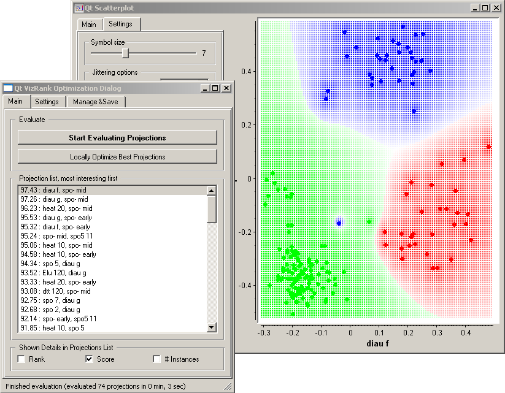
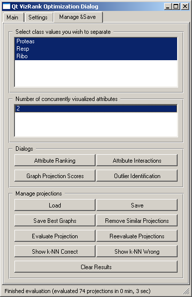
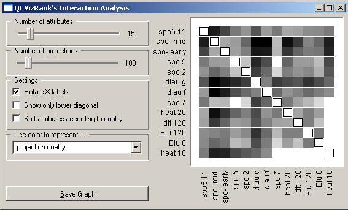

.. _Scatter Plot:

Scatter Plot
============

.. image:: ../icons/Distributions.png

A standard scatterplot visualization with explorative analysis and  intelligent
data visualization enhancements.

Signals
-------

Inputs:
   - Examples (ExampleTable)
      Input data set.
   - Example Subset (ExampleTable)
      A subset of data instances from Examples.

Outputs:
   - Selected Examples (ExampleTable)
      A subset of examples that user has manually selected from the
      scatterplot.
   - Unselected Examples (ExampleTable)
      All other examples (examples not included in the user's selection).

Description
-----------

Scatterplot widget provides a standard 2-dimensional scatterplot visualization
for both continuous and discrete-valued attributes. The data is displayed as a
collection of points, each having the value of :obj:`X-axis attribute`
determining the position on the horizontal axis and the value of
:obj:`Y-axis attribute` determining the position on the vertical axis.
Various properties of the graph, like color, size and shape of the  points are
controlled through the appropriate setting in the :obj:`Main` pane of the
widget, while other (like legends and axis titles, maximum point size and
jittering) are set in the :obj:`Settings` pane. A snapshot below shows a
scatterplot of an Iris data set, with the size of the points proportional to
the value of sepal width attribute, and coloring matching that of the class
attribute.

.. image:: images/Scatterplot-Iris.png

In the case of discrete attributes, jittering (:obj:`Jittering options` )
should be used to circumvent the overlap of the points with the same value for
both axis, and to obtain a plot where density of the points in particular
region corresponds better to the density of the data with that particular
combination of values. As an example of such a plot, the scatterplot for the
Titanic data reporting on the gender of the passenger and the traveling class
is shown below; withouth jittering, scatterplot would display only eight
distinct points.

.. image:: images/Scatterplot-Titanic.png

Most of the scatterplot options are quite standard, like those for selecting
attributes for point colors, labels, shape and size (:obj:`Main` pane), or
those that control the display of various elements in the graph like axis
title, grid lines, etc. (:obj:`Settings` pane). Beyond these, the Orange's
scatterplot also implements an intelligent visualization technique called
VizRank that is invoked through :obj:`VizRank` button in :obj:`Main` tab.

Intelligent Data Visualization

If a data set has many attributes, it is impossible to manually scan through
all the pairs of attributes to find interesting scatterplots. Intelligent data
visualizations techniques are about finding such visualizations automatically.
Orange's Scatterplot includes one such tool called VizRank ([1]_), that
can be in current implementation used only with classification data sets, that
is, data sets where instances are labeled with a discrete class. The task of
optimization is to find those scatterplot projections, where instances with
different class labels are well separated. For example, for a data set 
brown-selected.tab
(comes with Orange installation) the two attributes that best separate
instances of different class are displayed in the snapshot below, where we have
also switched on the :obj:`Show Probabilities` option from Scatterplot's
:obj:`Settings` pane. Notice that this projection appears at the top of
:obj:`Projection list, most interesting first`, followed by a list of
other potentially interesting projections. Selecting each of these would
change the projection displayed in the scatterplot, so the list and associated
projections can be inspected in this way.

The number of different projections that can be considered by VizRank may be
quite high. VizRank searches the space of possible projections heuristically.
The search is invoked by pressing :obj:`Start Evaluating Projections`, which
may be stopped anytime. Search through modification of top-rated projections
(replacing one of the two attributes with another one) is invoked by pressing a
:obj:`Locally Optimize Best Projections` button.

.. image:: images/Scatterplot-VizRank-Settings.png
   :align: left

VizRank's options are quite elaborate, and if you are not the expert in machine
learning it would be best to leave them at their defaults. The options are
grouped according to the different aspects of the methods as described in
[1]_. The projections are evaluated through testing a selected
classifier (:obj:`Projection evaluation method` default is k-nearest neighbor
classification) using some standard evaluation technique
(:obj:`Testing method`). For very large data set use sampling to speed-up the
evaluation (:obj:`Percent of data used`). Visualizations will then be ranked
according to the prediction accuracy (:obj:`Measure of classification success`
), in our own tests :obj:`Average Probability Assigned to the Correct Class`
worked somehow better than more standard measures like
:obj:`Classification Accuracy` or :obj:`Brier Score`. To avoid exhaustive
search for data sets with many attributes, these are ranked by heuristics
(:obj:`Measure for attribute ranking`), testing most likely projection
candidates first. Number of items in the list of projections is controlled in
:obj:`Maximum length of projection list`.

A set of tools that deals with management and post-analysis of list of
projections is available under :obj:`Manage & Save` tab. Here you may decide
which classes the visualizations should separate (default set to separation of
all the classes). Projection list can saved (:obj:`Save` in
:obj:`Manage projections` group), loaded (:obj:`Load`), a set of best
visualizations may be saved (:obj:`Saved Best Graphs`).
:obj:`Reevalutate Projections` is used when you have loaded the list of best
projections from file, but the actual data has changed since the last
evaluation. For evaluating the current projection without engaging the
projection search there is an :obj:`Evaluate Projection` button. Projections
are evaluated based on performance of k-nearest neighbor classifiers, and the
results of these evaluations in terms of which data instances were correctly or
incorrectly classified is available through the two :obj:`Show k-NN` buttons.

Based on a set of interesting projections found by VizRank, a number of
post-analysis tools is available. :obj:`Attribute Ranking` displays a graph
which show how many times the attributes appear in the top-rated projections.
Bars can be colored according to the class with maximal average value of the
attribute. :obj:`Attribute Interactions` displays a heat map showing how many
times the two attributes appeared in the top-rated projections.
:obj:`Graph Projection Scores` displays the distribution of projection scores.

.. image:: images/Scatterplot-VizRank-AttributeHistogram.png

.. image:: images/Scatterplot-VizRank-Scores.png

List of best-rated projections may also be used for the search and analysis of
outliers. The idea is that the outliers are those data instances, which are
incorrectly classified in many of the top visualizations. For example, the
class of the 33-rd instance in brown-selected.tab should be Resp,
but this instance is quite often misclassified as Ribo. The snapshot below
shows one particular visualization displaying why such misclassification
occurs. Perhaps the most important part of the :obj:`Outlier Identification`
window is a list in the lower left (:obj:`Show predictions for all examples`)
with a list of candidates for outliers sorted by the probabilities of
classification to the right class. In our case, the most likely outlier is the
instance 171, followed by an instance 33, both with probabilities of
classification to the right class below 0.5.

.. image:: images/Scatterplot-VizRank-Outliers.png

Explorative Data Analysis

.. image:: images/Scatterplot-ZoomSelect.png

Scatterplot, together with the rest of the Orange's widget, provides for a
explorative data analysis environment by supporting zooming-in and out of the
part of the plot and selection of data instances. These functions are enabled
through :obj:`Zoom/Select` toolbox. The default tool is zoom: left-click and
drag on the plot area defines the rectangular are to zoom-in. Right click to
zoom out. Next two buttons in this tool bar are rectangular and polygon
selection. Selections are stacked and can be removed in order from the last
one defined, or all at once (back-arrow and cross button from the tool bar).
The last button in the tool bar is used to resend the data from this widget.
Since this is done automatically after every change of the selection, this
last function is not particularly useful. An example of a simple schema where
we selected data instances from two polygon regions and send them to the
:ref:`Data Table` widget is shown below. Notice that by counting the dots from
the scatterplot there should be 12 data instances selected, whereas the data
table shows 17. This is because some data instances overlap (have the same
value of the two attributes used) - we could use Jittering to expose them.

.. image:: images/Scatterplot-Iris-Selection.png

Examples
--------

Scatterplot can be nicely combined with other widgets that output a list of
selected data instances. For example, a combination of classification tree and
scatterplot, as shown below, makes for a nice exploratory tool displaying data
instances pertinent to a chosen classification tree node (clicking on any node
of classification tree would send a set of selected data instances to
scatterplot, updating the visualization and marking selected instances with
filled symbols).

.. image:: images/Scatterplot-ClassificationTree.png

References
----------

.. [1] Leban G, Zupan B, Vidmar G, Bratko I. VizRank: Data
   Visualization Guided by Machine Learning. Data Mining and Knowledge
   Discovery 13(2): 119-136, 2006.
