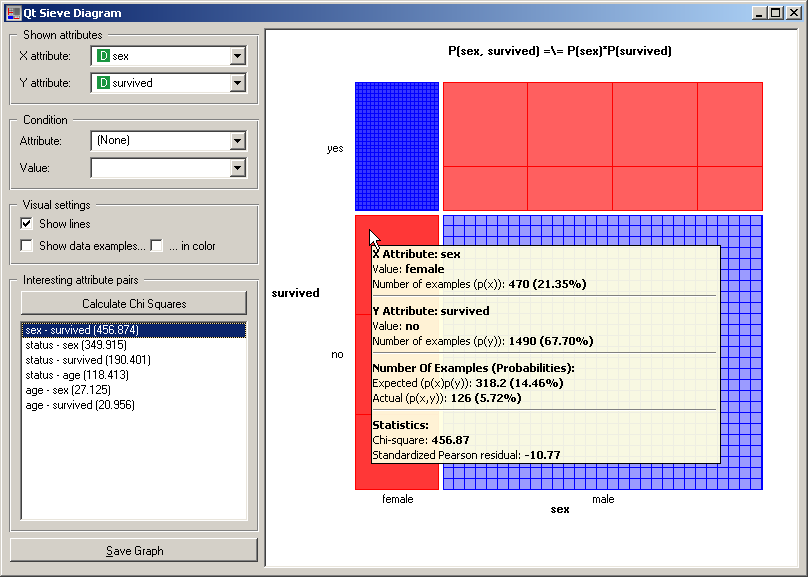
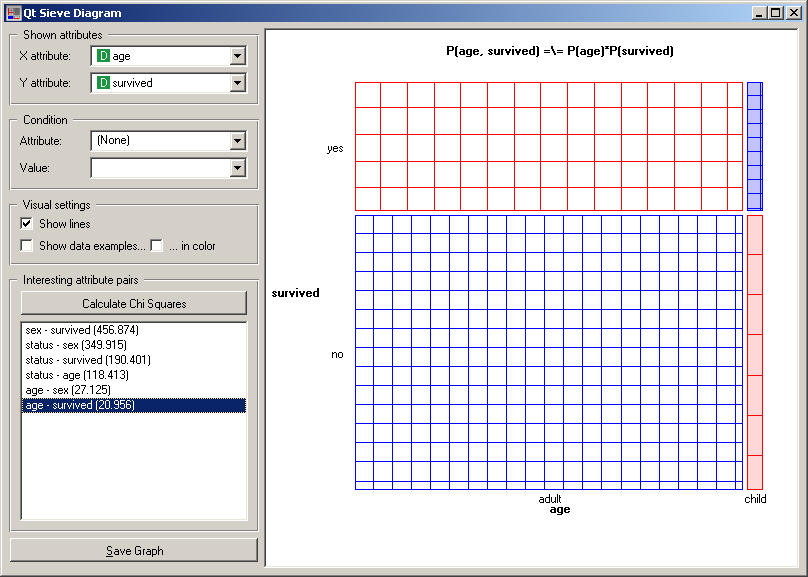

.. _Sieve Diagram:

Sieve Diagram
=============

Plots a sieve diagram for a pair of attributes.

Signals
-------

Inputs:
   - Examples (ExampleTable)
      Input data set.

Outputs:
   - None

Description
-----------

A sieve diagram is a graphical method for
visualizing the frequencies in a two-way contingency table
and comparing them 
to the expected frequencies under assumtion of independence. The sieve diagram was proposed by Riedwyl and Schüpbach in a technical report in 1983 and later called a parquet diagram <a href="#Riedwyl and Schüpbach" title="">(Riedwyl and Schüpbach, 1994)</a>. In this display the area of each rectangle is proportional to expected frequency and observed frequency is shown by the number of squares in each rectangle. The difference between observed and expected frequency (proportional to standard Pearson residual) appears as the density of shading, using color to indicate whether the deviation from independence is positive (blue) or negative (red).

The snapshot below shows a sieve diagram for Titanic data set and attributes sex and survived (the later is actually a class attribute in this data set). The plot shows that the two variables are highly associated, as there are substantial differences between observed and expected frequencies in all of the four quadrants. For example and as highlighted in a balloon, the chance for not surviving the accident was for female passengers much lower than expected (0.05 vs. 0.14).

Orange can help to identify pairs of attributes with interesting associations. Such attribute pairs are upon request (:obj:`Calculate Chi Squares`) listed in :obj:`Interesting attribute pair`. As it turns out, the most interesting attribute pair in Titanic data set is indeed the one we show in the above snapshot. For a contrast, the sieve diagram of the least interesting pair (age vs. survival) is shown below.

References
----------

  - Riedwyl, H., and Schüpbach, M. (1994). Parquet diagram to plot contingency tables. In  Softstat '93: Advances in Statistical Software, F. Faulbaum (Ed.). New York: Gustav Fischer, 293-299.
