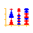

.. _Survey Plot:

Survey Plot
===========

Displays a Survey Plot.

Signals
-------

Inputs:
   - Examples (ExampleTable)
      Input data set.
   - Attribute Selection List
      List of attributes to be shown in the visualization.

Outputs:
   - Attribute Selection List
      List of attributes used in the visualization.

Description
-----------

A survey plot is a simple multi-attribute visualization technique that can help
to spot correlations between any two variables especially when the data is
sorted according to a particular dimension. Each horizontal splice in a plot
corresponds to a particular data instance. The data on a specific attribute is
shown in a single column, where the length of the line corresponds to the
dimensional value. When data includes a discrete or continuous class, the
slices (data instances) are colored correspondingly.

Implementation in Orange supports sorting by two selected attributes
(:obj:`Sorting`). The attributes shown in the plot are listed in
:obj:`Shown attributes` box, all other appear in the list of
:obj:`Hidden attributes`.

Below is a snapshot of survey plot widget for an Iris. Plot nicely shows that
petal width and length and sepal length are correlated. It is also very clear
that Iris-setosa can be classified based on petal length or width alone, while
for the Iris versicolor and virginica there is some ambiguity with some
potential outliers, one of which is highlighted in the snapshot.

.. image:: images/SurveyPlot-Iris.png

Values of the attributes may be scaled independently, for each attribute at
the time, or globally, using the information from all of the attributes This
option is controlled through :obj:`Global values scaling` check box. Switching
it on results in a plot shown below; notice that the leafs have smalled widths
than lengths, and the ratio is bigger with petal leafs. With
:obj:`Example tracking` on, mousing over the plot would bring a box around the
row representing a single data instance, which would with :obj:`Show legend`
display the information about the values of particular instance (just like in
the snapshot aboce). The attributes appearing in the attribute list may be
ordered according to selected criteria. :obj:`Tooltips settings` controls the
amount of information displayed in the data instance balloon (essentially, one
can change between including the information of only visualized attributes, or
all the attributes in the data set).

.. image:: images/SurveyPlot-Settings.png
